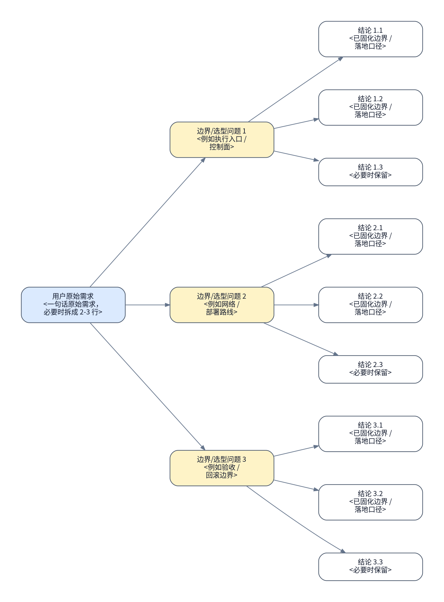

# <runbook 标题>

## 背景与现状

### 背景

- <为什么这份 runbook 现在要做>
- <上游 authority / 环境变化 / 触发原因>

### 现状

- <本轮最新 reconnaissance 证据 1>
- <本轮最新 reconnaissance 证据 2>
- <如果引用历史结论，必须明确标注它只是历史背景，不是本轮现场真相>


- `### 现状` 必须来自本轮真实侦察或用户刚提供的新证据，不能只复述旧文档。
- 不要单独再起 `## 当前前提`；前提、入口、地址、边界都并入这里。

## 目标与非目标

### 目标

- <目标状态>
- <成功定义 / handoff 边界>


### 非目标

- <明确不在本 runbook 覆盖的内容>
- <必须留给后续 authority 的内容>

## 风险与收益

### 风险

1. <最高风险>
2. <第二风险>

### 收益

1. <最高收益>
2. <第二收益>

- 如果风险或收益会改变执行路径、回滚边界或验收口径，后文必须体现它们如何被收敛。

## 思维脑图



- 根节点必须直接引用用户原始需求，而不是作者摘要。
- 至少 3 个边界/选型问题，每个问题至少 2 个叶子结论。
- 叶子节点写已经固化的结论，不写“是否 …”。
- 每个节点都手动换行；不要依赖 Graphviz 自动换行。

## 红线行为

- <严格禁止的动作>
- <一旦触发必须停止并回规划态的条件>
- `## 红线行为` 只保留红线条目与必要的禁止命令示例，不要再加 `###` 子标题。

## 执行计划

<a id="item-1"></a>

### 1. 冻结现状

#### 执行

[跳转到执行记录](#item-1-execution-record)

执行分组：<现场冻结分组标题>

```bash
...
```

预期结果：

- <冻结后的证据 1>
- <冻结后的证据 2>

停止条件：

- <冻结失败条件 1>
- <冻结失败条件 2>

#### 验收

[跳转到验收记录](#item-1-acceptance-record)

- [ ] 已生成当前现场状态的真实留档

验收命令：

```bash
...
```

预期结果：

- <执行者可以确认后续动作基于同一份冻结现状>

停止条件：

- <冻结证据不足>
- <冻结证据无法支撑 `### 现状`>

<a id="item-2"></a>

### 2. <编号项标题>

#### 执行

[跳转到执行记录](#item-2-execution-record)

执行分组：<执行分组标题>

```bash
...
```

预期结果：

- <预期状态变化或产物>

停止条件：

- <失败条件>
- <若命中停止条件或出现新的事实，必须回规划态>

#### 验收

[跳转到验收记录](#item-2-acceptance-record)

- [ ] <通过条件>

验收命令：

```bash
...
```

预期结果：

- <通过证据>

停止条件：

- <验收失败条件>
- <若验收失败或出现新 blocker，不得直接续跑下一项>

- 每个编号项都必须有 `#### 执行` / `#### 验收`。
- `## 执行计划` 下的每个步骤标题都必须使用 `### N. 标题` 形态，编号从 `1` 连续递增。
- 每个执行或验收分组都应包含 code block、`预期结果`、`停止条件`。
- 如果命令很长，拆成多个分组，不要把多层逻辑埋进一大段 shell。
- 不要另起 `## 编排策略`；顺序、回退、侦察触发条件都拆回各编号项。

## 执行记录

### 1. 冻结现状

<a id="item-1-execution-record"></a>

#### 执行记录

执行命令：

```bash
...
```

执行结果：

```text
...
```

执行结论：

- 待执行

<a id="item-1-acceptance-record"></a>

#### 验收记录

验收命令：

```bash
...
```

验收结果：

```text
...
```

验收结论：

- 待执行

### 2. <编号项标题>

<a id="item-2-execution-record"></a>

#### 执行记录

执行命令：

```bash
...
```

执行结果：

```text
...
```

执行结论：

- 待执行

<a id="item-2-acceptance-record"></a>

#### 验收记录

验收命令：

```bash
...
```

验收结果：

```text
...
```

验收结论：

- 待执行

- `## 执行记录` 的 item 标题必须和 `## 执行计划` 一一对齐。
- `## 执行记录` 下的每个步骤标题都必须使用与 `## 执行计划` 完全一致的 `### N. 标题`。
- 未执行 / 未验收前，只保留未签名的 `#### 执行记录` / `#### 验收记录`。
- 真正回填证据时，再改成签名形态：
  - `#### 执行记录 @名字 YYYY-MM-DD HH:MM TZ`
  - `#### 验收记录 @名字 YYYY-MM-DD HH:MM TZ`

## 最终验收

最终验收命令：

```bash
...
```

最终验收结果：

```text
...
```

最终验收结论：

- 通过 / 未通过

## 回滚方案

- <默认回滚边界>
- <禁止回滚路径>

回滚动作：

```bash
...
```

回滚后验证：

```bash
...
```

- `## 回滚方案` 固定放在 `## 最终验收` 后面。
- 回滚边界、回滚动作、回滚后最小验证都写在这里，不要再塞回 `## 红线行为`。
- `## 回滚方案` 不要再起 `###` 子标题；直接写边界、命令和验证。

## 访谈记录

> 这里只记录 planning 阶段真正向用户提的问题、用户真实回答，以及该回答如何收敛 authority。不要写作者自问自答，也不要改写成 `## 当前已决策`。

### 1. <问题主题>

> Q：<主 rollout 在规划阶段向用户提出的真实问题>
>
> A：<用户的真实回答；如果用户按编号选项回答，也要回填完整选项语义，而不是只写“选项 1”>

收敛影响：

- <这条回答如何改变执行路径 / 验收 / 回滚 / 非目标边界>

### 2. <问题主题>

> Q：<...>
>
> A：<...>

收敛影响：

- <...>

### 3. <问题主题>

> Q：<...>
>
> A：<...>

收敛影响：

- <...>

### 4. <问题主题>

> Q：<...>
>
> A：<...>

收敛影响：

- <...>

### 5. <问题主题>

> Q：<...>
>
> A：<...>

收敛影响：

- <...>

- `## 访谈记录` 至少要有 5 条真实用户访谈。
- `Q：` 和 `A：` 后面的正文必须和前缀写在同一行，中间保留一个空 quote 行。
- 如果真实访谈还不够，说明规划未完成，不要先定稿正文。

## 文档链接

- [<上游 authority / 前置文档>](./<path>.md)：<为什么和当前 runbook 直接相关>
- [<下游 authority / 后续文档>](./<path>.md)：<执行完成后通常衔接到哪里>
- [<旁路参考 / 相关设计文档>](./<path>.md)：<帮助执行者理解边界或设计约束>
