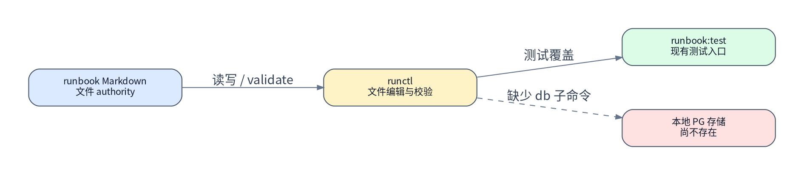
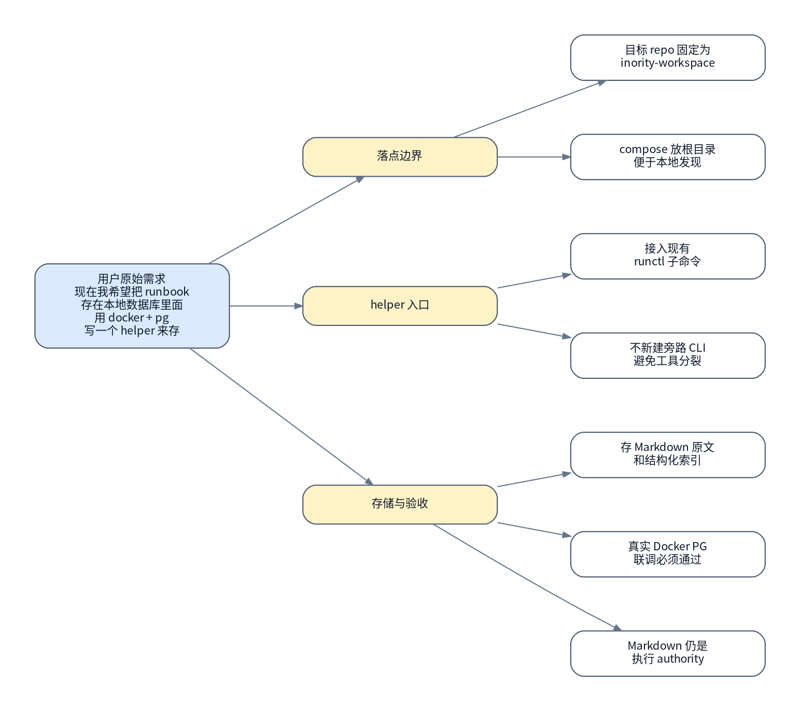

# runbook 数据库 PostgreSQL helper 执行手册

> [!NOTE]
> 当前模式：`coding`

## 背景与现状

### 背景

- 用户要求把 runbook 存到本地数据库里面，并明确使用 Docker + PostgreSQL，同时写一个 helper 完成写入。
- 本轮访谈已拍板：落点为 `inority-workspace`，helper 接入现有 `skills/runbook/scripts/runctl`，数据库保存 Markdown 原文和解析后的结构化索引。
- 本 runbook 只规划代码仓内变更路径，不直接执行实现。

### 现状

- `inority-workspace` 当前是 Node/npm workspace，根目录 `package.json` 已有 `runbook:test`，执行入口为 `node ./skills/runbook/tests/run.mjs`。
- `skills/runbook/scripts/runctl` 已有 `init`、`validate`、`add-step`、`add-qa`、`sign-step`、`sync-records` 等子命令，命令注册集中在 `skills/runbook/scripts/commands/index.mjs`。
- 根目录当前没有 `docker-compose.yml`、`.env.example` 或数据库 DSN 约定；`.gitignore` 已忽略 `.env` / `.env.*` 并允许提交 `.env.example`。
- `git status --short` 在规划侦察时为空，说明本轮开始前 `inority-workspace` 工作区干净。



## 目标与非目标

### 目标

- 在 `inority-workspace` 根目录新增本地 PostgreSQL Docker compose 栈和 `.env.example`，形成固定的本地数据库启动与连接约定。
- 在 `skills/runbook/scripts/runctl` 中新增数据库 helper 子命令，至少覆盖 `db-init` 和 `db-store <runbook>`。
- 数据库存储同时保留 Markdown 原文与结构化索引，索引至少覆盖路径、标题、模式、内容 hash、步骤、访谈记录、最终验收项和更新时间。
- 验收必须包含真实 Docker PostgreSQL 联调：启动 PG、初始化 schema、写入一份 runbook、查询验证原文与索引均落库。


### 非目标

- 不把 PostgreSQL 改成 runbook 的唯一 authority；Markdown 文件仍是当前人工审阅与执行 authority。
- 不做 handbook UI、搜索页面、API 服务或远端同步。
- 不迁移历史 runbook 存量数据；本次只提供 helper 和一份样例写入验收路径。
- 不在规划态启动 Docker、创建数据库或修改代码。

## 风险与收益

### 风险

1. 本地 Docker 或 PostgreSQL 端口不可用会阻塞真实联调验收。
2. Markdown 解析规则若未覆盖现有 runbook 结构，结构化索引可能缺字段或误判章节。
3. 数据库凭据和端口若没有统一环境变量，会导致 helper 在不同本地环境表现不一致。

### 收益

1. runbook 可以在本地 PostgreSQL 中保留可查询快照，降低只靠文件扫描的检索成本。
2. 结构化索引为后续按步骤、模式、访谈记录、验收项查询打基础。
3. `runctl` 内聚数据库写入能力，避免新增一套脱离现有 runbook validator 的旁路工具。

## 思维脑图



## 红线行为

- 禁止在规划态执行 `docker compose up`、创建数据库、写入 PostgreSQL 或修改代码。
- 禁止把 `.env`、真实密码或本地私有 DSN 提交进仓库。
- 禁止把数据库作为唯一 authority 并删除 Markdown runbook。
- 禁止在未通过 `npm run runbook:test` 和真实 PG 联调前宣称 helper 可交付。

## 清理现场

清理触发条件：

- 执行态在 Docker/PG 联调中断，留下运行中的 `inority-runbook-postgres` 容器或测试数据。
- `db-init` 或 `db-store` 半执行后，数据库 schema 与当前代码不匹配。
- 本地 `.env` 被临时改写且影响后续连接。

清理命令：

```bash
docker compose down
git status --short
```

清理完成条件：

- `docker compose ps` 不再显示运行中的本 runbook PostgreSQL 服务。
- `git status --short` 只显示本次实现预期内的源码、测试、文档和 compose 变更。
- 本地 `.env` 中的数据库变量与 `.env.example` 字段名一致。

恢复执行入口：

- 清理完成后，从 `### 🟢 1. 保证工作区干净` 重新进入。

## 执行计划

<a id="item-1"></a>

### 🟢 1. 保证工作区干净

> [!TIP]
> 本步骤只读确认仓库基线和当前分支，避免覆盖既有工作。

#### 执行

[跳转到执行记录](#item-1-execution-record)

操作性质：只读

执行分组：检查 Git 基线

```bash
git status --short
git branch --show-current
git rev-parse --short HEAD
```

预期结果：

- `git status --short` 输出为空，或只包含用户明确允许纳入本次实现的文件。
- 当前分支和 HEAD 被记录，后续代码变更可追踪。

停止条件：

- 工作区存在未确认来源的改动。
- 当前不在可提交的普通工作分支上。

#### 验收

[跳转到验收记录](#item-1-acceptance-record)

验收命令：

```bash
git diff --stat
```

预期结果：

- 实现前没有未审阅 diff；若有 diff，已明确归属本次实现或用户已有改动。

停止条件：

- diff 来源不清楚，不能判断是否可继续。

<a id="item-2"></a>

### 🟢 2. 冻结当前 runctl 实现

> [!TIP]
> 本步骤只读记录现有 runctl 命令注册、测试入口和环境变量现状。

#### 执行

[跳转到执行记录](#item-2-execution-record)

操作性质：只读

执行分组：读取现有工具链入口

```bash
sed -n '1,220p' skills/runbook/scripts/commands/index.mjs
sed -n '1,220p' skills/runbook/tests/helpers.mjs
cat package.json
find . -maxdepth 2 -name 'docker-compose.yml' -o -name '.env.example'
```

预期结果：

- 确认 `runctl` 命令注册方式和测试 helper 形态。
- 确认根目录尚无 Docker compose 与 `.env.example` 冲突。

停止条件：

- 发现现有数据库 helper 或 compose 文件，且与本 runbook 目标冲突。

#### 验收

[跳转到验收记录](#item-2-acceptance-record)

验收命令：

```bash
npm run runbook:test
```

预期结果：

- 现有 runbook 测试在变更前通过，或者失败项被记录为变更前既有问题。

停止条件：

- 基线测试失败且无法确认是否与本次目标无关。

<a id="item-3"></a>

### 🟡 3. 新增本地 PostgreSQL compose 约定

> [!WARNING]
> 本步骤新增根目录 Docker PostgreSQL 配置和示例环境变量。

#### 执行

[跳转到执行记录](#item-3-execution-record)

操作性质：幂等

执行分组：新增 compose 与环境变量示例

```bash
git diff -- docker-compose.yml .env.example .gitignore
```

预期结果：

- 新增 `docker-compose.yml`，服务名固定为 `postgres`，容器名可识别为 `inority-runbook-postgres`。
- 新增 `.env.example`，包含 `RUNBOOK_DB_DSN`、`POSTGRES_DB`、`POSTGRES_USER`、`POSTGRES_PASSWORD` 和端口约定。
- `.env` 继续被忽略，`.env.example` 可提交。

停止条件：

- compose 端口与本机既有关键服务冲突且没有替代端口策略。
- `.env.example` 泄露真实密码或私有连接串。

#### 验收

[跳转到验收记录](#item-3-acceptance-record)

验收命令：

```bash
docker compose config
git diff --check docker-compose.yml .env.example .gitignore
```

预期结果：

- compose 配置可被 Docker 解析。
- diff 不包含空白错误或敏感 `.env` 内容。

停止条件：

- `docker compose config` 解析失败。

<a id="item-4"></a>

### 🟡 4. 实现 runctl 数据库 helper

> [!WARNING]
> 本步骤在 runctl 内新增数据库初始化、解析和写入子命令。

#### 执行

[跳转到执行记录](#item-4-execution-record)

操作性质：幂等

执行分组：新增命令与数据库模块

```bash
git diff -- skills/runbook/scripts/commands skills/runbook/scripts
```

预期结果：

- `skills/runbook/scripts/commands/index.mjs` 注册 `db-init` 和 `db-store`。
- 新增数据库模块从 `RUNBOOK_DB_DSN` 读取连接串，不硬编码本地密码。
- schema 支持 runbook 原文表和结构化索引表，并通过 upsert 保证重复写入可重入。
- Markdown 解析覆盖标题、模式、执行计划步骤、访谈记录、最终验收 checkbox 和内容 hash。

停止条件：

- 需要新增 npm 依赖但无法在当前网络或锁文件策略下确定版本。
- 解析逻辑必须改变现有 runbook validator 语义。

#### 验收

[跳转到验收记录](#item-4-acceptance-record)

验收命令：

```bash
skills/runbook/scripts/runctl --help
skills/runbook/scripts/runctl db-init --help
skills/runbook/scripts/runctl db-store --help
```

预期结果：

- help 输出包含新子命令。
- 缺少 `RUNBOOK_DB_DSN` 时命令给出清晰错误，不产生未捕获异常。

停止条件：

- 新命令破坏既有 `runctl --help` 或既有子命令解析。

<a id="item-5"></a>

### 🟡 5. 补充测试与文档

> [!WARNING]
> 本步骤新增 helper 单元测试和本地使用说明。

#### 执行

[跳转到执行记录](#item-5-execution-record)

操作性质：幂等

执行分组：新增测试覆盖

```bash
git diff -- skills/runbook/tests skills/runbook/README.md README.md
```

预期结果：

- 测试覆盖 Markdown 解析、schema SQL 生成、缺失 DSN 错误和重复 `db-store` 的幂等语义。
- 文档说明 compose 会启动 PostgreSQL，并给出 `db-init` / `db-store` 的最小用法。

停止条件：

- 测试只能依赖真实数据库，无法在无 Docker 环境下做快速单元验证。

#### 验收

[跳转到验收记录](#item-5-acceptance-record)

验收命令：

```bash
npm run runbook:test
```

预期结果：

- runbook 测试全部通过。

停止条件：

- 新增测试失败。
- 既有测试出现与本次实现相关的回归。

<a id="item-6"></a>

### 🔴 6. 执行真实 Docker PostgreSQL 联调

> [!CAUTION]
> 本步骤会启动本地 PostgreSQL 容器并写入测试 runbook 数据。

> [!CAUTION]
> 严重后果：如果端口或卷配置错误，可能覆盖同名 Docker volume 或影响本机已有 PostgreSQL 开发环境。

#### 执行

[跳转到执行记录](#item-6-execution-record)

操作性质：破坏性

执行分组：启动数据库并写入 runbook

```bash
docker compose up -d postgres
skills/runbook/scripts/runctl db-init
skills/runbook/scripts/runctl db-store docs/runbook/2026-05-08/runbook-db-postgres-helper-runbook.md
```

预期结果：

- PostgreSQL 容器健康运行。
- `db-init` 成功创建或迁移 schema。
- `db-store` 成功写入本 runbook 原文与结构化索引。

停止条件：

- Docker 不可用。
- PostgreSQL 健康检查失败。
- 写入命令失败或报 schema 不兼容。

#### 验收

[跳转到验收记录](#item-6-acceptance-record)

验收命令：

```bash
docker compose exec postgres psql "$POSTGRES_DB" "$POSTGRES_USER" -c "select path, title, mode from runbooks order by updated_at desc limit 1;"
docker compose exec postgres psql "$POSTGRES_DB" "$POSTGRES_USER" -c "select count(*) from runbook_steps;"
docker compose exec postgres psql "$POSTGRES_DB" "$POSTGRES_USER" -c "select count(*) from runbook_interviews;"
```

预期结果：

- 最新 runbook 记录路径指向本 authority 文件。
- `runbook_steps` 至少包含本 runbook 的 6 个执行步骤。
- `runbook_interviews` 至少包含 5 条访谈记录。

停止条件：

- 查询不到 runbook 原文记录。
- 步骤或访谈记录索引数量不足。

<a id="item-7"></a>

### 🟢 7. 整理交付证据

> [!TIP]
> 本步骤只读整理最终 diff、测试和联调证据，准备评审交付。

#### 执行

[跳转到执行记录](#item-7-execution-record)

操作性质：只读

执行分组：汇总变更

```bash
git status --short
git diff --stat
git diff --check
```

预期结果：

- 变更只包含 compose、环境变量示例、runctl helper、测试、文档和本 authority runbook。
- `git diff --check` 无空白错误。

停止条件：

- 出现非本次目标范围内的文件变更。
- diff check 失败。

#### 验收

[跳转到验收记录](#item-7-acceptance-record)

验收命令：

```bash
npm run runbook:test
docker compose ps
```

预期结果：

- 单元测试保持通过。
- PostgreSQL 联调现场状态清楚，可按交付要求保留或清理。

停止条件：

- 最终测试失败。
- Docker 现场状态无法解释。

## 执行记录

### 🟢 1. 保证工作区干净

<a id="item-1-execution-record"></a>

#### 执行记录

执行命令：

```bash
git status --short
git branch --show-current
git rev-parse --short HEAD
```

执行结果：

```text
待执行
```

执行结论：

- 待执行

<a id="item-1-acceptance-record"></a>

#### 验收记录

验收命令：

```bash
git diff --stat
```

验收结果：

```text
待执行
```

验收结论：

- 待执行

### 🟢 2. 冻结当前 runctl 实现

<a id="item-2-execution-record"></a>

#### 执行记录

执行命令：

```bash
sed -n '1,220p' skills/runbook/scripts/commands/index.mjs
sed -n '1,220p' skills/runbook/tests/helpers.mjs
cat package.json
find . -maxdepth 2 -name 'docker-compose.yml' -o -name '.env.example'
```

执行结果：

```text
待执行
```

执行结论：

- 待执行

<a id="item-2-acceptance-record"></a>

#### 验收记录

验收命令：

```bash
npm run runbook:test
```

验收结果：

```text
待执行
```

验收结论：

- 待执行

### 🟡 3. 新增本地 PostgreSQL compose 约定

<a id="item-3-execution-record"></a>

#### 执行记录

执行命令：

```bash
git diff -- docker-compose.yml .env.example .gitignore
```

执行结果：

```text
待执行
```

执行结论：

- 待执行

<a id="item-3-acceptance-record"></a>

#### 验收记录

验收命令：

```bash
docker compose config
git diff --check docker-compose.yml .env.example .gitignore
```

验收结果：

```text
待执行
```

验收结论：

- 待执行

### 🟡 4. 实现 runctl 数据库 helper

<a id="item-4-execution-record"></a>

#### 执行记录

执行命令：

```bash
git diff -- skills/runbook/scripts/commands skills/runbook/scripts
```

执行结果：

```text
待执行
```

执行结论：

- 待执行

<a id="item-4-acceptance-record"></a>

#### 验收记录

验收命令：

```bash
skills/runbook/scripts/runctl --help
skills/runbook/scripts/runctl db-init --help
skills/runbook/scripts/runctl db-store --help
```

验收结果：

```text
待执行
```

验收结论：

- 待执行

### 🟡 5. 补充测试与文档

<a id="item-5-execution-record"></a>

#### 执行记录

执行命令：

```bash
git diff -- skills/runbook/tests skills/runbook/README.md README.md
```

执行结果：

```text
待执行
```

执行结论：

- 待执行

<a id="item-5-acceptance-record"></a>

#### 验收记录

验收命令：

```bash
npm run runbook:test
```

验收结果：

```text
待执行
```

验收结论：

- 待执行

### 🔴 6. 执行真实 Docker PostgreSQL 联调

<a id="item-6-execution-record"></a>

#### 执行记录

执行命令：

```bash
docker compose up -d postgres
skills/runbook/scripts/runctl db-init
skills/runbook/scripts/runctl db-store docs/runbook/2026-05-08/runbook-db-postgres-helper-runbook.md
```

执行结果：

```text
待执行
```

执行结论：

- 待执行

<a id="item-6-acceptance-record"></a>

#### 验收记录

验收命令：

```bash
docker compose exec postgres psql "$POSTGRES_DB" "$POSTGRES_USER" -c "select path, title, mode from runbooks order by updated_at desc limit 1;"
docker compose exec postgres psql "$POSTGRES_DB" "$POSTGRES_USER" -c "select count(*) from runbook_steps;"
docker compose exec postgres psql "$POSTGRES_DB" "$POSTGRES_USER" -c "select count(*) from runbook_interviews;"
```

验收结果：

```text
待执行
```

验收结论：

- 待执行

### 🟢 7. 整理交付证据

<a id="item-7-execution-record"></a>

#### 执行记录

执行命令：

```bash
git status --short
git diff --stat
git diff --check
```

执行结果：

```text
待执行
```

执行结论：

- 待执行

<a id="item-7-acceptance-record"></a>

#### 验收记录

验收命令：

```bash
npm run runbook:test
docker compose ps
```

验收结果：

```text
待执行
```

验收结论：

- 待执行

## 最终验收

- [ ] 第 1 项验收通过并有 `#### 验收记录 @...` 证据
- [ ] 第 2 项验收通过并有 `#### 验收记录 @...` 证据
- [ ] 第 3 项验收通过并有 `#### 验收记录 @...` 证据
- [ ] 第 4 项验收通过并有 `#### 验收记录 @...` 证据
- [ ] 第 5 项验收通过并有 `#### 验收记录 @...` 证据
- [ ] 第 6 项验收通过并有 `#### 验收记录 @...` 证据
- [ ] 第 7 项验收通过并有 `#### 验收记录 @...` 证据
- [ ] 已新开一个独立上下文的 `$runbook-recon` 子代理执行最终终态侦察
- [ ] 最终验收只使用该独立 recon 子代理本轮重新采集的证据，不复用编号项执行 / 验收记录里的既有证据
- [ ] 最终验收 recon 输出证明整份 authority 已完成

最终验收侦察问题：

- 根目录 Docker compose、`.env.example`、`runctl db-init`、`runctl db-store` 是否都存在且符合本 runbook 目标。
- 真实 Docker PostgreSQL 中是否能查询到本 runbook 的原文记录、步骤索引和访谈记录索引。
- `npm run runbook:test` 是否在最终代码状态下通过。

最终验收命令：

```bash
git status --short
npm run runbook:test
docker compose exec postgres psql "$POSTGRES_DB" "$POSTGRES_USER" -c "select count(*) from runbooks;"
docker compose exec postgres psql "$POSTGRES_DB" "$POSTGRES_USER" -c "select count(*) from runbook_steps;"
docker compose exec postgres psql "$POSTGRES_DB" "$POSTGRES_USER" -c "select count(*) from runbook_interviews;"
```

最终验收结果：

```text
待独立上下文 runbook-recon 回填
```

最终验收结论：

- 待执行

## 回滚方案

- 默认回滚边界：本 runbook 的代码类变更可通过 Git 丢弃未提交改动或 revert 已提交 commit 回滚。
- 禁止回滚路径：禁止删除用户已有 `.env`、其他项目 Docker volume 或非本次创建的 PostgreSQL 数据。

6. 对应执行计划第 6 项的回滚边界、回滚动作和回滚后验证。

回滚动作：

```bash
docker compose down
```

回滚后验证：

```bash
docker compose ps
git status --short
```

## 访谈记录

### Q：这个“runbook 存本地数据库 + Docker PostgreSQL + helper”要落在哪个项目里？

> A：`inority-workspace`

访谈时间：2026-05-08 00:00 CST

目标 repo 固定为 `inority-workspace`，后续 authority 不再写到具体业务项目或 skill 子目录。

### Q：helper 入口你希望怎么做？

> A：接入现有 `skills/runbook/scripts/runctl`

访谈时间：2026-05-08 00:00 CST

执行路径固定为新增 `runctl` 数据库子命令，不新建脱离 runbook 工具链的旁路 helper。

### Q：数据库里保存 runbook 的粒度你希望是哪一种？

> A：Markdown 原文 + 解析后的结构化索引

访谈时间：2026-05-08 00:00 CST

schema 必须同时保存 Markdown 原文和可查询索引，不能只做文件备份。

### Q：Docker PostgreSQL 栈怎么落地？

> A：新增 repo 根目录 `docker-compose.yml` + `.env.example`

访谈时间：2026-05-08 00:00 CST

compose 和环境变量示例固定放在 workspace 根目录，方便 `runctl` helper 和本地开发统一发现。

### Q：这次 authority 的验收范围选哪种？

> A：必须包含真实 Docker PostgreSQL 联调

访谈时间：2026-05-08 00:00 CST

最终验收必须启动真实 PostgreSQL、初始化 schema、写入 runbook 并查询验证，不能只依赖单元测试。

## 参考资料

| name | type | link | desc |
| --- | --- | --- | --- |
| runbook skill | skill | [skills/runbook/SKILL.md](../../../skills/runbook/SKILL.md) | 约束 authority runbook 的规划、结构和校验方式。 |
| runctl command registry | source | [skills/runbook/scripts/commands/index.mjs](../../../skills/runbook/scripts/commands/index.mjs) | 新增数据库 helper 子命令的注册入口。 |
| runbook tests | source | [skills/runbook/tests/run.mjs](../../../skills/runbook/tests/run.mjs) | `npm run runbook:test` 的实际测试入口。 |
| workspace package scripts | source | [package.json](../../../package.json) | 现有 npm scripts 和 workspace 元数据。 |
