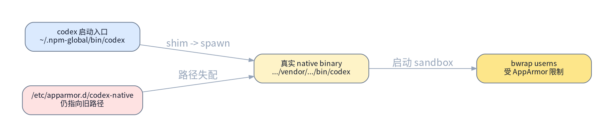
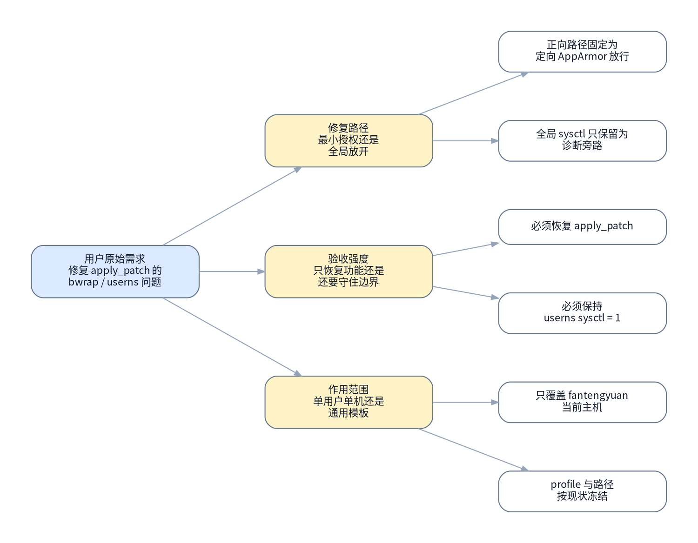

# Codex apply_patch userns 修复执行手册

> [!NOTE]
> 当前模式：`operation`

## 背景与现状

### 背景

- 当前主机上的 Codex CLI 在执行 `apply_patch` 或部分本地写入动作时，会在 Linux sandbox helper 阶段失败。
- 目标不是关闭 Codex sandbox，也不是全局放开内核限制，而是在保持 `workspace-write` 与最小授权边界的前提下恢复本机 Codex 的正常补丁能力。
- 本轮 authority 只覆盖当前用户 `fantengyuan` 在当前主机上的本机 Codex 安装路径，不扩展到其他用户或通用模板。

### 现状

- `~/.codex/config.toml` 当前已经使用 `approval_policy = "on-request"` 和 `sandbox_mode = "workspace-write"`，说明问题不在项目级写权限模式。
- `/proc/sys/kernel/apparmor_restrict_unprivileged_userns = 1`，`/proc/sys/kernel/unprivileged_userns_clone = 1`，说明内核允许 unprivileged userns，但 AppArmor 仍在做额外限制。
- `codex` 启动入口是 `/home/fantengyuan/.npm-global/bin/codex`，其 Node shim 位于 `/home/fantengyuan/.npm-global/lib/node_modules/@openai/codex/bin/codex.js`。
- 当前真实原生 Codex binary 位于 `/home/fantengyuan/.npm-global/lib/node_modules/@openai/codex/node_modules/@openai/codex-linux-x64/vendor/x86_64-unknown-linux-musl/bin/codex`，bundled `bwrap` 位于同一 vendor 目录下的 `codex-resources/bwrap`。
- 主机上已存在 `/etc/apparmor.d/codex-native`，但其中 `@{codex_cli_bin}` 仍指向旧的 `.../vendor/x86_64-unknown-linux-musl/codex/codex` 路径，与当前真实 binary 不一致。
- 非提权环境下读取 `aa-status` 只能确认 `apparmor module is loaded`，无法直接列出完整 profile set，因此 authority 正向路径需要显式冻结并修复现有 `codex-native` profile，而不是假设 profile 已正确生效。



## 目标与非目标

### 目标

- 修复当前用户 `fantengyuan` 在本机使用的 Codex 原生 binary 对应的 AppArmor profile 路径，使其与真实 native binary 一致。
- 保持 `kernel.apparmor_restrict_unprivileged_userns = 1` 不变，通过定向 AppArmor 放行恢复 `apply_patch`。
- 在新的 Codex 进程中验证最小 patch 探针可以成功完成，不再出现 `bwrap: loopback: Failed RTM_NEWADDR: Operation not permitted`。


### 非目标

- 不把 `kernel.apparmor_restrict_unprivileged_userns` 全局改成 `0` 作为正向修复路径。
- 不覆盖其他用户、其他主机或其他 Codex 安装布局。
- 不顺手重构 Codex 安装方式、npm 全局路径或用户级 `.codex/config.toml`。

## 风险与收益

### 风险

1. 如果未来 `@openai/codex` 的 vendor 目录再次漂移，`/etc/apparmor.d/codex-native` 里的固定路径仍可能再次失效。
2. `codex-native` profile 属于主机安全策略文件，误改路径或语法可能导致 Codex 继续无法启动 sandbox。

### 收益

1. 在不扩大全局 userns 风险面的前提下恢复 `apply_patch` 和本地写补丁能力。
2. 把问题收敛成单机、单用户、单 binary 路径修复，后续重现与回滚边界都更明确。

## 思维脑图



## 红线行为

- 不要把 `sudo sysctl -w kernel.apparmor_restrict_unprivileged_userns=0` 写进正向执行计划。
- 不要修改 `/etc/apparmor.d/` 下与 Codex 无关的其他 profile。
- 不要在生产项目源码上直接验证 `apply_patch`；最终验证只能使用临时 scratch 目录。
- 如果 `/etc/apparmor.d/codex-native` 中的当前内容与本轮冻结事实不一致，必须先回规划态，不要现场猜路径继续改。

## 清理现场

清理触发条件：

- 第 3 项或第 4 项中断，导致 `/etc/apparmor.d/codex-native` 处于半写入或半 reload 状态。
- 临时 scratch 验证目录残留，影响下一次验证。

清理命令：

```bash
sudo cp -f /etc/apparmor.d/codex-native.bak /etc/apparmor.d/codex-native
sudo apparmor_parser -r /etc/apparmor.d/codex-native
rm -rf /tmp/codex-apply-patch-probe
```

清理完成条件：

- `codex-native` profile 已恢复到执行前备份版本。
- 没有残留的 `/tmp/codex-apply-patch-probe` 验证目录。

恢复执行入口：

- 清理完成后，从 `### 🔴 3. 落定向 AppArmor profile` 重新进入。

## 执行计划


<a id="item-1"></a>

### 🟢 1. 冻结现状

> [!TIP]
> 本步骤只读冻结当前 Codex、sysctl 和 AppArmor 相关现状，作为后续修复基线。

#### 执行 @吕布 2026-06-09 16:33 +0800

[跳转到执行记录](#item-1-execution-record)

操作性质：只读

执行分组：冻结当前配置与报错上下文

```bash
cat /home/fantengyuan/.codex/config.toml | sed -n '1,20p'
cat /proc/sys/kernel/apparmor_restrict_unprivileged_userns
cat /proc/sys/kernel/unprivileged_userns_clone
command -v codex
ls -l /home/fantengyuan/.npm-global/bin/codex
sed -n '1,20p' /etc/apparmor.d/codex-native
```

预期结果：

- 确认 `sandbox_mode = "workspace-write"`。
- 确认 `kernel.apparmor_restrict_unprivileged_userns = 1` 且 `kernel.unprivileged_userns_clone = 1`。
- 确认主机已有 `/etc/apparmor.d/codex-native`。

停止条件：

- `.codex/config.toml` 不存在或当前会话并未使用 `workspace-write`。
- `apparmor_restrict_unprivileged_userns` 已不是 `1`，导致本 runbook 的问题模型不成立。

#### 验收 @吕布 2026-06-09 16:34 +0800

[跳转到验收记录](#item-1-acceptance-record)

验收命令：

```bash
cat /proc/sys/kernel/apparmor_restrict_unprivileged_userns
command -v codex
```

预期结果：

- 输出仍分别为 `1` 与当前用户的 Codex 启动入口路径。

停止条件：

- 读到的 sysctl 值与冻结记录不一致。
- `codex` 入口与执行前记录不一致。


<a id="item-2"></a>

### 🟢 2. 冻结现状后的路径与内核边界

> [!TIP]
> 本步骤只读确认真实 native binary、bundled bwrap 与现有 AppArmor profile 的路径失配点。

#### 执行 @吕布 2026-06-09 16:35 +0800

[跳转到执行记录](#item-2-execution-record)

操作性质：只读

执行分组：冻结真实 binary 链路与 profile 漂移点

```bash
readlink -f /home/fantengyuan/.npm-global/bin/codex
ls /home/fantengyuan/.npm-global/lib/node_modules/@openai/codex/node_modules/@openai/codex-linux-x64/vendor/x86_64-unknown-linux-musl/bin
ls /home/fantengyuan/.npm-global/lib/node_modules/@openai/codex/node_modules/@openai/codex-linux-x64/vendor/x86_64-unknown-linux-musl/codex-resources
rg -n 'codex_cli_bin|userns' /etc/apparmor.d/codex-native
```

预期结果：

- 真实 native binary 位于 `.../vendor/x86_64-unknown-linux-musl/bin/codex`。
- bundled `bwrap` 位于 `.../codex-resources/bwrap`。
- `/etc/apparmor.d/codex-native` 中 `@{codex_cli_bin}` 仍指向旧的 `.../codex/codex`。

停止条件：

- 真实 native binary 或 bundled `bwrap` 不存在。
- 当前 profile 中的路径与冻结现状不同，无法安全套用本 runbook。

#### 验收 @吕布 2026-06-09 16:36 +0800

[跳转到验收记录](#item-2-acceptance-record)

验收命令：

```bash
rg -n 'codex_cli_bin' /etc/apparmor.d/codex-native
```

预期结果：

- 能明确记录 profile 当前绑定的旧路径，作为第 3 项修复前后对比基线。

停止条件：

- `codex-native` profile 不存在或无法读取。


<a id="item-3"></a>

### 🔴 3. 落定向 AppArmor profile

> [!CAUTION]
> 本步骤会修改主机上的 `/etc/apparmor.d/codex-native`，把现有 Codex profile 重新绑定到真实 native binary。

> [!CAUTION]
> 严重后果：如果 profile 路径或语法写错，Codex 仍可能无法正常启动 sandbox，且会把问题从“路径漂移”升级成“host security profile 配置错误”。

#### 执行 @吕布 2026-06-09 16:39 +0800

[跳转到执行记录](#item-3-execution-record)

操作性质：破坏性

执行分组：备份并修复 `codex-native` 的 CLI binary 路径

```bash
sudo cp -f /etc/apparmor.d/codex-native /etc/apparmor.d/codex-native.bak
sudo python3 - <<'PY'
from pathlib import Path
path = Path('/etc/apparmor.d/codex-native')
text = path.read_text()
old = '@{codex_cli_bin} = /home/fantengyuan/.npm-global/lib/node_modules/@openai/codex/node_modules/@openai/codex-linux-x64/vendor/x86_64-unknown-linux-musl/codex/codex'
new = '@{codex_cli_bin} = /home/fantengyuan/.npm-global/lib/node_modules/@openai/codex/node_modules/@openai/codex-linux-x64/vendor/x86_64-unknown-linux-musl/bin/codex'
if old not in text:
    raise SystemExit('expected stale codex_cli_bin line not found')
path.write_text(text.replace(old, new, 1))
PY
```

预期结果：

- 生成 `/etc/apparmor.d/codex-native.bak` 备份。
- `codex-native` 中的 `@{codex_cli_bin}` 改成真实 `.../bin/codex`。

停止条件：

- 备份失败。
- `expected stale codex_cli_bin line not found`，说明现场已经偏离本 runbook 的冻结前提。

#### 验收 @吕布 2026-06-09 16:39 +0800

[跳转到验收记录](#item-3-acceptance-record)

验收命令：

```bash
rg -n 'codex_cli_bin' /etc/apparmor.d/codex-native
test -f /etc/apparmor.d/codex-native.bak
```

预期结果：

- `codex-native` 中只出现新的 `.../bin/codex` 路径。
- 备份文件存在。

停止条件：

- 仍然匹配旧路径。
- 备份文件不存在。


<a id="item-4"></a>

### 🔴 4. reload AppArmor 并重启 Codex 会话

> [!CAUTION]
> 本步骤会让新的 `codex-native` profile 立即进入运行态，并要求后续验证从新的 Codex 进程开始。

> [!CAUTION]
> 严重后果：如果 reload 失败或继续沿用旧 Codex 进程，后续第 5 项的验证结论会失真。

#### 执行 @吕布 2026-06-09 16:40 +0800

[跳转到执行记录](#item-4-execution-record)

操作性质：破坏性

执行分组：reload 新 profile 并切换到新 Codex 进程

```bash
sudo apparmor_parser -r /etc/apparmor.d/codex-native
printf 'Close any existing Codex TUI or exec process before continuing to item 5.
'
```

预期结果：

- `apparmor_parser` 成功返回。
- 执行者明确从新的 Codex 进程进入第 5 项验证。

停止条件：

- `apparmor_parser` 返回非零。
- 执行者无法确认第 5 项会从新进程开始。

#### 验收 @吕布 2026-06-09 16:40 +0800

[跳转到验收记录](#item-4-acceptance-record)

验收命令：

```bash
sudo apparmor_parser -p /etc/apparmor.d/codex-native | rg -n 'userns|codex_cli_bin'
```

预期结果：

- 能看到 `userns` 规则与更新后的 `codex_cli_bin` 已进入解析结果。

停止条件：

- 解析输出缺少 `userns` 或缺少新的 binary 路径。


<a id="item-5"></a>

### 🟡 5. 验证 apply_patch 恢复且 sysctl 保持不变

> [!WARNING]
> 本步骤在独立 scratch 目录中做幂等验证，既确认新 Codex 进程能完成最小 patch，也确认全局 userns sysctl 没有被放开。

#### 执行 @吕布 2026-06-09 16:46 +0800

[跳转到执行记录](#item-5-execution-record)

操作性质：幂等

执行分组：在 scratch 目录运行最小 Codex patch 探针

```bash
rm -rf /tmp/codex-apply-patch-probe
mkdir -p /tmp/codex-apply-patch-probe
cd /tmp/codex-apply-patch-probe
git init -q
printf 'alpha
' > probe.txt
codex exec -s workspace-write -C /tmp/codex-apply-patch-probe --skip-git-repo-check "Use apply_patch to change the only line in probe.txt from alpha to beta. Do not modify any other file."
cat probe.txt
cat /proc/sys/kernel/apparmor_restrict_unprivileged_userns
```

预期结果：

- `codex exec` 不再出现 `bwrap: loopback: Failed RTM_NEWADDR: Operation not permitted`。
- `probe.txt` 变成 `beta`。
- `kernel.apparmor_restrict_unprivileged_userns` 仍然是 `1`。

停止条件：

- `codex exec` 仍然出现 `RTM_NEWADDR` 或其他 sandbox 初始化错误。
- `probe.txt` 没有被修改为 `beta`。
- sysctl 值不再是 `1`。

#### 验收 @吕布 2026-06-09 16:46 +0800

[跳转到验收记录](#item-5-acceptance-record)

验收命令：

```bash
cd /tmp/codex-apply-patch-probe
cat probe.txt
cat /proc/sys/kernel/apparmor_restrict_unprivileged_userns
```

预期结果：

- 分别读到 `beta` 与 `1`。

停止条件：

- `probe.txt` 不是 `beta`。
- sysctl 不是 `1`。


## 执行记录


### 🟢 1. 冻结现状

<a id="item-1-execution-record"></a>

#### 执行记录 @吕布 2026-06-09 16:33 +0800

执行命令：

```bash
cat /home/fantengyuan/.codex/config.toml | sed -n '1,20p'
cat /proc/sys/kernel/apparmor_restrict_unprivileged_userns
cat /proc/sys/kernel/unprivileged_userns_clone
command -v codex
ls -l /home/fantengyuan/.npm-global/bin/codex
sed -n '1,20p' /etc/apparmor.d/codex-native
```

执行结果：

```text
approval_policy = "on-request"
sandbox_mode = "workspace-write"
model = "gpt-5.4"
personality = "pragmatic"
model_reasoning_effort = "medium"
service_tier = "fast"
[projects."/home/fantengyuan/workspace"]
trust_level = "trusted"

[projects."/home/fantengyuan"]
trust_level = "trusted"

[projects."/home/fantengyuan/workspace/handbook"]
trust_level = "trusted"

[projects."/home/fantengyuan/workspace/galaxy-library-agent-classifier"]
trust_level = "trusted"

[mcp_servers.langfuse]
1
1
/home/fantengyuan/.npm-global/bin/codex
lrwxrwxrwx 1 fantengyuan domain users 46 Jun  4 17:18 /home/fantengyuan/.npm-global/bin/codex -> ../lib/node_modules/@openai/codex/bin/codex.js
abi <abi/4.0>,
include <tunables/global>

@{codex_cli_bin} = /home/fantengyuan/.npm-global/lib/node_modules/@openai/codex/node_modules/@openai/codex-linux-x64/vendor/x86_64-unknown-linux-musl/codex/codex
@{codex_vscode_bin} = /home/fantengyuan/.vscode/extensions/openai.chatgpt-*-linux-x64/bin/linux-x86_64/codex

profile codex-native-cli @{codex_cli_bin} flags=(unconfined) {
  userns,
  @{codex_cli_bin} mr,

  include if exists <local/codex-native-cli>
}

profile codex-native-vscode @{codex_vscode_bin} flags=(unconfined) {
  userns,
  @{codex_vscode_bin} mr,

  include if exists <local/codex-native-vscode>
}
```

执行结论：

- 当前会话已经启用 `workspace-write`。
- 两个 userns 相关 sysctl 当前都为 `1`。
- `/etc/apparmor.d/codex-native` 存在，且 `@{codex_cli_bin}` 仍指向旧的 `.../codex/codex` 路径。

<a id="item-1-acceptance-record"></a>

#### 验收记录 @吕布 2026-06-09 16:34 +0800

验收命令：

```bash
cat /proc/sys/kernel/apparmor_restrict_unprivileged_userns
command -v codex
```

验收结果：

```text
1
/home/fantengyuan/.npm-global/bin/codex
```

验收结论：

- 冻结后的 sysctl 与 Codex 入口仍与执行记录一致，可以安全进入 item 2。

### 🟢 2. 冻结现状后的路径与内核边界

<a id="item-2-execution-record"></a>

#### 执行记录 @吕布 2026-06-09 16:35 +0800

执行命令：

```bash
readlink -f /home/fantengyuan/.npm-global/bin/codex
ls /home/fantengyuan/.npm-global/lib/node_modules/@openai/codex/node_modules/@openai/codex-linux-x64/vendor/x86_64-unknown-linux-musl/bin
ls /home/fantengyuan/.npm-global/lib/node_modules/@openai/codex/node_modules/@openai/codex-linux-x64/vendor/x86_64-unknown-linux-musl/codex-resources
rg -n 'codex_cli_bin|userns' /etc/apparmor.d/codex-native
```

执行结果：

```text
/home/fantengyuan/.npm-global/lib/node_modules/@openai/codex/bin/codex.js

codex

bwrap
zsh

4:@{codex_cli_bin} = /home/fantengyuan/.npm-global/lib/node_modules/@openai/codex/node_modules/@openai/codex-linux-x64/vendor/x86_64-unknown-linux-musl/codex/codex
7:profile codex-native-cli @{codex_cli_bin} flags=(unconfined) {
8:  userns,
9:  @{codex_cli_bin} mr,
15:  userns,
```

执行结论：

- `codex` 启动入口解析到 Node shim `codex.js`，符合 npm 安装形态。
- vendor 目录下当前真实可执行项存在于 `.../bin/codex`，bundled sandbox 资源目录里存在 `bwrap`。
- `codex-native` profile 仍然绑定旧的 `.../codex/codex` 路径，问题前提继续成立。

<a id="item-2-acceptance-record"></a>

#### 验收记录 @吕布 2026-06-09 16:36 +0800

验收命令：

```bash
rg -n 'codex_cli_bin' /etc/apparmor.d/codex-native
```

验收结果：

```text
4:@{codex_cli_bin} = /home/fantengyuan/.npm-global/lib/node_modules/@openai/codex/node_modules/@openai/codex-linux-x64/vendor/x86_64-unknown-linux-musl/codex/codex
7:profile codex-native-cli @{codex_cli_bin} flags=(unconfined) {
9:  @{codex_cli_bin} mr,
```

验收结论：

- 已明确冻结当前 profile 漂移点，第 3 项可以按旧路径 -> 新路径的唯一路径修复继续推进。

### 🔴 3. 落定向 AppArmor profile

<a id="item-3-execution-record"></a>

#### 执行记录 @吕布 2026-06-09 16:39 +0800

执行命令：

```bash
sudo cp -f /etc/apparmor.d/codex-native /etc/apparmor.d/codex-native.bak
sudo python3 - <<'PY2'
from pathlib import Path
path = Path('/etc/apparmor.d/codex-native')
text = path.read_text()
old = '@{codex_cli_bin} = /home/fantengyuan/.npm-global/lib/node_modules/@openai/codex/node_modules/@openai/codex-linux-x64/vendor/x86_64-unknown-linux-musl/codex/codex'
new = '@{codex_cli_bin} = /home/fantengyuan/.npm-global/lib/node_modules/@openai/codex/node_modules/@openai/codex-linux-x64/vendor/x86_64-unknown-linux-musl/bin/codex'
if old not in text:
    raise SystemExit('expected stale codex_cli_bin line not found')
path.write_text(text.replace(old, new, 1))
print('updated codex-native cli path')
PY2
```

执行结果：

```text
updated codex-native cli path
```

执行结论：

- 已生成 `/etc/apparmor.d/codex-native.bak` 备份。
- `codex-native` 中的 `codex_cli_bin` 已从旧的 `.../codex/codex` 修到真实的 `.../bin/codex`。

<a id="item-3-acceptance-record"></a>

#### 验收记录 @吕布 2026-06-09 16:39 +0800

验收命令：

```bash
rg -n 'codex_cli_bin' /etc/apparmor.d/codex-native
test -f /etc/apparmor.d/codex-native.bak && echo BACKUP_OK
```

验收结果：

```text
4:@{codex_cli_bin} = /home/fantengyuan/.npm-global/lib/node_modules/@openai/codex/node_modules/@openai/codex-linux-x64/vendor/x86_64-unknown-linux-musl/bin/codex
7:profile codex-native-cli @{codex_cli_bin} flags=(unconfined) {
9:  @{codex_cli_bin} mr,
BACKUP_OK
```

验收结论：

- 当前 profile 只匹配新的 `.../bin/codex` 路径。
- 备份文件存在，可以继续进入 item 4 的 runtime reload。

### 🔴 4. reload AppArmor 并重启 Codex 会话

<a id="item-4-execution-record"></a>

#### 执行记录 @吕布 2026-06-09 16:40 +0800

执行命令：

```bash
sudo apparmor_parser -r /etc/apparmor.d/codex-native
printf 'Use a fresh codex exec process for item 5.\n'
```

执行结果：

```text
Use a fresh codex exec process for item 5.
```

执行结论：

- 更新后的 `codex-native` profile 已重新装载进 AppArmor 运行态。
- item 5 将通过新启动的 `codex exec` 进程验证，而不是依赖当前 TUI 进程。

<a id="item-4-acceptance-record"></a>

#### 验收记录 @吕布 2026-06-09 16:40 +0800

验收命令：

```bash
sudo apparmor_parser -p /etc/apparmor.d/codex-native | rg -n 'userns|codex_cli_bin'
```

验收结果：

```text
520:@{codex_cli_bin} = /home/fantengyuan/.npm-global/lib/node_modules/@openai/codex/node_modules/@openai/codex-linux-x64/vendor/x86_64-unknown-linux-musl/bin/codex
525:profile codex-native-cli @{codex_cli_bin} flags=(unconfined) {
526:  userns,
527:  @{codex_cli_bin} mr,
536:  userns,
```

验收结论：

- 运行态解析结果已经包含新的 `codex_cli_bin` 与 `userns` 规则。
- 可以进入 item 5 的新进程验证。

### 🟡 5. 验证 apply_patch 恢复且 sysctl 保持不变

<a id="item-5-execution-record"></a>

#### 执行记录 @吕布 2026-06-09 16:46 +0800

执行命令：

```bash
rm -rf /tmp/codex-apply-patch-probe
mkdir -p /tmp/codex-apply-patch-probe
cd /tmp/codex-apply-patch-probe
git init -q
printf 'alpha
' > probe.txt
codex exec -s workspace-write -C /tmp/codex-apply-patch-probe --skip-git-repo-check "Use apply_patch to change the only line in probe.txt from alpha to beta. Do not modify any other file."
cat probe.txt
cat /proc/sys/kernel/apparmor_restrict_unprivileged_userns
```

执行结果：

```text
codex
Updated `probe.txt` so its only line is now `beta`.

I did not modify any other file.
diff --git a/probe.txt b/probe.txt
index 4a58007052a65fbc2fc3f910f2855f45a4058e74..65b2df87f7df3aeedef04be96703e55ac19c2cfb
--- a/probe.txt
+++ b/probe.txt
@@ -1 +1 @@
-alpha
+beta

tokens used
29,635
Updated `probe.txt` so its only line is now `beta`.

I did not modify any other file.
beta

1
```

执行结论：

- fresh `codex exec` 已成功完成最小 `apply_patch` 探针。
- 过程中没有再出现 `bwrap: loopback: Failed RTM_NEWADDR: Operation not permitted`。
- `probe.txt` 已变成 `beta`，且全局 `kernel.apparmor_restrict_unprivileged_userns` 仍为 `1`。

<a id="item-5-acceptance-record"></a>

#### 验收记录 @吕布 2026-06-09 16:46 +0800

验收命令：

```bash
cd /tmp/codex-apply-patch-probe
cat probe.txt
cat /proc/sys/kernel/apparmor_restrict_unprivileged_userns
```

验收结果：

```text
beta
1
```

验收结论：

- scratch 探针目录中的 `probe.txt` 为 `beta`。
- 全局 sysctl 仍为 `1`，说明这次恢复来自定向 AppArmor 修复，而不是全局放开 userns 限制。
## 最终验收

- [x] 第 1 项验收通过并有 `#### 验收记录 @...` 证据
- [x] 第 2 项验收通过并有 `#### 验收记录 @...` 证据
- [x] 第 3 项验收通过并有 `#### 验收记录 @...` 证据
- [x] 第 4 项验收通过并有 `#### 验收记录 @...` 证据
- [x] 第 5 项验收通过并有 `#### 验收记录 @...` 证据
- [x] 新开一轮独立只读复核，重新确认 `kernel.apparmor_restrict_unprivileged_userns = 1`
- [x] 新开的 Codex 进程已完成 scratch patch 探针，且未再出现 `bwrap: loopback: Failed RTM_NEWADDR: Operation not permitted`

最终验收命令：

```bash
cat /proc/sys/kernel/apparmor_restrict_unprivileged_userns
cd /tmp/codex-apply-patch-probe
cat probe.txt
```

最终验收结果：

```text
独立只读复核子进程：codex exec session 019eabae-0576-7ea1-be1d-110eefb5dc2b
/proc/sys/kernel/apparmor_restrict_unprivileged_userns = 1
/tmp/codex-apply-patch-probe/probe.txt = beta
子进程结论：I did not encounter any sandbox startup error before running the reads.
```

最终验收结论：

- 通过。五个编号项均已完成并留有签名证据。
- 独立只读复核重新确认了 `sysctl = 1` 与 `probe.txt = beta`。
- 最终结论成立：`apply_patch` 恢复来自定向 AppArmor 修复，而不是全局放开 userns 限制。

## 回滚方案

3. 回滚 `codex-native` profile 文件：用执行前备份恢复 `/etc/apparmor.d/codex-native`，禁止保留半修改状态。

```bash
sudo cp -f /etc/apparmor.d/codex-native.bak /etc/apparmor.d/codex-native
```

4. 回滚运行时策略：在恢复原 profile 后重新执行 `sudo apparmor_parser -r /etc/apparmor.d/codex-native`，让运行态回到备份版本。

```bash
sudo apparmor_parser -r /etc/apparmor.d/codex-native
```

## 访谈记录


### Q：这次 authority runbook 要冻结成哪条修复路径？

> A：定向 AppArmor 放行 Codex 原生 binary 的 user namespace 能力，不走全局 sysctl 放开。

访谈时间：2026-06-09 16:24 +0800

收敛影响：authority 目标路径固定为最小授权的主机侧修复，后续执行计划不再把全局 sysctl 放开当成默认正向路径，只保留为诊断或回退验证备选。

### Q：这份 runbook 的最终验收要按哪种强度冻结？

> A：验证 apply_patch 恢复，同时要求 kernel.apparmor_restrict_unprivileged_userns 保持为 1，证明修复来自定向 AppArmor 放行，而不是全局 sysctl 放开。

访谈时间：2026-06-09 16:26 +0800

收敛影响：最终验收必须同时覆盖功能恢复和系统边界不扩张两项证据，后续执行计划需要显式包含 sysctl 现状冻结与验收回读。

### Q：这份 runbook 的回滚边界要按哪种强度冻结？

> A：只回滚新增的定向 AppArmor 规则文件，不要求把 apply_patch 再次失败当成回滚验收的一部分。

访谈时间：2026-06-09 16:27 +0800

收敛影响：回滚方案保持最小破坏面，后续 runbook 只需要覆盖新增 profile 的撤销与 AppArmor reload，不强制把功能回退验证纳入正向执行完成条件。

### Q：这份 runbook 的执行入口范围要冻结到哪一层？

> A：只覆盖当前用户 fantengyuan 在这台机器上的本机 Codex 安装，不扩展到其他用户或主机通用模板。

访谈时间：2026-06-09 16:28 +0800

收敛影响：profile 路径、二进制链路和验证命令都按当前用户目录冻结，runbook 不再为多用户或多安装布局预留抽象参数。

### Q：这份 runbook 要不要保留临时全局 sysctl 放开作为诊断旁路？

> A：保留为只读诊断分支，但不进入正向执行计划；正文主路径仍然只走定向 AppArmor 放行。

访谈时间：2026-06-09 16:29 +0800

收敛影响：authority 的正向执行计划不会包含全局 sysctl 放开，但风险、红线和参考说明中可以保留这条旁路，避免现场执行者临时把它误当成默认路径。
## 参考资料

| name | type | link | desc |
|---|---|---|---|
| Codex user config | local-config | [/home/fantengyuan/.codex/config.toml](/home/fantengyuan/.codex/config.toml) | 当前 `sandbox_mode` 与 approval 策略来源。 |
| codex-native profile | local-profile | [/etc/apparmor.d/codex-native](/etc/apparmor.d/codex-native) | 当前主机已存在的 Codex AppArmor profile，需修复其中的 native binary 路径。 |
| Codex launcher | local-file | [/home/fantengyuan/.npm-global/lib/node_modules/@openai/codex/bin/codex.js](/home/fantengyuan/.npm-global/lib/node_modules/@openai/codex/bin/codex.js) | Node shim，负责 spawn 真实原生 Codex binary。 |
| Codex CLI README | local-doc | [README.md](/home/fantengyuan/.npm-global/lib/node_modules/@openai/codex/README.md) | 本机安装包 README，可回查 `codex exec` 与 CLI 入口。 |
| apparmor.d manpage | local-manpage | [apparmor.d.5.gz](/usr/share/man/man5/apparmor.d.5.gz) | 本机 manpage 来源，用于确认 `userns` 与 `unconfined` 语法。 |
