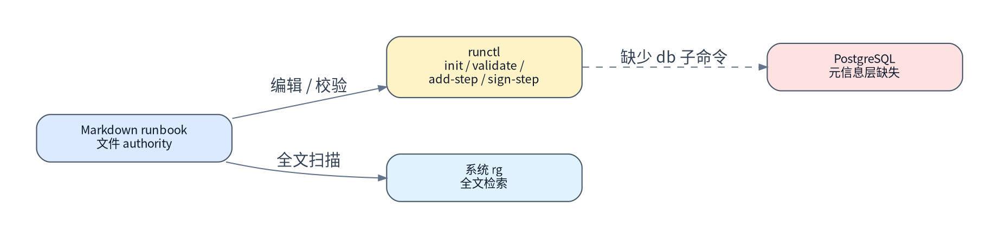
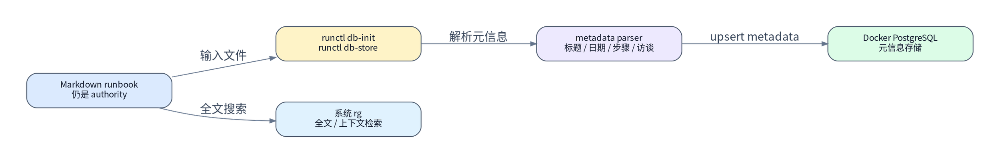
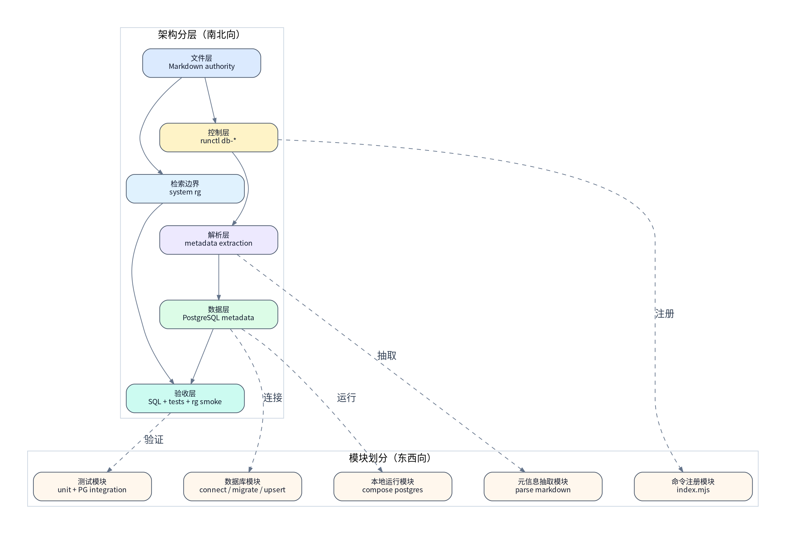

# runbook PostgreSQL 元信息存储设计文档

> [!NOTE]
> 当前 spec 类型：技术向 spec

> `runctl` 保持 Markdown runbook 的文件 authority，只把 runbook 元信息和结构化索引写入本地 PostgreSQL；全文内容与上下文检索继续交给系统 `rg` 扫描 Markdown 文件。

## 背景与现状

### 背景

> runbook workflow 需要可查询的结构化元信息，但不需要把 Markdown 全文复制进数据库。

`inority-workspace` 已经有 `skills/runbook/scripts/runctl` 作为 authority runbook 的统一编辑与校验入口。之前讨论过把 Markdown 原文、MCP grep 和本地数据库检索都纳入 PostgreSQL；最新口径调整为更保守的边界：PostgreSQL 只保存元信息，全文检索继续使用系统 `rg`，避免数据库承担文件 authority 和全文搜索职责。

本 spec 的上游执行手册是 [runbook 数据库 PostgreSQL helper 执行手册](../runbook/2026-05-08/runbook-db-postgres-helper-runbook.md)。后续 runbook 需要按本 spec 修订后再执行。

### 现状

> 当前系统只有 Markdown 文件 authority 和 `runctl` 文件工具链，没有本地 PostgreSQL 元信息层。

- 根目录 `package.json` 已有 `runbook:test`，对应 `node ./skills/runbook/tests/run.mjs`。
- `runctl` 命令注册集中在 `skills/runbook/scripts/commands/index.mjs`。
- 根目录当前没有 `docker-compose.yml`、`.env.example` 或 `RUNBOOK_DB_DSN` 约定。
- 系统 `rg` 已是本地文件全文检索的默认工具，不需要由数据库或 MCP 重新实现。

## 目标与非目标

### 目标

> 目标态是 `runctl` 能把 Markdown runbook 的结构化元信息写入 PostgreSQL，同时保留系统 `rg` 作为全文检索入口。

- 在 `inority-workspace` 根目录提供 `docker-compose.yml` 和 `.env.example`，固定本地 PostgreSQL 服务、端口、volume、数据库名和 DSN 变量。
- 在 `runctl` 中提供稳定的数据库子命令：`db-init` 初始化 schema，`db-store <runbook>` 写入 runbook 元信息。
- PostgreSQL 只保存文件级元信息、步骤索引和访谈索引，不保存 Markdown 原文。
- 全文内容、上下文、`-A/-B/-C` 等 grep 能力统一由系统 `rg` 直接扫描 Markdown 文件提供。
- 验收必须包含真实 Docker PostgreSQL 联调，不只依赖单元测试。

### 非目标

> 数据库是本地元信息索引层，不替代 Markdown 文件 authority，也不承担全文检索。

- 不把 PostgreSQL 变成 runbook 的唯一主存储。
- 不把 Markdown 原文存入数据库。
- 不建设 MCP grep、`runctl rg`、handbook 搜索页面、HTTP API、远端同步或多用户协作协议。
- 不迁移历史 runbook 存量数据；本次只提供 helper 和样例写入验收路径。
- 不定义生产 PostgreSQL 部署方案；本轮只覆盖本地 Docker PostgreSQL。

## 风险与红线

### 风险

> 主要风险集中在数据库边界漂移、解析完整度和本地 PostgreSQL 可用性。

- Docker 不可用、端口被占用或本地 volume 冲突，会阻塞真实 PG 联调。
- Markdown 解析若和 `runctl validate` 规则漂移，数据库元信息会和文件 authority 不一致。
- 如果数据库后续重新引入全文内容，会再次模糊 Markdown 文件 authority 和系统 `rg` 的职责边界。
- 如果 helper 静默读取不明确的 DSN，用户可能把测试数据写入错误数据库。

### 红线行为

> [!CAUTION]
> 不允许把 PostgreSQL 定义为唯一 authority；Markdown runbook 文件仍是人工审阅、执行和回滚的权威来源。

> [!CAUTION]
> 不允许把 Markdown 原文、全文片段或 grep 上下文写入 PostgreSQL。

> [!CAUTION]
> 不允许重新实现数据库 grep、MCP grep 或 `runctl rg`；全文检索必须回到系统 `rg`。

> [!CAUTION]
> 不允许提交 `.env`、真实密码、私有 DSN 或任何用户本地数据库凭据。

## 边界与契约

### 文件 authority 契约

> Markdown runbook 文件是输入 authority，数据库记录只是该文件的结构化元信息索引。

- `db-store <runbook>` 的输入必须是本地 Markdown 文件路径。
- helper 必须读取文件并计算稳定 hash；hash 变化代表同一路径下的内容快照变化。
- 数据库记录不得反向改写 Markdown 文件。
- 文件不存在、不是 Markdown、或不符合 runbook 最低结构时，helper 必须失败并输出可诊断错误。
- 全文检索、上下文定位和 `-A/-B/-C` 语义由系统 `rg` 直接读取 Markdown 文件完成。

### CLI 契约

> 数据库能力通过 `runctl` 子命令暴露，和现有 runbook 工具链保持一个入口。

- `skills/runbook/scripts/runctl db-init`：读取 `RUNBOOK_DB_DSN`，创建或迁移本地 schema。
- `skills/runbook/scripts/runctl db-store <runbook>`：读取同一 DSN，把 runbook 元信息 upsert 到 PostgreSQL。
- `--help` 必须展示新子命令和必要环境变量。
- 缺失 `RUNBOOK_DB_DSN` 时，命令必须以非 0 退出并给出明确错误。
- 新命令不得改变既有 `init`、`validate`、`add-step`、`sign-step`、`sync-records` 等子命令行为。
- 不新增 `runctl rg`；本地全文检索继续使用系统 `rg`。

### 数据库总体契约

> schema 只支持文件级元信息和常用 runbook 结构查询，不保存 Markdown 原文。

- `runbooks.path` 应是唯一键；同一路径重复写入更新该 runbook 的文件级元信息和派生索引。
- `runbooks.runbook_date` 应从路径中的 `docs/runbook/YYYY-MM-DD/` 日期目录解析；无法解析时保持 `null`，但不得阻断元信息写入。
- 派生索引应以事务方式替换：文件级记录更新成功但索引更新失败时，整体写入必须失败。
- 每张表都必须包含 `created_at` 和 `updated_at`；创建时同时写入，更新时只推进 `updated_at`。
- `runbook_steps.operation_level` 使用对齐 logging level 的整数：`10` 表示只读 / debug 级，`20` 表示幂等 / info 级，`40` 表示破坏性 / error 级。
- JSONB 可作为扩展字段承载后续解析结果，但首版不能用 JSONB 替代基础查询字段。

#### `runbooks`

> `runbooks` 保存文件级元信息、完成状态和幂等写入键。

**用途：**

- 作为 runbook 文件级主表。
- 保存路径、标题、模式、日期、hash 和完成时间。
- 为 `runbook_steps`、`runbook_interviews` 提供外键根记录。

**写入语义：**

- `path` 是唯一 upsert 键。
- 同一路径重复写入时更新文件级元信息、`content_hash`、`completed_at` 和 `updated_at`。
- `created_at` 只在首次创建时写入。

**字段说明：**

| 字段名 | 类型建议 | 约束 | 字段描述 |
| --- | --- | --- | --- |
| `id` | `uuid` | 主键 | runbook 数据库内部标识。 |
| `path` | `text` | 唯一、非空 | runbook Markdown 文件路径，是 `db-store` 的幂等 upsert 键。 |
| `runbook_date` | `date` | 可空 | 从 `docs/runbook/YYYY-MM-DD/` 路径段解析出的 runbook 日期，用于日期分片查询。 |
| `title` | `text` | 非空 | runbook H1 标题。 |
| `mode` | `text` | 非空 | runbook 模式，例如 `coding`、`operation`、`migration`。 |
| `content_hash` | `text` | 非空 | Markdown 文件内容 hash，用于判断同一路径内容是否变化；不代表数据库保存原文。 |
| `completed_at` | `timestamptz` | 可空 | runbook 最终验收完成时间；未完成时保持 `null`。 |
| `created_at` | `timestamptz` | 非空 | runbook 记录首次写入本地数据库的时间。 |
| `updated_at` | `timestamptz` | 非空 | runbook 记录最后一次 upsert 写入时间。 |

#### `runbook_steps`

> `runbook_steps` 保存执行计划步骤索引，支持按步骤和操作等级查询。

**用途：**

- 索引执行计划中的编号步骤。
- 支持按操作等级、步骤标题、执行/验收块完整性检索。

**写入语义：**

- 派生自当前 Markdown 文件。
- `db-store` 更新同一 runbook 时，在同一事务内替换该 runbook 的全部步骤索引。
- `operation_level` 对齐 logging level：`10` 只读、`20` 幂等、`40` 破坏性。

**字段说明：**

| 字段名 | 类型建议 | 约束 | 字段描述 |
| --- | --- | --- | --- |
| `id` | `uuid` | 主键 | 步骤索引内部标识。 |
| `runbook_id` | `uuid` | 外键、非空 | 关联 `runbooks.id`。 |
| `item_no` | `integer` | 非空 | 执行计划中的步骤编号。 |
| `title` | `text` | 非空 | 步骤标题，不含编号灯号时也应可读。 |
| `operation_level` | `integer` | 非空 | 操作等级，对齐 logging level：`10` 只读、`20` 幂等、`40` 破坏性。 |
| `has_execution` | `boolean` | 非空 | 是否解析到 `#### 执行` 块。 |
| `has_acceptance` | `boolean` | 非空 | 是否解析到 `#### 验收` 块。 |
| `created_at` | `timestamptz` | 非空 | 步骤索引首次写入本地数据库的时间。 |
| `updated_at` | `timestamptz` | 非空 | 步骤索引最后一次更新的时间。 |

#### `runbook_interviews`

> `runbook_interviews` 保存访谈记录索引，支持按决策来源检索和问答数量验收。

**用途：**

- 索引 spec/runbook 规划阶段真实用户问答。
- 支持按问题、回答和收敛影响检索决策来源。
- 支持验收访谈数量是否达到要求。

**写入语义：**

- 派生自当前 Markdown 文件中的 `## 访谈记录`。
- `position` 保留访谈记录在文档中的顺序。
- `db-store` 更新同一 runbook 时，在同一事务内替换该 runbook 的全部访谈索引。

**字段说明：**

| 字段名 | 类型建议 | 约束 | 字段描述 |
| --- | --- | --- | --- |
| `id` | `uuid` | 主键 | 访谈记录索引内部标识。 |
| `runbook_id` | `uuid` | 外键、非空 | 关联 `runbooks.id`。 |
| `position` | `integer` | 非空 | 访谈记录在文档中的顺序。 |
| `question` | `text` | 非空 | 访谈问题正文。 |
| `answer` | `text` | 非空 | 用户回答正文。 |
| `impact` | `text` | 非空 | 该轮问答对边界、契约或验收的收敛影响。 |
| `created_at` | `timestamptz` | 非空 | 访谈索引首次写入本地数据库的时间。 |
| `updated_at` | `timestamptz` | 非空 | 访谈索引最后一次更新的时间。 |

### Docker 与环境契约

> 本地 runbook 元信息存储栈必须可以通过根目录 compose 启动 PostgreSQL。

- 根目录 `docker-compose.yml` 必须提供 `postgres` service。
- `postgres` service 负责本地 PostgreSQL 元信息存储，必须配置健康检查、持久化 volume 和可选本机端口映射。
- `.env.example` 提供 `POSTGRES_DB`、`POSTGRES_USER`、`POSTGRES_PASSWORD`、`POSTGRES_PORT`、`RUNBOOK_DB_DSN` 示例。
- `.env` 继续保持未提交状态。
- compose 的 volume 名称必须能识别为 runbook 本地数据库用途，避免和其他项目 PostgreSQL volume 混淆。

## 架构总览

> 总体架构把文件 authority、CLI 控制面、解析层和本地元信息数据层串成一条可验收链路。

`runctl` 是唯一数据库写入入口，parser 和 database 模块是其内部实现细节。Docker compose 只提供本地 PostgreSQL 运行面。系统 `rg` 是独立的文件全文检索入口，不经过数据库。

## 架构分层

### 文件层

> 文件层保存人工可审阅的 runbook authority。

输入是 `docs/runbook/<date>/<topic>-runbook.md` 这类 Markdown 文件。该层继续承载标题、模式、步骤、访谈记录、最终验收和全文内容；数据库不能替代它的审阅和执行地位。

### 控制层

> 控制层把数据库元信息能力挂进 `runctl`。

控制层负责参数解析、环境变量检查、错误输出和子命令分发。`db-init` 与 `db-store` 必须按现有 `runctl` 风格返回退出码，不能要求用户绕到单独脚本。

### 解析层

> 解析层把 Markdown authority 转成数据库元信息索引，但不保存原文。

解析层读取标题、模式 note、路径日期、执行计划步骤、访谈记录和最终完成状态。解析失败时应阻断写入，避免数据库存入无法解释的半结构化结果。

### 数据层

> 数据层使用本地 Docker PostgreSQL 保存元信息和索引。

数据层通过 `RUNBOOK_DB_DSN` 连接 PostgreSQL。schema 初始化与 upsert 必须可重复执行，方便本地开发和联调反复运行。

### 检索边界

> 全文检索边界固定为系统 `rg`，不进入数据库和 `runctl`。

系统 `rg` 直接扫描 Markdown 文件，负责关键词、上下文和常见 `rg` 参数语义。数据库只回答结构化元信息查询，不承担全文片段检索。

### 验收层

> 验收层同时检查单元逻辑、真实 PG 写入结果和系统 `rg` 可用性。

验收层包括 `npm run runbook:test`、`docker compose config`、真实 `docker compose up -d postgres`、`db-init`、`db-store`、SQL 查询和系统 `rg` smoke check。任何只在 mock 中通过的实现都不满足完成定义。

## 模块划分

### 命令注册模块

> 命令注册模块只负责把 `db-init` 和 `db-store` 暴露为稳定 `runctl` 子命令。

- 修改点集中在 `skills/runbook/scripts/commands/index.mjs` 及新增 command handler。
- 参数解析沿用当前 `runctl` 轻量 parser，不引入第二套 CLI 框架。
- help 文本必须包含数据库命令，避免隐藏入口。

### 数据库模块

> 数据库模块负责连接、schema 初始化、事务和 upsert。

- 连接串来源只允许 `RUNBOOK_DB_DSN` 或显式 CLI 参数；首版默认只要求 `RUNBOOK_DB_DSN`。
- schema 初始化应可重复运行。
- `db-store` 应在一个事务内完成 `runbooks` 更新和派生索引替换。

### 元信息抽取模块

> 元信息抽取模块负责从 Markdown 中提取可查询字段，但不保存原文。

- 文件级字段：`path`、`runbook_date`、`title`、`mode`、`content_hash`、`completed_at`。
- 步骤字段：编号、标题、操作等级、是否包含执行与验收块。
- 访谈字段：问题、回答、收敛影响、顺序。
- 最终完成字段：最终验收完成时写入 `completed_at`；未完成时保持 `null`。

### 本地运行模块

> 本地运行模块让 PostgreSQL 可以被发现、启动、检查和清理。

- 根目录 `docker-compose.yml` 是本地 `postgres` 栈的默认入口。
- `postgres` service 必须有健康检查。
- `.env.example` 是 PostgreSQL 和 DSN 变量名的 authority。
- `.env` 不进入 Git。

### 测试模块

> 测试模块需要同时覆盖无数据库快速验证和真实数据库联调。

- 单元测试覆盖解析、SQL/schema 生成、缺失 DSN 错误、重复写入语义。
- 联调测试或手工验收覆盖真实 PostgreSQL schema 初始化、写入和 SQL 查询。
- 系统 `rg` smoke check 只验证文件全文检索边界可用，不进入数据库测试。
- 新测试纳入 `npm run runbook:test` 或在 spec 中明确额外联调命令。

## 方案对比

### 存储粒度方案对比

| 维度 | 方案 A：元信息 + 结构化索引 | 方案 B：原文 + 结构化索引 | 方案 C：只存结构化数据且不保留 hash |
| --- | --- | --- | --- |
| authority 边界 | 🟢 Markdown 原文只在文件中，边界清楚 | 🟡 原文在文件和数据库重复 | 🔴 缺少内容变化判断 |
| 查询能力 | 🟢 可按日期、模式、步骤、访谈查询 | 🟢 可查询结构和全文 | 🟡 结构可查但难以判断文件变化 |
| 实现复杂度 | 🟢 表结构较小，写入简单 | 🟡 需要处理大 text 和全文检索 | 🟢 简单但能力不足 |
| 推荐结论 | 🟢 首选方案 | 🔴 最新口径不采用 | 🟡 不推荐 |

> [!NOTE]
> 对比结论：当前推荐“元信息 + 结构化索引”，全文检索交给系统 `rg`。

### 全文检索方案对比

| 维度 | 方案 A：系统 `rg` 扫 Markdown | 方案 B：数据库全文检索 | 方案 C：MCP / runctl grep |
| --- | --- | --- | --- |
| 边界清晰度 | 🟢 文件 authority 与全文检索一致 | 🟡 数据库复制原文后边界变复杂 | 🔴 会引入第二套 grep 语义 |
| `rg` 参数兼容 | 🟢 原生支持 `-A/-B/-C` 等参数 | 🟡 需要重新映射 | 🟡 需要持续追平 |
| 实现成本 | 🟢 不新增实现 | 🔴 需要全文存储和 ranking | 🔴 需要 CLI/MCP 双入口 |
| 推荐结论 | 🟢 首选方案 | 🔴 不采用 | 🔴 不采用 |

> [!NOTE]
> 对比结论：当前推荐系统 `rg`，数据库不保存 `runbook_content`，也不提供 `runbook_grep` 或 `runctl rg`。

### compose 栈方案对比

| 维度 | 方案 A：根目录 compose 启动 postgres | 方案 B：skill 专属 compose | 方案 C：不提交 compose |
| --- | --- | --- | --- |
| 本地发现成本 | 🟢 根目录最容易发现和启动 | 🟡 需要进入 skill 子目录 | 🔴 需要用户另行准备 PG |
| workspace 影响面 | 🟡 会增加根目录文件 | 🟢 限定在 runbook skill 内 | 🟡 文件少但环境不可复现 |
| 联调可靠性 | 🟢 和 `runctl` 在同一 repo 根执行 | 🟡 需要路径说明 | 🔴 不能满足 Docker + PG 目标 |
| 推荐结论 | 🟢 首选方案 | 🟡 仅当根目录不允许新增 compose 时使用 | 🔴 不选 |

> [!NOTE]
> 对比结论：当前推荐根目录 `docker-compose.yml` + `.env.example` 启动 `postgres`，因为本地交付目标只需要 Docker PostgreSQL 元信息层。

## 验收标准

- [ ] `docs/specs/runbook-postgres-storage-spec.md` 通过 `skills/write-spec/scripts/specctl validate`。
- [ ] 根目录存在 `docker-compose.yml` 和 `.env.example`，且 `.env.example` 定义 `RUNBOOK_DB_DSN` 与 PostgreSQL 基础变量。
- [ ] `docker compose config` 能解析 `postgres` service。
- [ ] `docker compose up -d postgres` 能启动 PostgreSQL，且健康检查通过。
- [ ] `skills/runbook/scripts/runctl --help` 展示 `db-init` 和 `db-store`，不展示 `rg`。
- [ ] 缺少 `RUNBOOK_DB_DSN` 时，`db-init` / `db-store` 以非 0 退出并输出明确错误。
- [ ] `db-init` 能在真实 Docker PostgreSQL 中创建或迁移 schema。
- [ ] `db-store docs/runbook/2026-05-08/runbook-db-postgres-helper-runbook.md` 能写入 `runbooks` 元信息、步骤索引、访谈记录索引和 `completed_at` 完成状态。
- [ ] 数据库 schema 不包含 `runbook_content` 表，也不包含保存 Markdown 原文的 `content` 字段。
- [ ] 重复执行 `db-store` 不生成不可控重复记录。
- [ ] `npm run runbook:test` 通过。
- [ ] 系统 `rg` 能直接扫描 `docs/runbook` 下的 Markdown 文件并返回上下文。
- [ ] 真实 PostgreSQL 查询能证明 `runbooks`、`runbook_steps`、`runbook_interviews` 至少包含本次样例 runbook 的数据。

## 访谈记录

> Q：这个“runbook 存本地数据库 + Docker PostgreSQL + helper”要落在哪个项目里？
>
> A：`inority-workspace`

收敛影响：目标 repo 固定为 `inority-workspace`，spec 不覆盖其他业务项目或单独插件仓库。

> Q：helper 入口你希望怎么做？
>
> A：接入现有 `skills/runbook/scripts/runctl`

收敛影响：CLI 契约固定为 `runctl` 子命令，不新建脱离 runbook 工具链的旁路 helper。

> Q：数据库里保存 runbook 的粒度你希望是哪一种？
>
> A：Markdown 原文 + 解析后的结构化索引

收敛影响：这曾经推动 schema 包含原文表；最新问答已覆盖该结论，改为只存元信息。

> Q：Docker PostgreSQL 栈怎么落地？
>
> A：新增 repo 根目录 `docker-compose.yml` + `.env.example`

收敛影响：本地数据库运行契约固定在 workspace 根目录，方便 `runctl` 联调和用户发现。

> Q：这次 authority 的验收范围选哪种？
>
> A：必须包含真实 Docker PostgreSQL 联调

收敛影响：验收标准必须包含真实 PostgreSQL schema 初始化、写入和 SQL 查询验证，不能只靠单元测试。

> Q：数据库是否仍保存 runbook_content，并由数据库或 MCP 提供 rg 风格搜索？
>
> A：数据库不要存 `runbook_content`，只存元信息，`rg` 留给系统 `rg` 去搜。

收敛影响：移除 `runbook_content`、`runbook_grep`、`runctl rg` 和 MCP grep 目标，全文检索回到系统 `rg`。

## 参考资料

- [runbook 数据库 PostgreSQL helper 执行手册](../runbook/2026-05-08/runbook-db-postgres-helper-runbook.md)
- [runbook skill](../../skills/runbook/SKILL.md)
- [runctl command registry](../../skills/runbook/scripts/commands/index.mjs)
- [runbook tests](../../skills/runbook/tests/run.mjs)
- [workspace package scripts](../../package.json)
