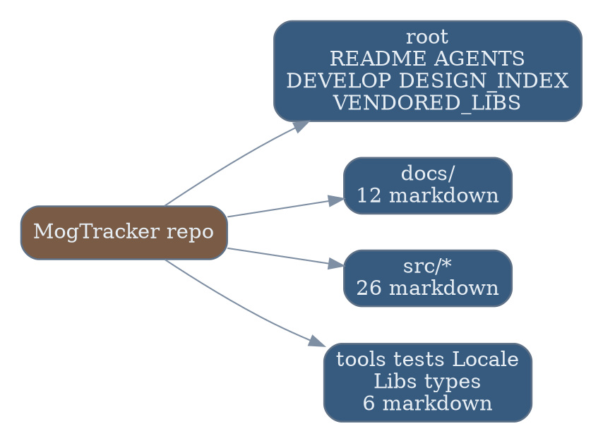
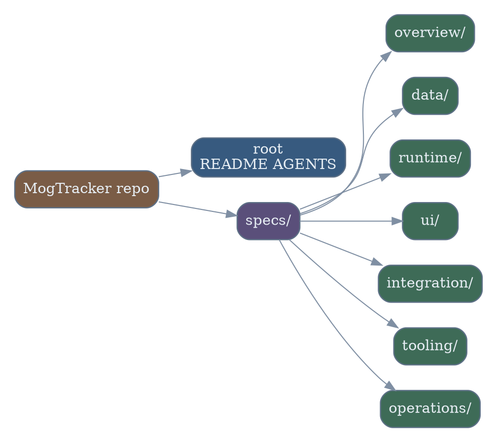
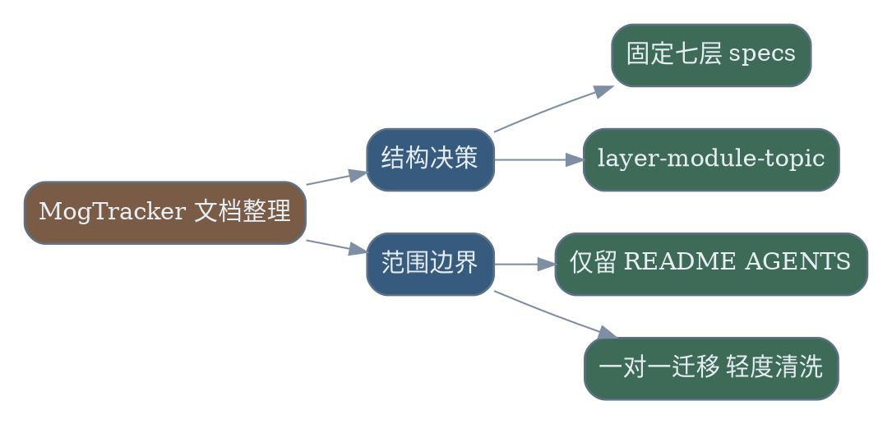

# MogTracker 文档整理与 Specs 重构 Runbook

## 背景与现状
### 背景
- MogTracker 当前文档散落在仓库根目录、`docs/`、`src/*`、`tools/`、`tests/`、`Locale/`、`Libs/`、`types/` 等多处，阅读入口和维护边界不统一。
- 本次整理的目标已经由用户限定为两条硬约束：根 `README.md` 只承担“项目简介 + 如何使用”；除根 `README.md` 和根 `AGENTS.md` 外，其余 Markdown 必须进入 `specs/`。
- 用户要求 `specs/` 采用纵向技术分层，并统一文件名为 kebab-case，避免文档继续按历史目录自然生长。

### 现状
- 现场侦察命令：`rg --files C:\Users\Terence\workspace\MogTracker -g "*.md"`。
- 现场结果：当前仓库共有 `49` 个 Markdown 文件，其中根目录 `5` 个、`docs/` `12` 个、`src/*` `26` 个、基础设施目录 `6` 个。
- 根目录当前包含：`README.md`、`AGENTS.md`、`DEVELOP.md`、`DESIGN_INDEX.md`、`VENDORED_LIBS.md`。
- `docs/` 当前包含面板、存储、runtime 方案与重构文档；`src/*` 下广泛存在模块级 `README.md` / `DESIGN.md`；`tools/fixtures/README.md`、`tests/DESIGN.md`、`Locale/DESIGN.md`、`Libs/DESIGN.md`、`types/DESIGN.md` 也各自分散。
- 这意味着本次执行至少会迁移 `47` 个 Markdown 文件，且需要同时处理目录重组、命名统一、README 角色收缩、交叉链接修正。



## 目标与非目标
### 目标
- 根目录最终只保留 `README.md` 与 `AGENTS.md` 两个 Markdown 文件。
- 其余 `47` 个 Markdown 文件全部进入 `specs/`，不再留在原来的根目录、`docs/`、`src/*`、`tools/`、`tests/`、`Locale/`、`Libs/`、`types/`。
- `specs/` 顶层固定为：`overview/`、`data/`、`runtime/`、`ui/`、`integration/`、`tooling/`、`operations/`。
- 迁移粒度采用“一对一保留”：一个源文档对应一个 `specs/` 目标文档，不做跨源文档合并。
- 文件名统一采用 `layer-module-topic.md` 风格的 kebab-case。
- 内容处理强度为“轻度清洗”：允许去重、补交叉引用、修正明显过期表述，但不做大规模重写。



### 非目标
- 不修改 Lua/XML/TS 业务代码，不顺带做架构重构。
- 不改动根 `AGENTS.md` 的位置和职责。
- 不把多个源文档合并成一个目标文档。
- 不把根 `README.md` 扩回维护手册或设计索引。
- 不在本 runbook 中直接执行迁移；本文件只定义生产级执行手册。

## 风险与收益
### 风险
1. `47` 个文档一对一迁移后，如果交叉链接或相对路径没有一起改，`README.md` 和 specs 内链会立即失效。
2. 纵向分层虽然已确定，但某些文档跨 `runtime / ui / tooling / operations` 边界，若归类标准不一致，会留下新的“找不到文档”问题。
3. 轻度清洗如果没有边界，容易把“格式整理”做成“内容重写”，从而偏离原始技术口径。
4. 根 `README.md` 收缩到简介和使用后，如果没有把维护型内容同步导向 `specs/`，维护者会失去入口。

### 收益
1. 文档入口收敛到 `README.md + specs/`，检索路径稳定，维护成本显著下降。
2. `specs/` 的技术分层固定后，新文档不再依赖历史源码目录自然生长，后续扩展更可控。
3. `layer-module-topic.md` 命名统一后，跨目录搜索、排序、链接和 review 都更直接。
4. 一对一迁移保留了源文档可追溯性，后续回查历史语义时不需要猜“哪几篇被合并了”。

## 红线行为
- 不移动或改写根 `AGENTS.md`。
- 不在迁移完成后留下除根 `README.md` 和根 `AGENTS.md` 之外的仓库外层 Markdown 残留。
- 不使用非 kebab-case 的新文件名。
- 不把多个源文档硬合并成一个目标文档。
- 不在链接校验通过前删除或提交源文档删除。
- 不把“轻度清洗”扩张成大规模内容重写。

## 访谈记录
### 访谈 1 - 分层结构
> Q:
> `specs/` 的纵向分层要采用哪一种主结构？
>
> A:
> `overview / data / runtime / ui / integration / tooling / operations`

### 访谈 2 - 保留边界
> Q:
> 除了根目录 `README.md` 外，哪些 Markdown 可以保留在原位？
>
> A:
> 只保留根 `README.md` 和根 `AGENTS.md`，其余 Markdown 全部进入 `specs/`。

### 访谈 3 - 迁移粒度
> Q:
> `src/*`、`tools/*`、`tests/*` 这些分散文档进入 `specs/` 后，采用什么归档粒度？
>
> A:
> 按模块一对一保留，每个源文档对应一个目标文档。

### 访谈 4 - 命名规则
> Q:
> `specs/` 内统一命名规则采用什么基准？
>
> A:
> 采用 `层级-模块-主题.md` 作为统一命名规则。

### 访谈 5 - 改写力度
> Q:
> 文档内容本身的处理力度采用哪种强度？
>
> A:
> 以迁移重组为主，并做轻度清洗：去重、补交叉引用、修正明显过期表述，但不做大规模重写。

## 思维脑图


## 执行计划
### 步骤 1 - 冻结现状并生成迁移清单
#### 执行
- 在 `MogTracker/` 根目录执行：
  ```powershell
  rg --files . -g "*.md"
  ```
- 以本 runbook 的现场侦察为基线，生成一份迁移清单，按下列规则逐条列出 `source -> target`：
  - 根目录 `README.md`、`AGENTS.md` 标记为 `retain`。
  - 其余所有 Markdown 标记为 `move`。
  - `layer` 取值只能来自 `overview / data / runtime / ui / integration / tooling / operations`。
  - `module` 取值优先使用稳定责任域，例如 `project`、`runtime`、`core`、`data`、`storage`、`metadata`、`ui`、`config`、`dashboard`、`loot`、`debug`、`locale`、`libs`、`types`、`tests`、`tools`、`fixtures`。
  - `topic` 由原文件主题归一化为 kebab-case，并去掉与 `layer`、`module` 完全重复的冗余词。
- 至少覆盖以下高频映射模式：
  - `docs/ConfigPanel.md` -> `specs/ui/ui-config-panel.md`
  - `docs/DashboardPanel.md` -> `specs/ui/ui-dashboard-panel.md`
  - `docs/DebugPanel.md` -> `specs/ui/ui-debug-panel.md`
  - `docs/LootPanel.md` -> `specs/ui/ui-loot-panel.md`
  - `docs/Panels.md` -> `specs/ui/ui-panels-overview.md`
  - `docs/StorageArchitecture.md` -> `specs/data/data-storage-architecture.md`
  - `docs/transmog-data-storage-plan.md` -> `specs/data/data-transmog-storage-plan.md`
  - `docs/runtime-lightweight-data-contracts.md` -> `specs/runtime/runtime-lightweight-data-contracts.md`
  - `DEVELOP.md` -> `specs/operations/operations-developer-workflow.md`
  - `DESIGN_INDEX.md` -> `specs/overview/overview-project-design-index.md`
  - `VENDORED_LIBS.md` -> `specs/tooling/tooling-vendored-libs.md`

#### 验收
- 迁移清单中的文档总数必须等于现场侦察结果：`49`。
- `retain` 项必须只有两条：`README.md`、`AGENTS.md`。
- `move` 项必须为 `47` 条，且每一条都已有唯一目标路径。
- 目标路径全部位于 `specs/`，且文件名全部符合正则：`^[a-z0-9]+-[a-z0-9-]+-[a-z0-9-]+\.md$`。

### 步骤 2 - 创建 specs 目录骨架与命名约束
#### 执行
- 在 `MogTracker/` 根目录执行：
  ```powershell
  New-Item -ItemType Directory -Force specs, specs\overview, specs\data, specs\runtime, specs\ui, specs\integration, specs\tooling, specs\operations | Out-Null
  ```
- 在迁移清单中补齐每个目标文件的三段式命名依据：
  - `layer`: 技术层。
  - `module`: 稳定责任域。
  - `topic`: 主题归一化。
- 对“跨层文档”使用以下归类原则，不再临时拍板：
  - 面板、交互、dashboard、loot、config、ui 相关文档归 `ui/`。
  - storage、metadata、data、transmog 数据模型相关文档归 `data/`。
  - runtime、core、事件流、轻量索引重构相关文档归 `runtime/`。
  - Locale、Libs、types 等外部契约边界文档归 `integration/`。
  - tools、fixtures、tests、vendored libs 相关文档归 `tooling/`。
  - developer workflow、debug capture、维护流程相关文档归 `operations/`。

#### 验收
- `specs/` 下只存在且仅存在七个顶层技术目录。
- 迁移清单中的每个目标文件都能解释清楚其 `layer`、`module`、`topic` 三段来源。
- 不存在需要“执行时再决定”的模糊落位。

### 步骤 3 - 迁移根目录与 docs 目录文档
#### 执行
- 按迁移清单对根目录与 `docs/` 文档执行 `git mv`，例如：
  ```powershell
  git mv DEVELOP.md specs/operations/operations-developer-workflow.md
  git mv DESIGN_INDEX.md specs/overview/overview-project-design-index.md
  git mv VENDORED_LIBS.md specs/tooling/tooling-vendored-libs.md
  git mv docs/ConfigPanel.md specs/ui/ui-config-panel.md
  git mv docs/DashboardPanel.md specs/ui/ui-dashboard-panel.md
  git mv docs/DebugPanel.md specs/ui/ui-debug-panel.md
  git mv docs/LootPanel.md specs/ui/ui-loot-panel.md
  git mv docs/Panels.md specs/ui/ui-panels-overview.md
  git mv docs/StorageArchitecture.md specs/data/data-storage-architecture.md
  git mv docs/transmog-data-storage-plan.md specs/data/data-transmog-storage-plan.md
  ```
- 对迁移后的文件做轻度清洗：
  - 标题层级统一。
  - 明显重复段落去重。
  - 原相对链接改到新位置。
  - 明显过期表述补充“历史口径”或直接修正。

#### 验收
- 根目录 Markdown 文件只剩 `README.md` 与 `AGENTS.md`。
- 原 `docs/` 下不再残留 Markdown 文件。
- 迁移后的目标文件可以从 `README.md` 或 `specs/overview/` 导航到。
- `git diff --name-status` 显示的变更以 `R` / `M` 为主，而不是大面积删除后重建无映射。

### 步骤 4 - 一对一迁移 src 与基础设施文档
#### 执行
- 按迁移清单继续处理 `src/*`、`tools/`、`tests/`、`Locale/`、`Libs/`、`types/` 下的 Markdown。
- 迁移时遵守以下一对一映射规则：
  - `src/runtime/*`、`src/core/*`、runtime 重构计划进入 `specs/runtime/`。
  - `src/data/*`、`src/storage/*`、`src/metadata/*`、存储与 transmog 文档进入 `specs/data/`。
  - `src/ui/*`、`src/config/*`、`src/dashboard/*`、`src/loot/*`、各 panel 文档进入 `specs/ui/`。
  - `tools/*`、`tools/fixtures/*`、`tests/*`、`VENDORED_LIBS.md` 关联内容进入 `specs/tooling/`。
  - `Locale/`、`Libs/`、`types/` 文档进入 `specs/integration/`。
- 每迁移一个文件就同步修正其内部相对链接，不留“最后统一改链接”的尾账。

#### 验收
- `src/`、`tools/`、`tests/`、`Locale/`、`Libs/`、`types/` 下不再残留 Markdown 文件。
- 每个源文档都能在 `specs/` 中找到唯一对应目标文档。
- 抽样检查至少 10 个迁移后的文件，确认标题、链接、引用路径都已更新到新位置。

### 步骤 5 - 收缩 README 并补齐 specs 入口
#### 执行
- 将根 `README.md` 收缩到两类内容：
  - 项目简介。
  - 如何使用。
- 把原本属于维护、设计、实现、架构、工具链、调试的内容移出或改写为指向 `specs/` 的入口链接。
- 在 `README.md` 中新增 `specs/` 导航段，至少给出七个顶层目录的入口说明。
- 在 `specs/overview/` 下准备一个总览文档，作为未来设计索引的稳定入口，例如保留由 `DESIGN_INDEX.md` 迁移而来的索引页。

#### 验收
- 根 `README.md` 不再承担开发手册、设计索引、工具链说明。
- 根 `README.md` 明确指向 `specs/`，且用户首次进入仓库能理解“简介/使用看 README，设计/实现看 specs”。
- `specs/overview/` 至少有一个总览入口文档。

### 步骤 6 - 全量校验与收尾提交
#### 执行
- 在 `MogTracker/` 根目录执行：
  ```powershell
  rg --files . -g "*.md"
  ```
- 再执行一次外层残留检查，确认除根 `README.md` 和根 `AGENTS.md` 外，没有任何 Markdown 留在 `specs/` 之外。
- 执行链接和命名抽查：
  - 搜索旧路径引用，如 `docs/`, `src/.../README.md`, `src/.../DESIGN.md`。
  - 搜索非 kebab-case 目标文件名。
- 整理提交说明，强调这是“文档重组 + 轻度清洗”，不是代码改造。

#### 验收
- `rg --files . -g "*.md"` 的结果中，除根 `README.md`、根 `AGENTS.md` 外，其余 Markdown 全部位于 `specs/`。
- `specs/` 内文件名全部符合 `layer-module-topic.md` 规范。
- 常见旧路径引用已清零或全部被显式标记为历史记录。
- `git status --short` 中的变更集合与 runbook 目标一致，不含无关代码改动。

## 执行记录
### 步骤 1 - 冻结现状并生成迁移清单
#### 执行 @吕布 2026-04-22 08:45 CST
- 在 `MogTracker/` 根目录执行 `rg --files . -g "*.md"`，确认本次执行面仍是 `49` 个 Markdown。
- 按 runbook 固化一份 `47 move + 2 retain` 的一对一迁移清单；保留项为 `README.md`、`AGENTS.md`，其余全部映射到 `specs/overview|data|runtime|ui|integration|tooling|operations`。
- 迁移清单覆盖了根目录、`docs/`、`src/*`、`tools/`、`tests/`、`Locale/`、`Libs/`、`types/` 全部 `47` 篇目标文档。

#### 验收 @吕布 2026-04-22 08:45 CST
- 复核命令输出：`ALL=49`、`MOVE=47`。
- 根目录保留集复核为 `README.md`、`AGENTS.md` 两项，没有第三个保留 Markdown。
- 迁移清单中的高频样例已命中计划：`DEVELOP.md -> specs/operations/operations-developer-workflow.md`、`docs/ConfigPanel.md -> specs/ui/ui-config-panel.md`、`docs/StorageArchitecture.md -> specs/data/data-storage-architecture.md`。

### 步骤 2 - 创建 specs 目录骨架与命名约束
#### 执行 @吕布 2026-04-22 08:45 CST
- 创建 `specs/overview`、`specs/data`、`specs/runtime`、`specs/ui`、`specs/integration`、`specs/tooling`、`specs/operations` 七个顶层目录。
- 将 `47` 个目标文件名全部收敛到 `layer-module-topic.md` 形式，并按 runbook 的层级规则固定 `layer/module/topic`。

#### 验收 @吕布 2026-04-22 08:45 CST
- `Get-ChildItem specs -Directory` 返回：`data`、`integration`、`operations`、`overview`、`runtime`、`tooling`、`ui`。
- 文件名正则检查结果为 `OK`：`specs/` 下全部 Markdown 都符合 `^specs/(overview|data|runtime|ui|integration|tooling|operations)/[a-z0-9]+-[a-z0-9-]+-[a-z0-9-]+\\.md$`。

### 步骤 3 - 迁移根目录与 docs 目录文档
#### 执行 @吕布 2026-04-22 08:45 CST
- 使用 `git mv` 迁移根目录与 `docs/` 文档到 `specs/`，包括 `DEVELOP.md`、`DESIGN_INDEX.md`、`VENDORED_LIBS.md` 以及 `docs/*.md`。
- 对迁移后的根/docs 文档执行一轮链接重写，修正 `README.md`、`specs/ui/ui-panels-overview.md`、`specs/overview/overview-project-design-index.md` 的 moved-link 目标。
- 对 `runtime` 方案文档执行额外绝对路径清洗，把旧 AddOn 物理路径 `/C:/World of Warcraft/_retail_/Interface/AddOns/MogTracker/...` 改写为仓库内相对链接。

#### 验收 @吕布 2026-04-22 08:45 CST
- 根目录 Markdown 复核结果：`ROOT=2`，仅剩 `AGENTS.md`、`README.md`。
- `docs/` Markdown 复核结果：`DOCS=0`。
- `git diff --name-status -- README.md specs` 显示根/docs 文档以 `R` / `RM` / `M` 进入 `specs/`，没有“大面积删除后重建无映射”的形态。

### 步骤 4 - 一对一迁移 src 与基础设施文档
#### 执行 @吕布 2026-04-22 08:45 CST
- 使用 `git mv` 继续迁移 `src/*`、`tools/`、`tests/`、`Locale/`、`Libs/`、`types/` 下全部 Markdown 到 `specs/`。
- 补做迁移后的文案清洗：`specs/overview/overview-docs-folder-design.md` 改为 legacy 说明，`specs/ui/ui-loot-overview.md` 去掉失效的 `docs/DropPanelCollectedVisibilityFlow.md` 指向。
- 对 `README.md` 与 `specs/` 做两轮批量改链，修正 moved-link、Windows 反斜杠 href 和旧 AddOn 绝对路径链接。

#### 验收 @吕布 2026-04-22 08:45 CST
- 旧目录残留复核：`SRC=0`、`INFRA=0`。
- 链接残留检查结果为 `OK`：`rg -n '\\]\\([^)]*(docs/|src/.+README\\.md|src/.+DESIGN\\.md|/C:/World%20of%20Warcraft/_retail_/Interface/AddOns/MogTracker/)' README.md specs --glob '*.md'` 未发现旧目标路径残留。
- 抽样复核已覆盖 `ui-panels-overview.md`、`overview-project-design-index.md`、`runtime-lightweight-data-contracts.md`、`runtime-index-refactor-current-state.md` 等迁移后文档，链接已指向新位置。

### 步骤 5 - 收缩 README 并补齐 specs 入口
#### 执行 @吕布 2026-04-22 08:45 CST
- 重写根 `README.md`，只保留三部分：项目简介、如何使用、`specs/` 导航。
- 在 `README.md` 中显式加入 `specs/overview|data|runtime|ui|integration|tooling|operations` 七层入口。
- 保留 `specs/overview/overview-project-design-index.md` 作为稳定总览入口，并让 README 阅读顺序首先导向该页。

#### 验收 @吕布 2026-04-22 08:45 CST
- `README.md` 当前只包含 `如何使用` 与 `Specs 导航` 两个主段，不再承载原先的大型架构、事件流和开发手册正文。
- `README.md` 已明确说明“设计、实现和维护文档统一位于 `specs/`”。
- `specs/overview/overview-project-design-index.md` 存在且可作为总览入口文档使用。

### 步骤 6 - 全量校验与收尾提交
#### 执行 @吕布 2026-04-22 08:45 CST
- 执行全量扫描与残留检查：`rg --files . -g "*.md"`、根目录计数、旧目录 Markdown 计数、旧链接残留检查、`specs/` 文件名正则检查。
- 复核 `git diff --name-status -- README.md specs` 与 `git status --short`，确认变更面仍然集中在文档迁移与轻度清洗。
- 按 workspace 规则补充两个可复用 postmortem 到 `.codex/memory.md`：Windows Markdown 链接归一化，以及批量文档改写误触 `node_modules` 的排除策略。

#### 验收 @吕布 2026-04-22 08:45 CST
- 全量扫描结果仍为 `49` 个 Markdown；其中根目录 `2` 个，其余 `47` 个全部位于 `specs/`。
- `specs/` 文件名正则检查结果为 `OK`，旧目标路径链接检查结果为 `OK`。
- `git status --short` 显示的改动集合与 runbook 目标一致，主体为根 `README.md` 修改与 `47` 篇 Markdown 迁移到 `specs/`。

## 最终验收
- 根目录最终只保留 `README.md` 与 `AGENTS.md` 两个 Markdown 文件。
- 其余 Markdown 全部位于 `specs/overview|data|runtime|ui|integration|tooling|operations` 之一。
- 所有目标文件都符合 kebab-case 的 `layer-module-topic.md` 规范。
- `README.md` 只负责项目简介与如何使用，并明确导向 `specs/`。
- 全量扫描、抽样链接检查、`git status` 结果都证明这次变更是文档重组而不是代码漂移。
- 执行模式：`Solo`，执行与验收均由 `@吕布` 归档完成。

## 参考文献
- [MogTracker README](</abs/c:/Users/Terence/workspace/MogTracker/README.md:1>)
- [MogTracker AGENTS](</abs/c:/Users/Terence/workspace/MogTracker/AGENTS.md:1>)
- [MogTracker DEVELOP](</abs/c:/Users/Terence/workspace/MogTracker/DEVELOP.md:1>)
- [MogTracker DESIGN_INDEX](</abs/c:/Users/Terence/workspace/MogTracker/DESIGN_INDEX.md:1>)
- [MogTracker VENDORED_LIBS](</abs/c:/Users/Terence/workspace/MogTracker/VENDORED_LIBS.md:1>)
- [docs/ConfigPanel.md](</abs/c:/Users/Terence/workspace/MogTracker/docs/ConfigPanel.md:1>)
- [docs/DashboardPanel.md](</abs/c:/Users/Terence/workspace/MogTracker/docs/DashboardPanel.md:1>)
- [docs/DebugPanel.md](</abs/c:/Users/Terence/workspace/MogTracker/docs/DebugPanel.md:1>)
- [docs/LootPanel.md](</abs/c:/Users/Terence/workspace/MogTracker/docs/LootPanel.md:1>)
- [docs/StorageArchitecture.md](</abs/c:/Users/Terence/workspace/MogTracker/docs/StorageArchitecture.md:1>)
- [src/DESIGN.md](</abs/c:/Users/Terence/workspace/MogTracker/src/DESIGN.md:1>)
- [src/runtime/DESIGN.md](</abs/c:/Users/Terence/workspace/MogTracker/src/runtime/DESIGN.md:1>)
- [src/ui/DESIGN.md](</abs/c:/Users/Terence/workspace/MogTracker/src/ui/DESIGN.md:1>)
- [tools/fixtures/README.md](</abs/c:/Users/Terence/workspace/MogTracker/tools/fixtures/README.md:1>)
- [tests/DESIGN.md](</abs/c:/Users/Terence/workspace/MogTracker/tests/DESIGN.md:1>)
- [Locale/DESIGN.md](</abs/c:/Users/Terence/workspace/MogTracker/Locale/DESIGN.md:1>)
- [Libs/DESIGN.md](</abs/c:/Users/Terence/workspace/MogTracker/Libs/DESIGN.md:1>)
- [types/DESIGN.md](</abs/c:/Users/Terence/workspace/MogTracker/types/DESIGN.md:1>)
