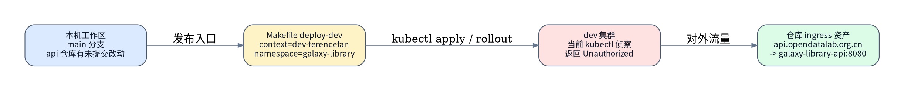
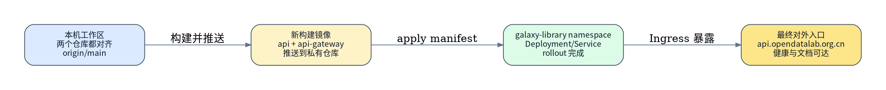
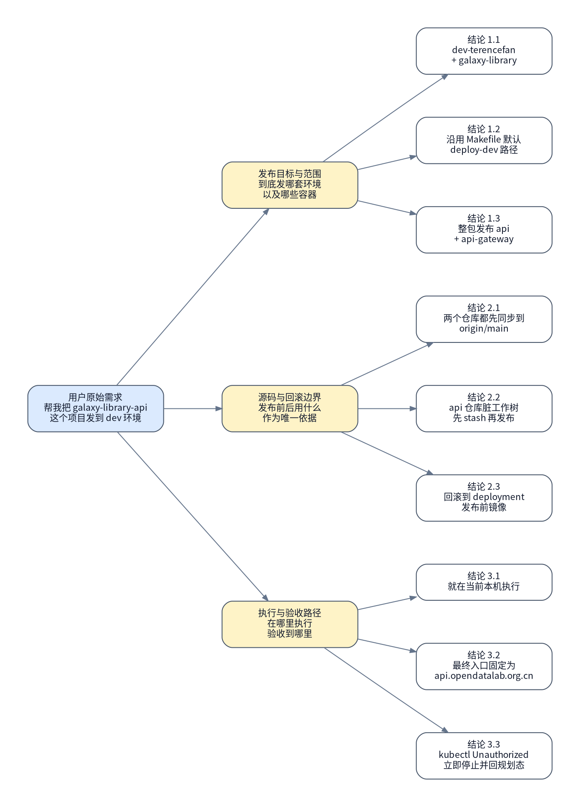

# Galaxy Library API Dev 整包发布

## 背景与现状

### 背景

- 用户要求把 `galaxy-library-api` 发布到 dev 环境，但仓库同时存在 `galaxy-library` 与 `galaxy-library-dev` 两套 namespace/ingress 资产，发布目标、执行入口、验收入口、代码基线和回滚边界都需要先冻结。
- 本轮规划已经通过真实访谈将执行路径收敛为：本机执行、两个仓库都以 `origin/main` 为唯一源码基线、必要时先 stash 本地改动、整包发布 `api + api-gateway`，最终以 `https://api.opendatalab.org.cn` 做外部验收。

### 现状

- 本地代码现状：`galaxy-library-api` 当前分支为 `main...origin/main`，但工作树有未提交改动，命中文件为 `k8s/namespaces/galaxy-library/galaxy-library-api.yaml` 与 `k8s/namespaces/galaxy-library-dev/galaxy-library-api.yaml`；`galaxy-library-api-gateway` 当前分支为干净的 `main...origin/main`。
- 本轮读取到的远端基线：`galaxy-library-api` 的 `origin/main` 头提交为 `2d07ca0`，`galaxy-library-api-gateway` 的 `origin/main` 头提交为 `f67f807`。
- 发布入口资产来自仓库默认路径：`Makefile` 中 `deploy-dev` 默认使用 `DEV_KUBE_CONTEXT=dev-terencefan`、`DEV_NAMESPACE=galaxy-library`、`DEV_MANIFEST=k8s/namespaces/galaxy-library/galaxy-library-api.yaml`；对应 ingress 清单把 `api.opendatalab.org.cn` 指向 `galaxy-library` namespace 下的 `galaxy-library-api:8080`。
- 本轮只读侦察尝试执行 `kubectl get deployment galaxy-library-api -n galaxy-library --context dev-terencefan` 与 `kubectl get ingress -n galaxy-library --context dev-terencefan` 时都返回 `Unauthorized`，说明执行前必须先恢复当前机对 `dev-terencefan` 的集群访问能力。
- 本轮尝试把 `make -n deploy-dev` 作为 no-op 预演，但终端命令通道未返回可用的项目级 stdout/stderr；因此这次 authority 不把它当作有效 dry-run 证据，而是把真正的执行可行性冻结到第 1 步只读检查里。



## 目标与非目标

### 目标

- 在当前本机把 `galaxy-library-api` 与 `galaxy-library-api-gateway` 都同步到各自的 `origin/main` 最新提交后，按仓库默认 `make deploy-dev` 进行整包发布。
- 整个执行路径只允许落到 `dev-terencefan` context、`galaxy-library` namespace 和 `k8s/namespaces/galaxy-library/galaxy-library-api.yaml` 这组资产。
- 发布前必须冻结发布前镜像基线；发布失败时按 deployment 实际读出的发布前 `api` / `api-gateway` 镜像回滚。
- 最终完成态以 `https://api.opendatalab.org.cn` 的外部入口健康与文档链路可达为准，不以“命令执行结束”替代验收。



### 非目标

- 不覆盖 `galaxy-library-dev` namespace、`api.data.pjlab.dev` 或任何非 `galaxy-library` 路线的发布。
- 不在本 runbook 内修改 `Makefile`、Kubernetes 清单内容、Ingress 规则、镜像仓库地址或 gateway 架构。
- 不处理集群账号续期、registry 登录修复、Docker 守护进程修复等环境级问题；这些只作为停止条件与前置修复项记录。

## 风险与收益

### 风险

1. 当前机对 `dev-terencefan` 的 `kubectl` 访问在本轮侦察中返回 `Unauthorized`；如果执行前不先恢复凭据，第 1 步冻结现状就会停止，整份 runbook 无法进入真正发布阶段。
2. `galaxy-library-api` 本地工作树当前不干净，而执行路径要求对齐 `origin/main`；如果不严格按“先 stash、再同步、发布后再恢复”的唯一路径执行，容易覆盖或遗漏本地未提交修改。
3. `make deploy-dev` 会同时构建、推送并更新 `api + api-gateway`；如果 operator 没先冻结发布前镜像基线，发布失败后的回滚会失去准确目标。

### 收益

1. 发布源码、执行入口、发布范围、回滚边界和验收入口都已经被压成唯一路径，执行者不需要临场补关键决策。
2. 以 deployment 实际镜像作为回滚基线，能够把回滚目标绑定到真实现场，而不是依赖记忆或口头 tag。
3. 最终验收明确以 `api.opendatalab.org.cn` 的对外链路为准，能避免“rollout 成功但外部入口仍异常”的假阳性。

## 思维脑图



## 红线行为

- 未在第 1 步拿到 `dev-terencefan` / `galaxy-library` 的有效 `kubectl` 只读证据前，不得直接执行 `make deploy-dev`。
- 不得把发布源码切换到任何非 `origin/main` 基线，也不得跳过 `galaxy-library-api` 本地改动的 stash 保护。
- 不得把 `api.data.pjlab.dev`、`galaxy-library-dev` 或任何其他 namespace / ingress 资产混入本次执行路径。
- 一旦出现 `Unauthorized`、`docker push` 失败、`kubectl apply` 失败、rollout 超时、发布后外部入口异常，必须停止并回规划态，不得现场改路径硬续跑。

## 清理现场

清理触发条件：

- 第 2 步已经 stash 或 reset 了本地仓库，但后续未进入成功发布闭环就中断。
- 第 3 步已开始发布但未完成最终验收，需要先恢复本地工作区和已知基线后再重新进入执行。

清理命令：

```bash
set -euo pipefail

cd /home/fantengyuan/workspace/galaxy-library-api
git status --short --branch
git stash list

cd /home/fantengyuan/workspace/galaxy-library-api-gateway
git status --short --branch
git stash list
```

```bash
set -euo pipefail

cd /home/fantengyuan/workspace/galaxy-library-api
if [ -n "${API_STASH_REF:-}" ]; then
  git stash apply --index "${API_STASH_REF}"
fi

cd /home/fantengyuan/workspace/galaxy-library-api-gateway
if [ -n "${GATEWAY_STASH_REF:-}" ]; then
  git stash apply --index "${GATEWAY_STASH_REF}"
fi
```

清理完成条件：

- 两个仓库都能明确看出当前分支、工作树状态和 stash 列表。
- 如果本轮曾创建 stash，则对应 stash 已被明确恢复或保留，执行者不会在下一轮重新进入时误覆盖本地改动。
- 若第 3 步已修改集群现场，则发布前镜像基线仍可从第 1 步冻结结果或 deployment 当前状态重新确认。

恢复执行入口：

- 完成清理后，一律从 `### 🟢 1. 冻结现状` 重新进入。
- 不允许从中间步骤直接续跑，除非重新冻结了源码、凭据、deployment 镜像和 ingress 现状。

## 执行计划

<a id="item-1"></a>

### 🟢 1. 冻结现状

> [!TIP]
> 本步骤只读冻结源码、kubectl 凭据、发布前镜像与 ingress 现状。

#### 执行

[跳转到执行记录](#item-1-execution-record)

操作性质：只读

执行分组：冻结本地源码与集群可达性

```bash
set -euo pipefail

cd /home/fantengyuan/workspace/galaxy-library-api
git status --short --branch
git rev-parse HEAD
git rev-parse origin/main

cd /home/fantengyuan/workspace/galaxy-library-api-gateway
git status --short --branch
git rev-parse HEAD
git rev-parse origin/main

kubectl config get-contexts
kubectl get deployment galaxy-library-api -n galaxy-library --context dev-terencefan -o jsonpath='{range .spec.template.spec.containers[*]}{.name}={.image}{"\n"}{end}'
kubectl get ingress galaxy-library-api galaxy-library-api-opendatalab -n galaxy-library --context dev-terencefan
```

预期结果：

- 能确认两个仓库当前都在 `main`，并知道各自 `HEAD` 与 `origin/main` 是否一致。
- 能拿到 `galaxy-library-api` deployment 当前 `api` / `api-gateway` 镜像，作为后续回滚基线。
- 能确认 `api.opendatalab.org.cn` 的 ingress 资产确实位于 `galaxy-library` namespace。

停止条件：

- 任一仓库当前分支不是 `main`。
- `origin/main` 无法解析。
- 任一 `kubectl` 命令返回 `Unauthorized`、`NotFound` 或 context / namespace 不匹配。

#### 验收

[跳转到验收记录](#item-1-acceptance-record)

验收命令：

```bash
set -euo pipefail

kubectl get deployment galaxy-library-api -n galaxy-library --context dev-terencefan -o jsonpath='{range .spec.template.spec.containers[*]}{.name}={.image}{"\n"}{end}'
kubectl get ingress galaxy-library-api-opendatalab -n galaxy-library --context dev-terencefan -o wide
```

预期结果：

- deployment 镜像清单非空，且包含 `api=` 与 `api-gateway=` 两行。
- `galaxy-library-api-opendatalab` ingress 可见，后续最终验收入口仍是 `api.opendatalab.org.cn`。

停止条件：

- 无法稳定读出发布前镜像基线。
- ingress 资产与 authority 约定的 host、namespace 或 service 不一致。

<a id="item-2"></a>

### 🔴 2. 保护本地改动并同步两个仓库到 origin/main

> [!CAUTION]
> 本步骤会修改当前本机两个仓库的 git 工作树，使其对齐到 `origin/main`。

> [!CAUTION]
> 严重后果：如果执行者不先记录 stash 引用或误执行额外 git 清理动作，可能导致本地未提交改动难以恢复。

#### 执行

[跳转到执行记录](#item-2-execution-record)

操作性质：破坏性

执行分组：stash 脏工作树并重置到远端主线

```bash
set -euo pipefail

STAMP="$(date +%Y%m%d-%H%M%S)"

cd /home/fantengyuan/workspace/galaxy-library-api
if [ -n "$(git status --porcelain)" ]; then
  git stash push -u -m "runbook-galaxy-library-api-dev-release-${STAMP}"
fi
git fetch origin main
git checkout main
git reset --hard origin/main

cd /home/fantengyuan/workspace/galaxy-library-api-gateway
if [ -n "$(git status --porcelain)" ]; then
  git stash push -u -m "runbook-galaxy-library-api-gateway-dev-release-${STAMP}"
fi
git fetch origin main
git checkout main
git reset --hard origin/main
```

预期结果：

- 两个仓库当前 `HEAD` 都对齐到各自 `origin/main`。
- 若发布前存在本地改动，则能在 `git stash list` 中看到本轮新创建的 stash 记录。

停止条件：

- `git stash push`、`git fetch`、`git checkout main` 或 `git reset --hard origin/main` 任一失败。
- 执行后任一仓库 `HEAD` 仍未对齐到 `origin/main`。

#### 验收

[跳转到验收记录](#item-2-acceptance-record)

验收命令：

```bash
set -euo pipefail

cd /home/fantengyuan/workspace/galaxy-library-api
test "$(git rev-parse HEAD)" = "$(git rev-parse origin/main)"
git status --short --branch
git stash list | head

cd /home/fantengyuan/workspace/galaxy-library-api-gateway
test "$(git rev-parse HEAD)" = "$(git rev-parse origin/main)"
git status --short --branch
git stash list | head
```

预期结果：

- 两个 `test` 都通过。
- 两个仓库当前都处于 `main...origin/main`，且如果之前有本地改动，stash 列表中可以找到本轮保存记录。

停止条件：

- 任一仓库仍存在未解释的分支漂移。
- stash 记录缺失，导致后续无法恢复本地改动。

<a id="item-3"></a>

### 🔴 3. 构建并推送发布镜像

> [!CAUTION]
> 本步骤会构建并推送 `api + api-gateway` 镜像，并生成后续发布唯一允许使用的镜像上下文。

> [!CAUTION]
> 严重后果：如果 registry 推送失败或发布上下文文件记录错误，后续集群发布会引用错误镜像，导致版本不可追溯。

#### 执行

[跳转到执行记录](#item-3-execution-record)

操作性质：破坏性

执行分组：构建镜像并写出发布上下文

```bash
set -euo pipefail

cd /home/fantengyuan/workspace/galaxy-library-api
STAMP="$(date +%Y%m%d-%H%M%S)"
API_IMAGE="registry2-cloud.d.pjlab.org.cn/ccr-tscpu-bigdata-xyz-dataproc/galaxy-library-api:${STAMP}"
GATEWAY_IMAGE="registry2-cloud.d.pjlab.org.cn/ccr-tscpu-bigdata-xyz-dataproc/galaxy-library-api-gateway:${STAMP}"
RELEASE_ENV="/tmp/galaxy-library-api-dev-release.env"

make frontend-build
docker build -f Dockerfile -t "${API_IMAGE}" /home/fantengyuan/workspace
docker push "${API_IMAGE}"
docker build -f /home/fantengyuan/workspace/galaxy-library-api-gateway/Dockerfile -t "${GATEWAY_IMAGE}" /home/fantengyuan/workspace/galaxy-library-api-gateway
docker push "${GATEWAY_IMAGE}"

cat > "${RELEASE_ENV}" <<EOF
API_IMAGE=${API_IMAGE}
GATEWAY_IMAGE=${GATEWAY_IMAGE}
EOF
```

预期结果：

- `api` 与 `api-gateway` 镜像都成功构建并推送到私有仓库。
- 本轮发布镜像通过 `/tmp/galaxy-library-api-dev-release.env` 被固定下来，供第 4 步唯一消费。

停止条件：

- `make frontend-build`、任一 `docker build` 或任一 `docker push` 返回非零。
- `RELEASE_ENV` 未生成，或内容未同时包含 `API_IMAGE=` 与 `GATEWAY_IMAGE=`。

#### 验收

[跳转到验收记录](#item-3-acceptance-record)

验收命令：

```bash
set -euo pipefail

source /tmp/galaxy-library-api-dev-release.env
docker manifest inspect "${API_IMAGE}" >/dev/null
docker manifest inspect "${GATEWAY_IMAGE}" >/dev/null
cat /tmp/galaxy-library-api-dev-release.env
```

预期结果：

- 两个镜像在仓库侧都可被读取。
- 发布上下文文件内容与本轮推送的两个镜像 tag 一致。

停止条件：

- 任一镜像无法被 `docker manifest inspect` 读取。
- 发布上下文文件缺失或内容与本轮推送结果不一致。

<a id="item-4"></a>

### 🔴 4. 用发布镜像更新 galaxy-library deployment

> [!CAUTION]
> 本步骤会把第 3 步产出的镜像写入 manifest，并更新 `galaxy-library` namespace 下的 deployment。

> [!CAUTION]
> 严重后果：如果 apply 或 rollout 失败，dev 环境可能处于部分更新状态，需要回滚到第 1 步冻结的发布前镜像。

#### 执行

[跳转到执行记录](#item-4-execution-record)

操作性质：破坏性

执行分组：应用 manifest 并等待 rollout

```bash
set -euo pipefail

source /tmp/galaxy-library-api-dev-release.env
TMP_MANIFEST="$(mktemp)"
trap 'rm -f "${TMP_MANIFEST}"' EXIT

sed \
  -e "s|image: registry2-cloud.d.pjlab.org.cn/ccr-tscpu-bigdata-xyz-dataproc/galaxy-library-api:.*|image: ${API_IMAGE}|" \
  -e "s|image: registry2-cloud.d.pjlab.org.cn/ccr-tscpu-bigdata-xyz-dataproc/galaxy-library-api-gateway:.*|image: ${GATEWAY_IMAGE}|" \
  /home/fantengyuan/workspace/galaxy-library-api/k8s/namespaces/galaxy-library/galaxy-library-api.yaml > "${TMP_MANIFEST}"

kubectl --context dev-terencefan apply --server-side --force-conflicts -f "${TMP_MANIFEST}"
kubectl --context dev-terencefan rollout status deployment/galaxy-library-api -n galaxy-library --timeout=180s
kubectl --context dev-terencefan get deployment galaxy-library-api -n galaxy-library -o jsonpath='{range .spec.template.spec.containers[*]}{.name}={.image}{"\n"}{end}'
```

预期结果：

- manifest 中的 `api` 与 `api-gateway` 都被替换为第 3 步产出的镜像。
- `kubectl apply` 与 `rollout status` 成功完成，deployment 当前镜像更新为本次发布 tag。

停止条件：

- `/tmp/galaxy-library-api-dev-release.env` 缺失或无法 `source`。
- `kubectl apply`、`rollout status` 或最终 deployment 镜像读取返回非零。

#### 验收

[跳转到验收记录](#item-4-acceptance-record)

验收命令：

```bash
set -euo pipefail

source /tmp/galaxy-library-api-dev-release.env
CURRENT_IMAGES="$(kubectl --context dev-terencefan get deployment galaxy-library-api -n galaxy-library -o jsonpath='{range .spec.template.spec.containers[*]}{.name}={.image}{"\n"}{end}')"
printf '%s\n' "${CURRENT_IMAGES}"
grep -F "api=${API_IMAGE}" <<<"${CURRENT_IMAGES}"
grep -F "api-gateway=${GATEWAY_IMAGE}" <<<"${CURRENT_IMAGES}"
```

预期结果：

- deployment 当前镜像与第 3 步发布上下文文件记录的两个镜像完全一致。
- 后续第 5 步可以在不猜测 tag 的前提下做外部入口验收。

停止条件：

- deployment 当前镜像未完全切到第 3 步产出的镜像。
- 集群再次返回 `Unauthorized` 或 deployment 不存在。

<a id="item-5"></a>

### 🟢 5. 验证 rollout 与对外入口

> [!TIP]
> 本步骤只读验证 `api.opendatalab.org.cn` 的健康与文档链路，确认外部入口已经切到新发布结果。

#### 执行

[跳转到执行记录](#item-5-execution-record)

操作性质：只读

执行分组：验证外部入口健康与公开文档

```bash
set -euo pipefail

curl -ksS https://api.opendatalab.org.cn/healthz
curl -ksS https://api.opendatalab.org.cn/readyz
curl -ksS https://api.opendatalab.org.cn/openapi.json
curl -ksS https://api.opendatalab.org.cn/sciverse/openapi.json
```

预期结果：

- `/healthz` 与 `/readyz` 返回健康结果。
- `/openapi.json` 与 `/sciverse/openapi.json` 能成功返回 JSON 文档，证明 gateway 与上游 API 链路可用。

停止条件：

- 任一 `curl` 返回非零。
- 任一健康或文档入口返回非预期内容，说明 rollout 成功但外部入口仍异常。

#### 验收

[跳转到验收记录](#item-5-acceptance-record)

验收命令：

```bash
set -euo pipefail

curl -ksS https://api.opendatalab.org.cn/healthz
curl -ksS https://api.opendatalab.org.cn/readyz
curl -ksS https://api.opendatalab.org.cn/docs
```

预期结果：

- `healthz` 与 `readyz` 都返回健康态。
- `/docs` 能返回页面内容，证明最终对外验收入口可供人工继续抽查。

停止条件：

- 最终对外域名不可达。
- 健康接口与文档接口之间出现状态不一致，无法证明入口已稳定可用。

## 执行记录

### 🟢 1. 冻结现状

<a id="item-1-execution-record"></a>

#### 执行记录

执行命令：

```bash
set -euo pipefail

cd /home/fantengyuan/workspace/galaxy-library-api
git status --short --branch
git rev-parse HEAD
git rev-parse origin/main

cd /home/fantengyuan/workspace/galaxy-library-api-gateway
git status --short --branch
git rev-parse HEAD
git rev-parse origin/main

kubectl config get-contexts
kubectl get deployment galaxy-library-api -n galaxy-library --context dev-terencefan -o jsonpath='{range .spec.template.spec.containers[*]}{.name}={.image}{"\n"}{end}'
kubectl get ingress galaxy-library-api galaxy-library-api-opendatalab -n galaxy-library --context dev-terencefan
```

执行结果：

```text
待执行；需要在记录区保留两个仓库的 HEAD/origin-main、deployment 发布前镜像，以及 ingress 只读结果。
```

执行结论：

- 待执行

<a id="item-1-acceptance-record"></a>

#### 验收记录

验收命令：

```bash
set -euo pipefail

kubectl get deployment galaxy-library-api -n galaxy-library --context dev-terencefan -o jsonpath='{range .spec.template.spec.containers[*]}{.name}={.image}{"\n"}{end}'
kubectl get ingress galaxy-library-api-opendatalab -n galaxy-library --context dev-terencefan -o wide
```

验收结果：

```text
待执行；需要留存发布前镜像清单与 api.opendatalab.org.cn ingress 证据。
```

验收结论：

- 待执行

### 🔴 2. 保护本地改动并同步两个仓库到 origin/main

<a id="item-2-execution-record"></a>

#### 执行记录

执行命令：

```bash
set -euo pipefail

STAMP="$(date +%Y%m%d-%H%M%S)"

cd /home/fantengyuan/workspace/galaxy-library-api
if [ -n "$(git status --porcelain)" ]; then
  git stash push -u -m "runbook-galaxy-library-api-dev-release-${STAMP}"
fi
git fetch origin main
git checkout main
git reset --hard origin/main

cd /home/fantengyuan/workspace/galaxy-library-api-gateway
if [ -n "$(git status --porcelain)" ]; then
  git stash push -u -m "runbook-galaxy-library-api-gateway-dev-release-${STAMP}"
fi
git fetch origin main
git checkout main
git reset --hard origin/main
```

执行结果：

```text
待执行；需要留存本轮创建的 stash 引用、两个仓库 reset 后的 HEAD，以及是否存在原始脏工作树。
```

执行结论：

- 待执行

<a id="item-2-acceptance-record"></a>

#### 验收记录

验收命令：

```bash
set -euo pipefail

cd /home/fantengyuan/workspace/galaxy-library-api
test "$(git rev-parse HEAD)" = "$(git rev-parse origin/main)"
git status --short --branch
git stash list | head

cd /home/fantengyuan/workspace/galaxy-library-api-gateway
test "$(git rev-parse HEAD)" = "$(git rev-parse origin/main)"
git status --short --branch
git stash list | head
```

验收结果：

```text
待执行；需要证明两个仓库都已对齐到 origin/main，并且 stash 保护链路可追溯。
```

验收结论：

- 待执行

### 🔴 3. 构建并推送发布镜像

<a id="item-3-execution-record"></a>

#### 执行记录

执行命令：

```bash
set -euo pipefail

cd /home/fantengyuan/workspace/galaxy-library-api
STAMP="$(date +%Y%m%d-%H%M%S)"
API_IMAGE="registry2-cloud.d.pjlab.org.cn/ccr-tscpu-bigdata-xyz-dataproc/galaxy-library-api:${STAMP}"
GATEWAY_IMAGE="registry2-cloud.d.pjlab.org.cn/ccr-tscpu-bigdata-xyz-dataproc/galaxy-library-api-gateway:${STAMP}"
RELEASE_ENV="/tmp/galaxy-library-api-dev-release.env"

make frontend-build
docker build -f Dockerfile -t "${API_IMAGE}" /home/fantengyuan/workspace
docker push "${API_IMAGE}"
docker build -f /home/fantengyuan/workspace/galaxy-library-api-gateway/Dockerfile -t "${GATEWAY_IMAGE}" /home/fantengyuan/workspace/galaxy-library-api-gateway
docker push "${GATEWAY_IMAGE}"

cat > "${RELEASE_ENV}" <<EOF
API_IMAGE=${API_IMAGE}
GATEWAY_IMAGE=${GATEWAY_IMAGE}
EOF
```

执行结果：

```text
待执行；需要保留两个镜像 tag、push 结果以及 `/tmp/galaxy-library-api-dev-release.env` 内容。
```

执行结论：

- 待执行

<a id="item-3-acceptance-record"></a>

#### 验收记录

验收命令：

```bash
set -euo pipefail

source /tmp/galaxy-library-api-dev-release.env
docker manifest inspect "${API_IMAGE}" >/dev/null
docker manifest inspect "${GATEWAY_IMAGE}" >/dev/null
cat /tmp/galaxy-library-api-dev-release.env
```

验收结果：

```text
待执行；需要证明两个镜像都可被读取，且发布上下文文件已固定本轮镜像 tag。
```

验收结论：

- 待执行

### 🔴 4. 用发布镜像更新 galaxy-library deployment

<a id="item-4-execution-record"></a>

#### 执行记录

执行命令：

```bash
set -euo pipefail

source /tmp/galaxy-library-api-dev-release.env
TMP_MANIFEST="$(mktemp)"
trap 'rm -f "${TMP_MANIFEST}"' EXIT

sed \
  -e "s|image: registry2-cloud.d.pjlab.org.cn/ccr-tscpu-bigdata-xyz-dataproc/galaxy-library-api:.*|image: ${API_IMAGE}|" \
  -e "s|image: registry2-cloud.d.pjlab.org.cn/ccr-tscpu-bigdata-xyz-dataproc/galaxy-library-api-gateway:.*|image: ${GATEWAY_IMAGE}|" \
  /home/fantengyuan/workspace/galaxy-library-api/k8s/namespaces/galaxy-library/galaxy-library-api.yaml > "${TMP_MANIFEST}"

kubectl --context dev-terencefan apply --server-side --force-conflicts -f "${TMP_MANIFEST}"
kubectl --context dev-terencefan rollout status deployment/galaxy-library-api -n galaxy-library --timeout=180s
kubectl --context dev-terencefan get deployment galaxy-library-api -n galaxy-library -o jsonpath='{range .spec.template.spec.containers[*]}{.name}={.image}{"\n"}{end}'
```

执行结果：

```text
待执行；需要保留 apply、rollout 和 deployment 当前镜像结果，证明发布镜像已经落到集群。
```

执行结论：

- 待执行

<a id="item-4-acceptance-record"></a>

#### 验收记录

验收命令：

```bash
set -euo pipefail

source /tmp/galaxy-library-api-dev-release.env
CURRENT_IMAGES="$(kubectl --context dev-terencefan get deployment galaxy-library-api -n galaxy-library -o jsonpath='{range .spec.template.spec.containers[*]}{.name}={.image}{"\n"}{end}')"
printf '%s\n' "${CURRENT_IMAGES}"
grep -F "api=${API_IMAGE}" <<<"${CURRENT_IMAGES}"
grep -F "api-gateway=${GATEWAY_IMAGE}" <<<"${CURRENT_IMAGES}"
```

验收结果：

```text
待执行；需要证明 deployment 当前镜像已与第 3 步发布上下文完全一致。
```

验收结论：

- 待执行

### 🟢 5. 验证 rollout 与对外入口

<a id="item-5-execution-record"></a>

#### 执行记录

执行命令：

```bash
set -euo pipefail

curl -ksS https://api.opendatalab.org.cn/healthz
curl -ksS https://api.opendatalab.org.cn/readyz
curl -ksS https://api.opendatalab.org.cn/openapi.json
curl -ksS https://api.opendatalab.org.cn/sciverse/openapi.json
```

执行结果：

```text
待执行；需要保留健康检查与公开 OpenAPI 返回的关键输出。
```

执行结论：

- 待执行

<a id="item-5-acceptance-record"></a>

#### 验收记录

验收命令：

```bash
set -euo pipefail

curl -ksS https://api.opendatalab.org.cn/healthz
curl -ksS https://api.opendatalab.org.cn/readyz
curl -ksS https://api.opendatalab.org.cn/docs
```

验收结果：

```text
待执行；需要证明最终对外入口健康且文档页可达。
```

验收结论：

- 待执行

## 最终验收

- [ ] 第 1 项验收通过并有 `#### 验收记录 @...` 证据
- [ ] 第 2 项验收通过并有 `#### 验收记录 @...` 证据
- [ ] 第 3 项验收通过并有 `#### 验收记录 @...` 证据
- [ ] 第 4 项验收通过并有 `#### 验收记录 @...` 证据
- [ ] 第 5 项验收通过并有 `#### 验收记录 @...` 证据
- [ ] 已新开一个独立上下文的 `$runbook-recon` 子代理执行最终终态侦察
- [ ] 最终验收只使用该独立 recon 子代理本轮重新采集的证据，不复用编号项执行 / 验收记录里的既有证据
- [ ] 最终验收 recon 输出证明 `api.opendatalab.org.cn` 对应的新发布结果已稳定可用

最终验收侦察问题：

- 独立 recon 需要重新确认 `galaxy-library-api` deployment 当前镜像仍与第 3 步发布上下文文件记录的镜像一致，而不是中途被其他操作覆盖。
- 独立 recon 需要重新确认 `https://api.opendatalab.org.cn/healthz`、`/readyz`、`/docs` 与 `/sciverse/openapi.json` 在同一轮只读证据里都可用。

最终验收命令：

```bash
set -euo pipefail

echo "dispatch to independent runbook-recon"
echo "re-check deployment images, rollout health, and api.opendatalab.org.cn endpoints"
```

最终验收结果：

```text
待独立 runbook-recon 子代理在执行态回填终态证据。
```

最终验收结论：

- 未通过；待执行态与独立 recon 回填证据后再收口

## 回滚方案

- 默认回滚边界：只有在第 1 步已经拿到发布前 `api` / `api-gateway` 镜像基线时，才允许对第 4 步执行集群回滚。
- 禁止回滚路径：不得凭猜测 tag 回滚，也不得把 `galaxy-library-dev` 的镜像或 manifest 拿来回滚 `galaxy-library` namespace。

2. 如果第 2 步后需要放弃本次发布，先恢复本轮 stash，再回到第 1 步重新冻结源码与现场。

回滚动作：

```bash
set -euo pipefail

cd /home/fantengyuan/workspace/galaxy-library-api
if [ -n "${API_STASH_REF:-}" ]; then
  git stash apply --index "${API_STASH_REF}"
fi

cd /home/fantengyuan/workspace/galaxy-library-api-gateway
if [ -n "${GATEWAY_STASH_REF:-}" ]; then
  git stash apply --index "${GATEWAY_STASH_REF}"
fi
```

回滚后验证：

```bash
set -euo pipefail

cd /home/fantengyuan/workspace/galaxy-library-api
git status --short --branch
git stash list | head

cd /home/fantengyuan/workspace/galaxy-library-api-gateway
git status --short --branch
git stash list | head
```

3. 如果第 3 步完成但第 4 步尚未开始，则不对私有仓库做删除回滚；只废弃本轮发布上下文文件，并在下一轮重新生成新 tag。

回滚动作：

```bash
set -euo pipefail

rm -f /tmp/galaxy-library-api-dev-release.env
```

回滚后验证：

```bash
set -euo pipefail

test ! -f /tmp/galaxy-library-api-dev-release.env
```

4. 如果第 4 步发布失败或第 5 步入口验收失败，则把 `galaxy-library-api` deployment 回退到第 1 步冻结得到的发布前镜像。

回滚动作：

```bash
set -euo pipefail

kubectl set image deployment/galaxy-library-api \
  api="${PRE_API_IMAGE}" \
  api-gateway="${PRE_GATEWAY_IMAGE}" \
  -n galaxy-library \
  --context dev-terencefan

kubectl rollout status deployment/galaxy-library-api -n galaxy-library --context dev-terencefan --timeout=180s
```

回滚后验证：

```bash
set -euo pipefail

kubectl get deployment galaxy-library-api -n galaxy-library --context dev-terencefan -o jsonpath='{range .spec.template.spec.containers[*]}{.name}={.image}{"\n"}{end}'
curl -ksS https://api.opendatalab.org.cn/healthz
curl -ksS https://api.opendatalab.org.cn/readyz
```

## 访谈记录

### Q：这次发布到底落在哪个 kube context、namespace 和 manifest 路线？

> A：使用 `dev-terencefan` context、`galaxy-library` namespace，并沿用仓库默认 `make deploy-dev` 路径。

访谈时间：2026-04-24 16:10 CST

后续所有执行与验收都固定落在 `galaxy-library`，不再考虑 `galaxy-library-dev` 路线。
第 1 步必须把 Makefile 默认 context/namespace 与现场读到的 deployment/ingress 对齐起来。

### Q：这次是只发 API，还是按仓库默认整包发布？

> A：按仓库默认 `make deploy-dev`，同时发布 `api + api-gateway`。

访谈时间：2026-04-24 16:11 CST

执行计划必须覆盖两个镜像的构建、推送、deployment 更新和回滚。
最终验收不能只看 `api`，还要覆盖 gateway 暴露出来的对外入口链路。

### Q：最终对外验收到底以哪个入口为准？

> A：只验 `https://api.opendatalab.org.cn`。

访谈时间：2026-04-24 16:12 CST

第 4 步和最终验收都固定使用 `api.opendatalab.org.cn`，不再把 `api.data.pjlab.dev` 当作完成标准。
执行计划中的 ingress 冻结和外部健康检查都必须围绕这个 host 编写。

### Q：本次发布源版本以什么代码基线为准？

> A：应该用 `main` 分支。

访谈时间：2026-04-24 16:13 CST

执行计划必须在发布前校验两个仓库当前分支，并把非 `main` 视为停止条件。
源码同步动作只能围绕 `origin/main` 展开，不能临时切其他分支或 tag。

### Q：发布失败时回滚到什么基线？

> A：回滚到发布前从 deployment 实际读出的 `api` / `api-gateway` 镜像 tag。

访谈时间：2026-04-24 16:14 CST

第 1 步必须把 deployment 当前镜像读出来并留证，否则第 3 步不得开始。
回滚方案需要显式使用 deployment 实际镜像，而不是口头约定的稳定 tag。

### Q：这次发布动作在哪台机器上执行？

> A：就在当前本机工作区执行，使用本机已有 `docker` 和 `kubectl --context dev-terencefan`。

访谈时间：2026-04-24 16:15 CST

整份 authority 不再拆远端控制机步骤，所有命令都以当前工作区绝对路径为准。
只要本机缺失 `docker`、registry 登录或 `kubectl` 凭据，就必须在对应步骤停止。

### Q：发布前的 `main` 到底取当前本地状态还是先同步远端？

> A：先把 `galaxy-library-api` 和 `galaxy-library-api-gateway` 都同步到 `origin/main` 最新提交，再构建发布。

访谈时间：2026-04-24 16:16 CST

第 2 步必须在两个仓库里都执行 `fetch + reset --hard origin/main`。
执行记录里必须同时留证两个仓库同步后的 `HEAD`，保证镜像来源可追溯。

### Q：如果 `galaxy-library-api` 本地工作树不干净，这次发布前怎么处理？

> A：允许先 stash 当前改动，再同步 `origin/main` 后发布。

访谈时间：2026-04-24 16:17 CST

第 2 步必须把 stash 保护链路写成唯一执行路径，并在记录区保留 stash 引用。
清理现场与回滚方案都必须覆盖 stash 恢复，避免发布后丢失本地未提交修改。

## 外部链接

| name | type | link | desc |
| --- | --- | --- | --- |
| galaxy-library-api Makefile | 资源 | [../../../../galaxy-library-api/Makefile](../../../../galaxy-library-api/Makefile) | 定义本次唯一允许的 `make deploy-dev` 发布入口。 |
| galaxy-library namespace manifest | 资源 | [../../../../galaxy-library-api/k8s/namespaces/galaxy-library/galaxy-library-api.yaml](../../../../galaxy-library-api/k8s/namespaces/galaxy-library/galaxy-library-api.yaml) | 约束 deployment、service 与镜像占位的目标清单。 |
| galaxy-library ingress 清单 | 资源 | [../../../../galaxy-library-api/k8s/namespaces/galaxy-library/ingress-controller.yaml](../../../../galaxy-library-api/k8s/namespaces/galaxy-library/ingress-controller.yaml) | 约束最终验收入口域名与服务映射。 |
| galaxy-library-api README | 文档 | [../../../../galaxy-library-api/README.md](../../../../galaxy-library-api/README.md) | 提供本地入口、共享域名和 API 对外路径背景。 |
