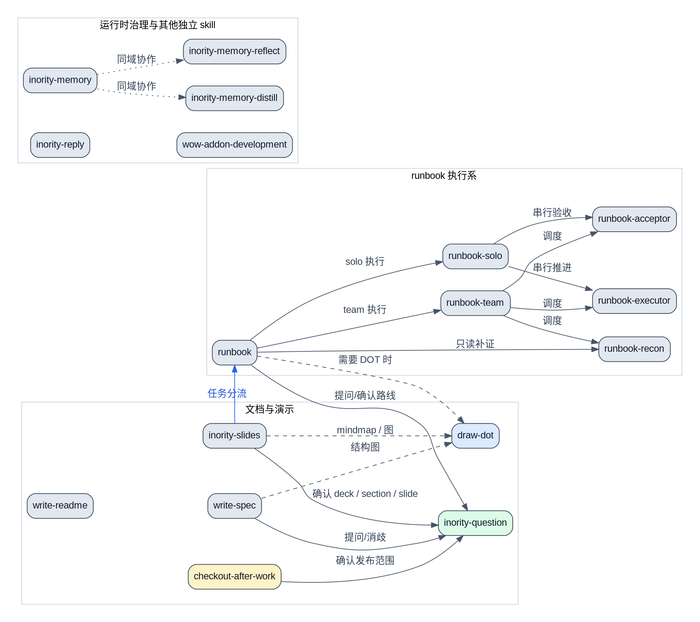

# skills

> 这里是 `inority-workspace` 里可维护的 Codex skills 源码目录，用来集中管理工作流、执行规范、安装脚本和配套参考资料。

## 说明

这个目录保存的是 skill 的源码边界，不是运行时唯一入口。

- 源码维护位置：`inority-workspace/skills/`
- 工作区运行时入口：`../.codex/skills/`
- 每个 skill 通常至少包含：
  - `SKILL.md`
  - `agents/openai.yaml`
  - 可选的 `scripts/`、`references/`、`assets/`

维护原则：

- 想改 skill 行为，优先改这里的源码目录
- 运行时 `.codex/skills/` 入口应通过逐项软链接挂载
- 不要直接在运行时入口里手工漂移修改

## 目录结构

| 路径 | 说明 |
|------|------|
| `checkout-after-work/` | 工作区级 Git 扫描、提交与 PR/MR 汇总发布 |
| `draw-dot/` | Graphviz / DOT 图生成与收敛 |
| `inority-memory/` | workspace memory 安装、同步与维护 |
| `inority-memory-distill/` | memory 蒸馏与沉淀 |
| `inority-memory-reflect/` | memory 反思与回写 |
| `inority-question/` | 统一提问、澄清、路线确认与访谈问答协议 |
| `inority-reply/` | 回复格式与运行时 hook 安装 |
| `inority-slides/` | slides / deck / H5 演示稿规划与交付 |
| `runbook/` | authority runbook 规划主 skill |
| `runbook-recon/` | runbook 只读侦察 |
| `runbook-executor/` | runbook 执行 phase |
| `runbook-acceptor/` | runbook 验收 phase |
| `runbook-solo/` | runbook solo 执行编排 |
| `runbook-team/` | runbook team 执行编排 |
| `wow-addon-development/` | WoW addon 开发与调试 |
| `write-readme/` | README 编写与重构 |
| `write-spec/` | spec / 设计文档编写与收敛 |

## 拓扑关系

> 下面这张图只画 skill 之间已经显式写进 `SKILL.md` 或 agent prompt 的依赖、加载和路由关系；不把“同目录但无调用关系”的 skill 硬连起来。

箭头语义：

- 实线：运行时会显式加载或切换到目标 skill
- 虚线：需要时才加载的辅助 skill
- 点线：并列存在但默认不自动加载的独立 skill

## 阅读顺序

如果你是第一次看这个目录，建议按下面顺序理解：

1. 先看根 README，理解 skill 源码目录和运行时 `.codex/skills/` 的关系。
2. 再看具体 skill 的 `SKILL.md`，确认触发场景、工作流和边界。
3. 如果 skill 带有 `README.md`，再读它的补充说明。
4. 需要修改执行细节时，再下钻 `scripts/`、`references/` 和 `agents/openai.yaml`。

按主题查找时，可以直接这样分：

- 文档类：`write-readme/`、`write-spec/`
- 工作区收尾类：`checkout-after-work/`
- 运维类：`runbook/`、`runbook-*`
- 演示类：`inority-slides/`、`draw-dot/`
- 运行时治理类：`inority-memory/`、`inority-reply/`、`inority-question/`

## 相关文档

- [仓库根 README](../README.md)
- [inority-memory](./inority-memory/README.md)
- [inority-reply](./inority-reply/README.md)
- [inority-slides](./inority-slides/README.md)
- [runbook](./runbook/README.md)
- [write-readme](./write-readme/README.md)
- [write-spec](./write-spec/README.md)
