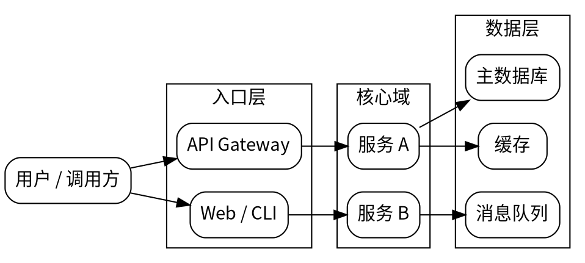
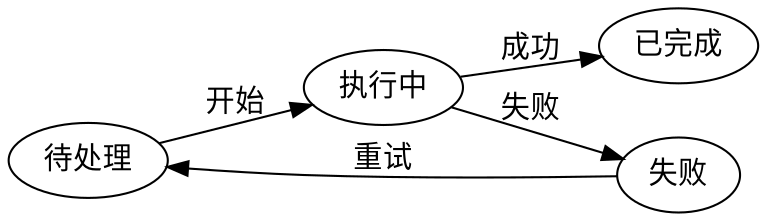
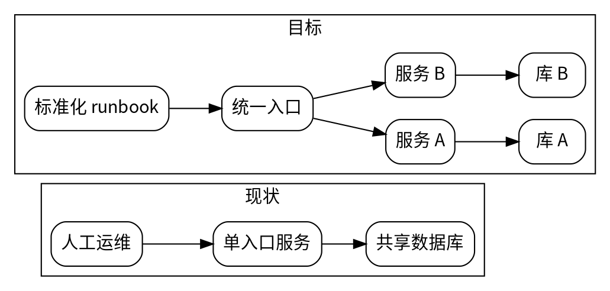
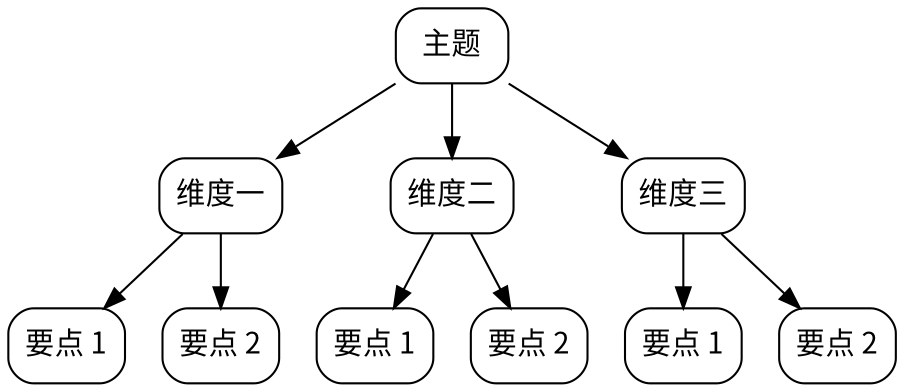

# DOT Patterns

Use these as starting points. Adapt labels and grouping to the real subject.

## Architecture Overview

## Request Or Data Flow

## State Machine

## Current Vs Target

## Mindmap

