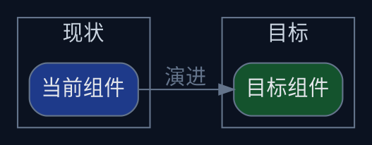

# 示例文档

```dot
digraph G {
  graph [fontname="Noto Sans CJK SC", rankdir=LR, bgcolor="#0b1220"];
  node [fontname="Noto Sans CJK SC", shape=box, style="rounded,filled", color="#64748b", fontcolor="#e5e7eb", fillcolor="#0f172a"];
  edge [fontname="Noto Sans CJK SC", color="#64748b", fontcolor="#64748b"];

  subgraph cluster_current {
    label="现状";
    color="#64748b";
    fontcolor="#cbd5e1";
    current [label="当前组件", fillcolor="#1e3a8a"];
  }

  subgraph cluster_target {
    label="目标";
    color="#64748b";
    fontcolor="#cbd5e1";
    target [label="目标组件", fillcolor="#14532d"];
  }

  current -> target [label="演进"];
}
```
