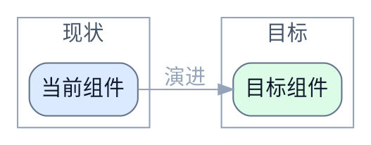

# 示例文档

```dot
digraph G {
  graph [fontname="Noto Sans CJK SC", rankdir=LR, bgcolor="transparent"];
  node [fontname="Noto Sans CJK SC", shape=box, style="rounded,filled", color="#64748b", fontcolor="#0f172a", fillcolor="#f8fafc"];
  edge [fontname="Noto Sans CJK SC", color="#94a3b8", fontcolor="#94a3b8"];

  subgraph cluster_current {
    label="现状";
    color="#94a3b8";
    fontcolor="#475569";
    current [label="当前组件", fillcolor="#dbeafe"];
  }

  subgraph cluster_target {
    label="目标";
    color="#94a3b8";
    fontcolor="#475569";
    target [label="目标组件", fillcolor="#dcfce7"];
  }

  current -> target [label="演进"];
}
```
