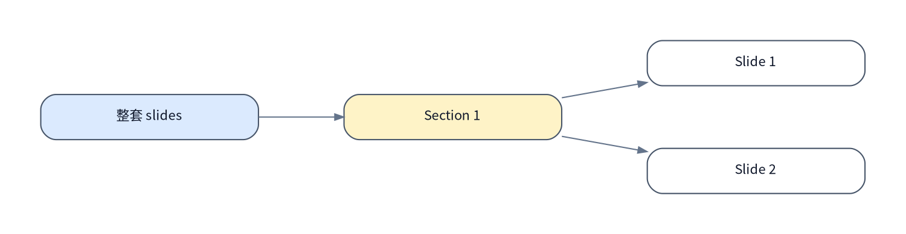

# <主题>Slides 规划

> [!NOTE]
> 当前模式：`slides`

## 大纲视图

### <Section 1 名称>

- 主线：<这个 section 主要承担什么叙事作用>
- 用户确认：[Q：<这个 section 为什么存在、重点是什么、不要讲什么>](#q-section-1-主线确认)

#### <Slide 1 名称>

> [!NOTE]
> 页目标：<这一页要讲清什么>
> QA 链接：[Q：<对应问题摘要>](#q-slide-1-页目标确认)

- `SVG` 线框图：

```html
<svg viewBox="0 0 1200 720" role="img" aria-label="<Slide 1 名称> 线框图">
  <rect x="80" y="72" width="1040" height="576" rx="32" fill="none" stroke="#94a3b8" stroke-width="4" />
  <rect x="128" y="120" width="944" height="72" rx="20" fill="none" stroke="#94a3b8" stroke-width="3" />
  <rect x="128" y="232" width="420" height="248" rx="24" fill="none" stroke="#94a3b8" stroke-width="3" />
  <rect x="580" y="232" width="492" height="248" rx="24" fill="none" stroke="#94a3b8" stroke-width="3" />
  <text x="152" y="165" fill="#94a3b8" font-size="28">Header / Narrative</text>
  <text x="152" y="364" fill="#94a3b8" font-size="28">Copy / Story</text>
  <text x="612" y="364" fill="#94a3b8" font-size="28">Visual / Diagram</text>
</svg>
```

- 交互说明：<滚动推进 / 页内流转 / 导航方式 / 动效触发方式>
- 素材清单：<标题、正文、图片、图标、数据、引用来源>
- 页级验收标准：<什么条件下这页算收敛完成>

#### <Slide 2 名称>

> [!NOTE]
> 页目标：<这一页要讲清什么>
> QA 链接：[Q：<对应问题摘要>](#q-slide-2-页目标确认)

- `SVG` 线框图：

```html
<svg viewBox="0 0 1200 720" role="img" aria-label="<Slide 2 名称> 线框图">
  <rect x="80" y="72" width="1040" height="576" rx="32" fill="none" stroke="#94a3b8" stroke-width="4" />
  <circle cx="300" cy="360" r="120" fill="none" stroke="#94a3b8" stroke-width="3" />
  <rect x="480" y="180" width="520" height="120" rx="24" fill="none" stroke="#94a3b8" stroke-width="3" />
  <rect x="480" y="340" width="520" height="180" rx="24" fill="none" stroke="#94a3b8" stroke-width="3" />
  <text x="220" y="368" fill="#94a3b8" font-size="28">Hero Visual</text>
  <text x="520" y="248" fill="#94a3b8" font-size="28">Key Message</text>
  <text x="520" y="430" fill="#94a3b8" font-size="28">Proof / Details</text>
</svg>
```

- 交互说明：<滚动推进 / 页内流转 / 导航方式 / 动效触发方式>
- 素材清单：<标题、正文、图片、图标、数据、引用来源>
- 页级验收标准：<什么条件下这页算收敛完成>

## 思维脑图



## 访谈记录

### Q：整套 slides 的总目标、受众和交付形态是什么？

> A：<用一句完整回答写清目标、受众和交付形态>
访谈时间：<YYYY-MM-DD HH:MM TZ>

影响面：

- <这条回答如何影响 section 划分、页数预算或交付形态>

### Q：Section 1 的主线为什么存在？

> A：<用一句完整回答写清这个 section 的叙事作用>
访谈时间：<YYYY-MM-DD HH:MM TZ>

影响面：

- <这条回答如何影响本 section 的 slide 选择>

### Q：Slide 1 的页目标是什么？

> A：<用一句完整回答写清这一页必须讲清什么>
访谈时间：<YYYY-MM-DD HH:MM TZ>

影响面：

- <这条回答如何影响该页结构、线框图或素材准备>

## 外部链接

| name | type | link | desc |
| --- | --- | --- | --- |
| 参考 deck | source | [示例链接](https://example.com/deck) | 作为品牌语气和结构参考。 |
| 数据源 | source | [示例链接](https://example.com/data) | 提供页面中的图表或数字依据。 |
