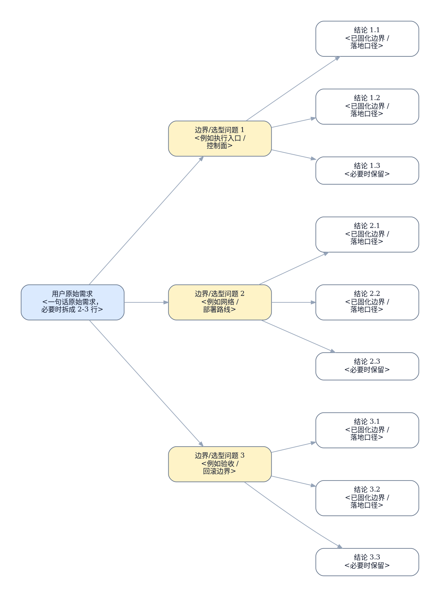

# <主题>执行手册

> [!NOTE]
> 当前模式：`operation`

## 背景与现状

### 背景

- <为什么这份 runbook 现在要做>
- <上游 authority / 环境变化 / 触发原因>

### 现状

- <本轮最新 reconnaissance 证据 1>
- <本轮最新 reconnaissance 证据 2>
- <如果引用历史结论，必须明确标注它只是历史背景，不是本轮现场真相>


## 目标与非目标

### 目标

- <目标状态>
- <成功定义 / handoff 边界>
- authority source： [<spec 设计文档>.md](./<spec-设计文档>.md)


### 非目标

- <明确不在本 runbook 覆盖的内容>
- <必须留给后续 authority 的内容>

## 资源命名

资源命名：适用

- [ ] 用户已确认本 runbook 中所有资源命名。

| 资源 | 名称 | 说明 |
| --- | --- | --- |
| <namespace / release / cluster / topic / secret / label> | `<name>` | <为什么采用该命名> |
| <飞书消息标题 / 目标群或接收人 / 卡片模板标识> | `<name>` | <消息资源的用途与命名依据> |

## 风险与收益

### 风险

1. <authority 定稿时仍客观存在的最高风险>
2. <authority 定稿时仍客观存在的第二风险>

### 收益

1. <最高收益>
2. <第二收益>

## 思维脑图



## 红线行为

- <严格禁止的动作>
- <一旦触发必须停止并回规划态的条件>

## 清理现场

清理策略：适用

清理触发条件：

- <哪些 stop boundary / 中断态需要先清理现场，才能恢复执行>
- <哪些半创建 / 半下发 / 半导入状态必须先被规划态收敛成清理动作>

清理命令：

```bash
...
```

清理完成条件：

- <哪些临时状态、半完成产物或脏现场需要被清掉>
- <清理完成后，现场应恢复到哪个可重入前置状态>

恢复执行入口：

- <清理完成后，应从哪个编号项重新进入执行>
- <清理完成后的恢复边界>

## 执行计划

<a id="item-1"></a>

### 🟢 1. 冻结现状

> [!TIP]
> 本步骤只读冻结当前现场状态并生成后续执行依据。

#### 执行

[跳转到执行记录](#item-1-execution-record)

操作性质：只读

执行分组：<现场冻结分组标题>

```bash
...
```

预期结果：

- <冻结后的证据 1>
- <冻结后的证据 2>

停止条件：

- <冻结失败条件 1>
- <冻结失败条件 2>

#### 验收

[跳转到验收记录](#item-1-acceptance-record)

验收命令：

```bash
<可直接执行、能够以退出码或明确输出判定结果的命令>
```

判定标准：

- 命令退出码为 0
- <精确返回值、字段、计数或阈值>

预期结果：

- <由上述命令直接证明的终态>

停止条件：

- <冻结证据不足>
- <冻结证据无法支撑 `### 现状`>

<a id="item-2"></a>

### 🔴 2. <编号项标题>

> [!CAUTION]
> 本步骤会执行<编号项标题>并改变现场状态。

> [!CAUTION]
> 严重后果：<例如数据丢失、服务中断、节点不可恢复、网络隔离或业务流量中断>

#### 执行

[跳转到执行记录](#item-2-execution-record)

操作性质：破坏性

执行分组：<执行分组标题>

```bash
...
```

预期结果：

- <预期状态变化或产物>

停止条件：

- <失败条件>
- <若命中停止条件或出现新的事实，必须回规划态>

#### 验收

[跳转到验收记录](#item-2-acceptance-record)

验收命令：

```bash
<可直接执行、能够以退出码或明确输出判定结果的命令>
```

判定标准：

- 命令退出码为 0
- <精确返回值、字段、计数或阈值>

预期结果：

- <由上述命令直接证明的终态>

停止条件：

- <验收失败条件>
- <若验收失败或出现新 blocker，不得直接续跑下一项>

## 执行记录

### 🟢 1. 冻结现状

<a id="item-1-execution-record"></a>

#### 执行记录

执行命令：

```bash
...
```

执行结果：

```text
...
```

执行结论：

- 待执行

<a id="item-1-acceptance-record"></a>

#### 验收记录

验收命令：

```bash
...
```

验收结果：

```text
...
```

验收结论：

- 待执行

### 🔴 2. <编号项标题>

<a id="item-2-execution-record"></a>

#### 执行记录

执行命令：

```bash
...
```

执行结果：

```text
...
```

执行结论：

- 待执行

<a id="item-2-acceptance-record"></a>

#### 验收记录

验收命令：

```bash
...
```

验收结果：

```text
...
```

验收结论：

- 待执行

## 最终验收

- [ ] 第 1 项验收通过并有 `#### 验收记录 @...` 证据
- [ ] 第 2 项验收通过并有 `#### 验收记录 @...` 证据
- [ ] 已新开一个独立上下文的 `references/recon/recon.md` 对应的只读 recon 子上下文执行最终终态侦察
- [ ] 最终验收只使用该独立 recon 子代理本轮重新采集的证据，不复用编号项执行 / 验收记录里的既有证据
- [ ] 最终验收 recon 输出证明整份 authority 已完成

最终验收侦察问题：

- <独立 recon 子代理必须重新确认的最终终态事实 1>
- <独立 recon 子代理必须重新确认的最终终态事实 2>

最终验收命令：

```bash
...
```

最终验收结果：

```text
<粘贴独立上下文 recon 子代理本轮返回的最终终态证据；不要粘贴或转述旧执行 / 验收证据>
```

- [ ] 已使用独立最终 recon 的终态证据更新对应 spec；若无现有 spec，已在参考资料中记录检索范围

最终验收结论：

- 通过 / 未通过

## 回滚方案

- <默认回滚边界>
- <禁止回滚路径>

2. <对应执行计划第 2 项的回滚边界、回滚动作和回滚后验证>

回滚动作：

```bash
...
```

回滚后验证：

```bash
...
```

## 访谈记录

### Q：<主 rollout 在规划阶段向用户提出的真实问题>

> A：<用户的真实回答；如果用户按编号选项回答，也要回填完整选项语义，而不是只写“选项 1”>

访谈时间：2026-04-23 14:30 CST

<这条回答如何改变执行路径 / 验收 / 回滚 / 非目标边界>
<如果有第二个影响面，就继续单独占一行>

### Q：<...>

> A：<...>

访谈时间：2026-04-23 14:35 CST

<...>

### Q：<...>

> A：<...>

访谈时间：2026-04-23 14:40 CST

<...>

## 参考资料

| name | type | link | desc |
| --- | --- | --- | --- |
| <authority spec / 上游 authority> | 文档 | [<path>-spec.md](./<path>-spec.md) | 如果本 runbook 派生自 spec，这里放唯一 authority source。 |
| <上游 authority / 前置文档> | 文档 | [<path>.md](./<path>.md) | 说明该文档的直接作用。 |
| <Ansible playbook / Python 脚本 / 模板文件> | 资源 | [<path>](./<path>) | 说明该资源在执行中的作用。 |
| <旁路参考 / 相关设计文档> | 文档 | [<path>.md](./<path>.md) | 说明该参考如何约束边界。 |
