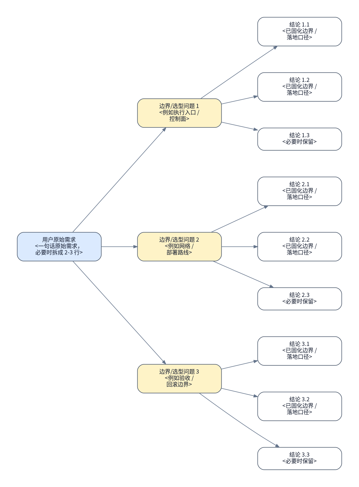

# <主题>执行手册

> [!NOTE]
> 当前模式：`<coding|operation|migration>`

## 背景与现状

### 背景

- <为什么这份 runbook 现在要做>
- <上游 authority / 环境变化 / 触发原因>

### 现状

- <本轮最新 reconnaissance 证据 1>
- <本轮最新 reconnaissance 证据 2>
- <如果引用历史结论，必须明确标注它只是历史背景，不是本轮现场真相>


- `### 现状` 必须来自本轮真实侦察或用户刚提供的新证据，不能只复述旧文档。
- 不要单独再起 `## 当前前提`；前提、入口、地址、边界都并入这里。
- 如果后续执行命令有工具原生 dry-run / no-op 预演模式，`### 现状` 或对应执行项必须引用本轮侦察实际执行 dry-run 后得到的退出码和关键输出；如果没有执行，必须说明 dry-run 不可用或不在只读边界内的原因。

## 目标与非目标

### 目标

- <目标状态>
- <成功定义 / handoff 边界>
- authority source： [<spec 设计文档>.md](./<spec-设计文档>.md)


### 非目标

- <明确不在本 runbook 覆盖的内容>
- <必须留给后续 authority 的内容>

## 风险与收益

### 风险

1. <authority 定稿时仍客观存在的最高风险>
2. <authority 定稿时仍客观存在的第二风险>

### 收益

1. <最高收益>
2. <第二收益>

- 如果风险或收益会改变执行路径、回滚边界或验收口径，后文必须体现它们如何被收敛。
- 已经通过重新计划、现场侦察或用户问答消除的风险，不要继续留在 `### 风险`；如有必要，可把它体现在访谈记录、现状或正文收敛结果里，但不要再当作当前风险。

## 思维脑图



- 根节点必须直接引用用户原始需求，而不是作者摘要。
- 至少 3 个边界/选型问题，每个问题至少 2 个叶子结论。
- 叶子节点写已经固化的结论，不写“是否 …”。
- 每个节点都手动换行；不要依赖 Graphviz 自动换行。

## 红线行为

- <严格禁止的动作>
- <一旦触发必须停止并回规划态的条件>
- `## 红线行为` 只保留红线条目与必要的禁止命令示例，不要再加 `###` 子标题。

## 清理现场

清理触发条件：

- <哪些 stop boundary / 中断态需要先清理现场，才能恢复执行>
- <哪些半创建 / 半下发 / 半导入状态必须先被规划态收敛成清理动作>

清理命令：

```bash
...
```

清理完成条件：

- <哪些临时状态、半完成产物或脏现场需要被清掉>
- <清理完成后，现场应恢复到哪个可重入前置状态>

恢复执行入口：

- <清理完成后，应从哪个编号项重新进入执行>
- <本章节由规划态维护；执行记录只保留恢复后的成功路径，不在 `## 执行记录` 里累计中断分支的失败清理尝试>

## 执行计划

- 如果当前模式是 `coding`，第一个编号项必须写成 `保证工作区干净`。
- 如果当前模式是 `operation` 或 `migration`，第一个编号项必须写成 `冻结现场`。
- 下方示例默认按 `operation` / `migration` 模式展示首项骨架；`coding` 模式请把首项替换成“保证工作区干净”的对应检查与验收。

<a id="item-1"></a>

### 🟢 1. 冻结现状

> [!TIP]
> 本步骤只读冻结当前现场状态并生成后续执行依据。

#### 执行

[跳转到执行记录](#item-1-execution-record)

操作性质：只读

执行分组：<现场冻结分组标题>

```bash
...
```

预期结果：

- <冻结后的证据 1>
- <冻结后的证据 2>

停止条件：

- <冻结失败条件 1>
- <冻结失败条件 2>

#### 验收

[跳转到验收记录](#item-1-acceptance-record)

验收命令：

```bash
...
```

预期结果：

- <执行者可以确认后续动作基于同一份冻结现状>

停止条件：

- <冻结证据不足>
- <冻结证据无法支撑 `### 现状`>

<a id="item-2"></a>

### 🔴 2. <编号项标题>

> [!CAUTION]
> 本步骤会执行<编号项标题>并改变现场状态。

> [!CAUTION]
> 严重后果：<例如数据丢失、服务中断、节点不可恢复、网络隔离或业务流量中断>

#### 执行

[跳转到执行记录](#item-2-execution-record)

操作性质：破坏性

执行分组：<执行分组标题>

```bash
...
```

预期结果：

- <预期状态变化或产物>

停止条件：

- <失败条件>
- <若命中停止条件或出现新的事实，必须回规划态>

#### 验收

[跳转到验收记录](#item-2-acceptance-record)

验收命令：

```bash
...
```

预期结果：

- <通过证据>

停止条件：

- <验收失败条件>
- <若验收失败或出现新 blocker，不得直接续跑下一项>

- 每个编号项都必须有 `#### 执行` / `#### 验收`。
- `## 执行计划` 下的每个步骤标题都必须使用 `### N. 标题` 形态，编号从 `1` 连续递增。
- 每个 `#### 执行` 必须写 `操作性质：只读`、`操作性质：幂等` 或 `操作性质：破坏性`。
- 每个编号项标题必须在编号前用灯号标出操作性质，例如 `### 🟢 1. 冻结现状`、`### 🟡 2. 幂等步骤`、`### 🔴 3. 破坏性步骤`。
- 每个编号项在 `#### 执行` 前必须写 GitHub alert：只读用 `> [!TIP]`，幂等用 `> [!WARNING]`，破坏性 / Danger 用 `> [!CAUTION]`；alert 正文只写一句话，用来概括这个编号项实际要做的事情。
- 破坏性步骤必须额外增加一个独立的 `> [!CAUTION]`，正文写 `严重后果：...`，说明最坏情况下会造成什么实际损害。
- 任何直接修改宿主机网络、磁盘、cgroup 等底层配置的步骤，都必须标为 `操作性质：破坏性`；即使命令可重复执行，也不能归类为幂等。
- `操作性质：只读`、`操作性质：幂等`、`操作性质：破坏性` 任意两类不允许出现在同一个编号项；先按操作性质拆成独立步骤再分别验收。
- 破坏性步骤的回滚方案只写在 `## 回滚方案`，并使用同一个编号项序号对齐，例如执行计划 `### 🔴 2. ...` 对应回滚方案里的 `2. ...`。
- 编号项的 `#### 验收` 不写 checkbox；所有验收 checkbox 统一放到 `## 最终验收`。
- 每个执行或验收分组都应包含 code block、`预期结果`、`停止条件`。
- 如果命令很长，拆成多个分组，不要把多层逻辑埋进一大段 shell。
- 不要另起 `## 编排策略`；顺序、回退、侦察触发条件都拆回各编号项。
- `## 清理现场` 用来承接中断后恢复执行前必须做的现场清理；规划态负责回填这一章，执行态在清理完成后再按 `恢复执行入口` 重进 `## 执行计划`。

## 执行记录

### 🟢 1. 冻结现状

<a id="item-1-execution-record"></a>

#### 执行记录

执行命令：

```bash
...
```

执行结果：

```text
...
```

执行结论：

- 待执行

<a id="item-1-acceptance-record"></a>

#### 验收记录

验收命令：

```bash
...
```

验收结果：

```text
...
```

验收结论：

- 待执行

### 🔴 2. <编号项标题>

<a id="item-2-execution-record"></a>

#### 执行记录

执行命令：

```bash
...
```

执行结果：

```text
...
```

执行结论：

- 待执行

<a id="item-2-acceptance-record"></a>

#### 验收记录

验收命令：

```bash
...
```

验收结果：

```text
...
```

验收结论：

- 待执行

- `## 执行记录` 的 item 标题必须和 `## 执行计划` 一一对齐。
- `## 执行记录` 下的每个步骤标题都必须使用与 `## 执行计划` 完全一致的 `### N. 标题`。
- `## 执行记录` 只保留恢复后的成功路径；中断后为恢复执行而新增的现场清理动作，由规划态写进 `## 清理现场`，不要把失败清理分支继续累积进成功路径记录里。
- 未执行 / 未验收前，只保留未签名的 `#### 执行记录` / `#### 验收记录`。
- 交付 runbook 时，即使规划态已经做过只读 reconnaissance，也不要预签名；这些证据应留在 `### 现状`、风险或 `## 访谈记录`，记录区保持未签名占位态。
- 真正回填证据时，再改成签名形态：
  - `#### 执行记录 @名字 YYYY-MM-DD HH:MM TZ`
  - `#### 验收记录 @名字 YYYY-MM-DD HH:MM TZ`

## 最终验收

- [ ] 第 1 项验收通过并有 `#### 验收记录 @...` 证据
- [ ] 第 2 项验收通过并有 `#### 验收记录 @...` 证据
- [ ] 已新开一个独立上下文的 `$runbook-recon` 子代理执行最终终态侦察
- [ ] 最终验收只使用该独立 recon 子代理本轮重新采集的证据，不复用编号项执行 / 验收记录里的既有证据
- [ ] 最终验收 recon 输出证明整份 authority 已完成

最终验收侦察问题：

- <独立 recon 子代理必须重新确认的最终终态事实 1>
- <独立 recon 子代理必须重新确认的最终终态事实 2>

最终验收命令：

```bash
...
```

最终验收结果：

```text
<粘贴独立上下文 recon 子代理本轮返回的最终终态证据；不要粘贴或转述旧执行 / 验收证据>
```

最终验收结论：

- 通过 / 未通过

- `## 最终验收` 必须由新开的独立上下文 `$runbook-recon` 子代理重新采集证据后收口。
- 最终验收 recon 子代理只做只读终态侦察，不接收父线程里的执行证据作为验收依据。
- 主 rollout 可以把 authority 路径、最终验收侦察问题、只读边界和需要回答的终态事实交给 recon 子代理；不得把已有执行 / 验收记录作为“已证明”证据交给它。
- 最终结论只能基于该 recon 子代理本轮返回的证据；编号项记录只能作为定位 scope 的索引，不能作为最终验收通过的证据来源。

## 回滚方案

- <默认回滚边界>
- <禁止回滚路径>

2. <对应执行计划第 2 项的回滚边界、回滚动作和回滚后验证>

回滚动作：

```bash
...
```

回滚后验证：

```bash
...
```

- `## 回滚方案` 固定放在 `## 最终验收` 后面。
- 回滚边界、回滚动作、回滚后最小验证都写在这里，不要再塞回 `## 红线行为`。
- 每个破坏性编号项都必须在这里写一个同序号回滚条目；不要把破坏性步骤的回滚方案写回 `#### 执行` 正文。
- `## 回滚方案` 不要再起 `###` 子标题；直接写边界、命令和验证。

## 访谈记录

> 这里只记录 planning 阶段真正向用户提的问题、用户真实回答，以及回答带来的具体影响面。不要写作者自问自答，也不要改写成 `## 当前已决策`。

### Q：<主 rollout 在规划阶段向用户提出的真实问题>

> A：<用户的真实回答；如果用户按编号选项回答，也要回填完整选项语义，而不是只写“选项 1”>

访谈时间：<必填；例如 2026-04-23 14:30 CST>

<这条回答如何改变执行路径 / 验收 / 回滚 / 非目标边界>
<如果有第二个影响面，就继续单独占一行>

### Q：<...>

> A：<...>

访谈时间：<必填>

<...>

### Q：<...>

> A：<...>

访谈时间：<必填>

<...>

### Q：<...>

> A：<...>

访谈时间：<必填>

<...>

### Q：<...>

> A：<...>

访谈时间：<必填>

<...>

- `## 访谈记录` 至少要有 5 条真实用户访谈。
- `### Q：` 标题和 `> A：` 回答都必须把正文写在同一行。
- `> A：` 下方必须先写一行 `访谈时间：...`；如果用 `runctl add-qa` 且未显式传 `--time`，脚本默认填当前本地时间。
- `访谈时间：...` 后必须空一行，再写影响面正文。
- 除了必填时间行外，`> A：` 下方的每个非空正文行都只写一个影响面，不要再写旧标签行。
- 如果真实访谈还不够，说明规划未完成，不要先定稿正文。

## 外部链接

| name | type | link | desc |
| --- | --- | --- | --- |
| <authority spec / 上游 authority> | 文档 | [<path>-spec.md](./<path>-spec.md) | 如果本 runbook 派生自 spec，这里放唯一 authority source。 |
| <上游 authority / 前置文档> | 文档 | [<path>.md](./<path>.md) | 说明该文档的直接作用。 |
| <Ansible playbook / Python 脚本 / 模板文件> | 资源 | [<path>](./<path>) | 说明该资源在执行中的作用。 |
| <旁路参考 / 相关设计文档> | 文档 | [<path>.md](./<path>.md) | 说明该参考如何约束边界。 |
