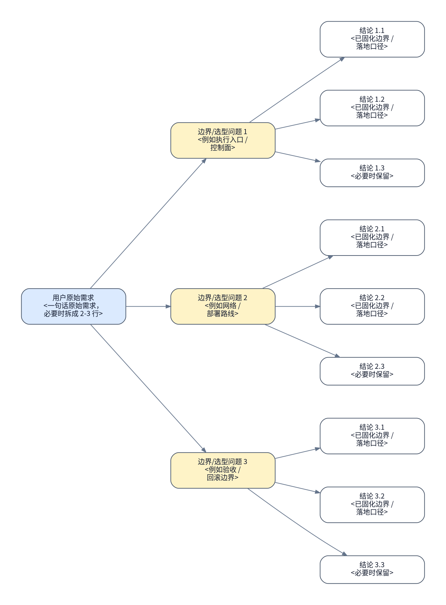

# <主题>执行手册

> [!NOTE]
> 当前模式：`<coding|operation|migration>`

> [!NOTE]
> slides / PPT / H5 规划已经拆分到独立 skill：`$inority-slides`

## 背景与现状

### 背景

- <为什么这份 runbook 现在要做>
- <上游 authority / 环境变化 / 触发原因>

### 现状

- <本轮最新 reconnaissance 证据 1>
- <本轮最新 reconnaissance 证据 2>
- <如果引用历史结论，必须明确标注它只是历史背景，不是本轮现场真相>


- `### 现状` 必须来自本轮真实侦察或用户刚提供的新证据，不能只复述旧文档。
- 不要单独再起 `## 当前前提`；前提、入口、地址、边界都并入这里。
- 如果后续执行命令有工具原生 dry-run / no-op 预演模式，`### 现状` 或对应执行项必须引用本轮侦察实际执行 dry-run 后得到的退出码和关键输出；如果没有执行，必须说明 dry-run 不可用或不在只读边界内的原因。

## 目标与非目标

### 目标

- <目标状态>
- <成功定义 / handoff 边界>
- authority source： [<spec 设计文档>.md](./<spec-设计文档>.md)


### 非目标

- <明确不在本 runbook 覆盖的内容>
- <必须留给后续 authority 的内容>

## 风险与收益

### 风险

1. <authority 定稿时仍客观存在的最高风险>
2. <authority 定稿时仍客观存在的第二风险>

### 收益

1. <最高收益>
2. <第二收益>

- 如果风险或收益会改变执行路径、回滚边界或验收口径，后文必须体现它们如何被收敛。
- 已经通过重新计划、现场侦察或用户问答消除的风险，不要继续留在 `### 风险`；如有必要，可把它体现在访谈记录、现状或正文收敛结果里，但不要再当作当前风险。

## 思维脑图



- 根节点必须直接引用用户原始需求，而不是作者摘要。
- 至少 3 个边界/选型问题，每个问题至少 2 个叶子结论。
- 叶子节点写已经固化的结论，不写“是否 …”。
- 每个节点都手动换行；不要依赖 Graphviz 自动换行。

## 红线行为

- <严格禁止的动作>
- <一旦触发必须停止并回规划态的条件>
- `## 红线行为` 只保留红线条目与必要的禁止命令示例，不要再加 `###` 子标题。

## 清理现场

清理触发条件：

- <哪些 stop boundary / 中断态需要先清理现场，才能恢复执行>
- <哪些半创建 / 半下发 / 半导入状态必须先被规划态收敛成清理动作>

清理命令：

```bash
...
```

清理完成条件：

- <哪些临时状态、半完成产物或脏现场需要被清掉>
- <清理完成后，现场应恢复到哪个可重入前置状态>

恢复执行入口：

- <清理完成后，应从哪个编号项重新进入执行>
- <本章节由规划态维护；执行记录只保留恢复后的成功路径，不在 `## 执行记录` 里累计中断分支的失败清理尝试>

## 执行计划

- 如果当前模式是 `coding`，第一个编号项必须写成 `保证工作区干净`。
- 如果当前模式是 `operation` 或 `migration`，第一个编号项必须写成 `冻结现场`。
- 下方示例默认按 `operation` / `migration` 模式展示首项骨架；`coding` 模式请替换首项。

<a id="item-1"></a>

### 🟢 1. 冻结现状

> [!TIP]
> 本步骤只读冻结当前现场状态并生成后续执行依据。

#### 执行

[跳转到执行记录](#item-1-execution-record)

操作性质：只读

执行分组：<现场冻结分组标题>

```bash
...
```

预期结果：

- <执行结束后应看到的真实状态>

停止条件：

- <一旦出现就必须停下回规划态的条件>

#### 验收

[跳转到验收记录](#item-1-acceptance-record)

验收命令：

```bash
...
```

预期结果：

- <确认本步骤完成的证据>

停止条件：

- <验收失败时必须停止的条件>

<a id="item-2"></a>

### 🔴 2. <编号项标题>

> [!CAUTION]
> 本步骤会实际修改现场状态，执行前必须确认边界、回滚入口和验收口径已经冻结。

> [!CAUTION]
> 严重后果：<例如数据丢失、服务中断、节点不可恢复、网络隔离或业务流量中断>

#### 执行

[跳转到执行记录](#item-2-execution-record)

操作性质：破坏性

执行分组：<执行分组标题>

```bash
...
```

预期结果：

- <执行结束后应看到的真实状态>

停止条件：

- <一旦出现就必须停下回规划态的条件>

#### 验收

[跳转到验收记录](#item-2-acceptance-record)

验收命令：

```bash
...
```

预期结果：

- <确认本步骤完成的证据>

停止条件：

- <验收失败时必须停止的条件>

## 执行记录

### 🟢 1. 冻结现状

<a id="item-1-execution-record"></a>

#### 执行记录

执行命令：

```bash
...
```

执行结果：

- <待补执行结果>

执行结论：

- 待执行

<a id="item-1-acceptance-record"></a>

#### 验收记录

验收命令：

```bash
...
```

验收结果：

- 待验收

验收结论：

- 待验收

### 🔴 2. <编号项标题>

<a id="item-2-execution-record"></a>

#### 执行记录

执行命令：

```bash
...
```

执行结果：

- <待补执行结果>

执行结论：

- 待执行

<a id="item-2-acceptance-record"></a>

#### 验收记录

验收命令：

```bash
...
```

验收结果：

- 待验收

验收结论：

- 待验收

## 最终验收

最终验收命令：

```bash
...
```

最终验收结果：

- [ ] <最终验收检查点 1>
- [ ] <最终验收检查点 2>

最终验收结论：

- <整份 runbook 是否达成 authority 目标>

## 回滚方案

1. <对应执行计划第 1 项的回滚边界、回滚动作和回滚后验证>

2. <对应执行计划第 2 项的回滚边界、回滚动作和回滚后验证>

回滚动作：

```bash
...
```

## 访谈记录

### Q：<...>

> A：<...>

访谈时间：<必填；例如 2026-04-23 14:30 CST>

<这条回答如何改变执行路径 / 验收 / 回滚 / 非目标边界>

### Q：<...>

> A：<...>

访谈时间：<必填；例如 2026-04-23 14:30 CST>

<这条回答如何改变执行路径 / 验收 / 回滚 / 非目标边界>

### Q：<...>

> A：<...>

访谈时间：<必填；例如 2026-04-23 14:30 CST>

<这条回答如何改变执行路径 / 验收 / 回滚 / 非目标边界>

### Q：<...>

> A：<...>

访谈时间：<必填；例如 2026-04-23 14:30 CST>

<这条回答如何改变执行路径 / 验收 / 回滚 / 非目标边界>

### Q：<...>

> A：<...>

访谈时间：<必填；例如 2026-04-23 14:30 CST>

<这条回答如何改变执行路径 / 验收 / 回滚 / 非目标边界>

## 外部链接

| 名称 | 类型 | 链接 | desc |
| --- | --- | --- | --- |
| <authority source> | spec | [<标题>](https://example.com) | <为什么它与本 runbook 相关> |
| <运行面文档> | docs | [<标题>](https://example.com) | <执行者需要回看的外部依据> |
| <补充资料> | reference | [<标题>](https://example.com) | <补充理解或验收口径> |
