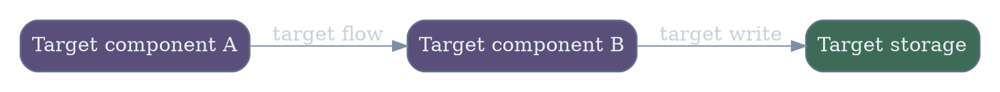
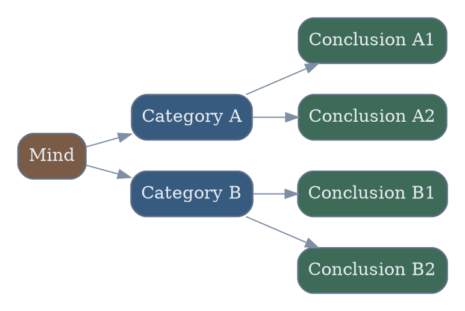

# <Runbook Title>

## 背景与现状
### 背景
- <Why this work exists now>

### 现状
- <Fresh reconnaissance evidence from this turn>
- <Historical context only if explicitly labeled historical>

## 目标与非目标
### 目标
- <Desired end state>
- <Scope boundary and success definition>

### 非目标
- <Explicitly out of scope item>

## 风险与收益
### 风险
1. <Highest still-open objective risk at finalization time>
2. <Next still-open objective risk at finalization time>

### 收益
1. <Highest benefit>
2. <Next benefit>

## 红线行为
- <Strictly forbidden action>

## 访谈记录
### Q：<question text>
> A：<user answer with actual content only, no numeric-choice recap>

访谈时间：<required interview time>

<impact line 1>
<impact line 2>

### Q：<question text>
> A：<user answer with actual content only, no numeric-choice recap>

<impact line 1>

### Q：<question text>
> A：<user answer with actual content only, no numeric-choice recap>

<impact line 1>

### Q：<question text>
> A：<user answer with actual content only, no numeric-choice recap>

<impact line 1>

### Q：<question text>
> A：<user answer with actual content only, no numeric-choice recap>

<impact line 1>

## 思维脑图

## 执行计划
### 🟢 1. <step title>
> [!TIP]
> This step reads the current state and records evidence for the next action.

#### 执行
操作性质：只读
- <Exact commands or exact actions>
- <Expected artifact or state change>

#### 验收
- <Exact validation commands or exact checks>
- <Pass criteria>

### 🟡 2. <step title>
> [!WARNING]
> This step applies the target state idempotently and records whether a change was needed.

#### 执行
操作性质：幂等
- <Exact commands or exact actions>
- <Expected artifact or state change>

- Direct host network, disk, cgroup, and similar low-level configuration changes must use `操作性质：破坏性`, even when the command is repeatable.

#### 验收
- <Exact validation commands or exact checks>
- <Pass criteria>

## 执行记录
### 步骤 1 - <step title>
#### 执行
- <Execution evidence>

#### 验收
- <Acceptance evidence>

### 步骤 2 - <step title>
#### 执行
- <Execution evidence>

#### 验收
- <Acceptance evidence>

## 最终验收
- <Open a fresh, independent-context `$runbook-recon` subagent for runbook-level final acceptance>
- <Use only evidence newly collected by that recon subagent; do not reuse existing execution or acceptance evidence>
- <Completion evidence or release decision based on the fresh recon result>

## 参考文献
- [<Live evidence source>](</abs/path/to/file.md:1>)
- [<External source>](https://example.com)
