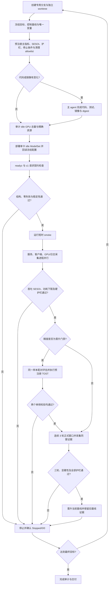

# Benchmark Mode

适用于模型服务、API、系统组件和基础设施的性能实验与基线报告。Benchmark 是独立文档模式，不归入 report 模式。

## 模式职责

- 在查看实验结果前冻结目标、实验约束、实验设计和统计判定规则。
- 区分历史基线、当前控制基线与实验组。
- 对每个实验指标同时判断实际方向与统计显著性。
- 用证据支持接受、继续实验或拒绝上线的决策。
- 只有连续三轮均显著正向且不触发护栏的候选项才能晋升为新基线。
- 将“最终目标”和“基线晋升触发条件”分开：候选即使未达到最终目标，只要相对当前基线显著正向，就必须尝试完成基线晋升验证，验证通过后先升级基线再继续迭代。
- 在结论完成后记录临时资源回收结果。

## 启动判断

用户提到压测、benchmark、吞吐、延迟、性能基线、实验组、A/B 性能对比、统计显著性或性能回退时进入本模式。

开始前至少明确：

- 实验对象与请求契约；
- 固定输入或流量口径；
- 待提升指标；
- 实验约束，包括硬件、资源形态、请求契约、数据集有效性条件与结果接受边界；
- 当前控制组与可用历史基线；
- 统计方法、显著性水平和实际效应阈值；
- 最终目标与基线晋升的最低实际效应门槛；
- 临时资源范围及回收责任。

## 模板

- `templates/benchmark-template.md`

## Validator

- 规则：`validator/rules.json`
- 错误码：`validator/error-codes.yaml`

## 文件与标题

- 标题只写对象与实验主题，不重复日期、实验 ID 或实验批次范围；日期由正文元数据和目录路径表达。
- 类型说明固定为 `当前文档类型：benchmark`。
- 默认路径为目标项目的 `docs/benchmark/YYYY-MM-DD/<topic>.md`；若项目已约定 `docs/report/`，可沿用项目路径，但文档类型仍为 benchmark。

## 统计判定

### 统计方法呈现

- `### 统计方法` 下按指标拆分，每个指标使用 `#### <指标名>` 独立子标题；不得把多个指标的公式混在同一无标题段落。
- 每个指标子标题后的首个内容块必须是 callout，用一句话说明该指标回答的问题、优化方向和用于描述性统计、主判定或护栏中的哪一种。
- 每个指标必须至少包含一个 fenced `katex`（或等价 `math`）公式；不得用公式截图、行内代码或纯文字替代核心定义。
- 公式后必须定义符号、单位、聚合窗口、样本口径和适用条件，并确保符号与结果表字段及统计脚本一致。
- 吞吐、延迟、资源、误差、显著性或等效性指标只保留本次实验实际使用的项目；不适用的公式不得为了填模板而虚构。
- 完整遵循 [`../../references/formulas.md`](../../references/formulas.md) 的 KaTeX 语法和渲染验收规则。

每个指标只能归入一类：

- `显著正向`：方向有利、置信区间排除零、显著性规则通过且达到实际目标；
- `正向但不显著`：点估计有利，但统计证据或实际效应不足；
- `中性`：变化落在预先声明的等效区间或噪声带；
- `负向但不显著`：点估计不利，但统计证据不足；
- `显著负向`：统计证据确认负向变化，或突破预注册的结果接受边界。

不得仅凭百分比变化声称显著。至少报告方向、绝对和相对变化、置信区间、p 值（适用时）、效应量、样本量、检验方法和多重比较校正。

提升目标与实验约束独立判定。硬件、资源形态、请求契约或数据集约束不满足时整轮无效；任何结果接受边界被突破都默认阻断接受实验，除非实验前已明确其他决策规则。

## 实验基线纪律

- 历史基线必须带日期、版本、数据集、资源规格、并发和证据链接。
- 当前控制基线必须与实验组同窗或说明时间偏差。
- 不可直接比较的历史基线只能作为背景，不得参与显著性结论。
- 当历史结果属于不同目标、请求契约或统计口径，且会污染当前基线链时，必须迁入独立的 benchmark archive。archive 仍使用 benchmark mode 完整记录实验卡片、排除项、未确认项和资源回收；当前 benchmark 只在“排除项”和“参考资料”保留链接与不可比原因，禁止复制历史结果表或倒填基线。
- `不相关（排除）` 的实验没有可比控制组时，不得为满足格式虚构相对变化百分比；callout 必须改为明确说明不可比原因。
- 缺少历史基线时明确写“无可用历史基线”，不得用本轮实验结果倒填。
- 显著正向只获得“基线候选”资格；候选必须在相同冻结契约下连续三轮都显著正向，并且三轮均满足全部实验约束，才能晋升。
- 不得以“尚未达到最终目标”为由跳过显著正向候选的晋升尝试。先执行精度、重复性和资源护栏验证；验证通过即更新当前基线，最终目标的剩余差距从新基线继续搜索。
- smoke 若达到预注册的基线晋升触发条件但尚不足以判断显著性，必须进入正式晋升轮；不得只因未达到最终目标而停止。smoke 本身不能直接晋升。
- 每个实验结果必须使用模板中的统一实验卡片：关键参数使用表格，冻结配置使用列表，随后依次给出结果、精度/输出偏移、有效性与决策、资产与回收；失败、排除和进行中的实验也不得省略结构。
- `实验组` 登记表中的每个实验 ID 必须在 `实验结果` 中恰好出现一次，反之亦然；两处顺序必须一致。同一编号前缀内按数字和小写后缀自然顺序严格递增，例如 `N13 < N13b < N14`，不得重复、倒序或用跳回旧编号追加结果。不同前缀（如诊断组 `P0`）各自独立检查递增，但仍须在两处占据相同位置。
- 每一个实际执行的 smoke、正式轮、配对轮、验证轮和晋升轮都必须作为独立表格行持久化，至少包含轮次、样本/成功/失败、配置引用、吞吐、描述性延迟、输出护栏、有效性与决策；不得只保留均值或散文总结。
- 每个历史基线在 `## 实验基线` 内使用独立 H3 小标题，并在卡片内以 `**验证**` 和 `**晋升决策**` 固化其三轮证据、护栏、决定、生效时间及被后继基线取代的原因；不得把多个历史基线压缩成一张汇总表，也不得另建全局验证/晋升表或后置的 `## 基线晋升`。
- 未知事实写为 `测量中` 或 `未取得（具体原因）`。任何会改变有效性、结论方向、护栏状态或决策的歧义都必须重新测试，不得补写推测值。
- 连续三轮中的任一轮不显著、为负向、不可比较或触发护栏，都中止本次晋升计数；不得挑选成功轮次或删除失败轮次。
- 晋升后记录旧基线、新基线、三轮证据、版本与生效时间，旧基线保留为历史基线。

## 实验执行方法

### 冻结目标与约束

- `目标` 只描述要最大化或改善的主指标、搜索范围、实际效应门槛和高峰判定，不混入回退条件。
- `实验约束` 单独声明失败率、输出契约、模型精度、业务决策一致率、资源红线和不可接受回退。任何约束被突破时，即使吞吐更高也不能接受候选。
- 指标必须声明优先级。用户明确吞吐优先时，P95 和 P99 只作为观测项，不得仅因尾延迟上升淘汰吞吐更高的候选。
- 基线与候选必须固定使用同一真实数据、manifest、有效样本、输入预处理、请求顺序、客户端并发和统计口径。存在差异时禁止直接排序。
- 测试集必须版本化，并记录稳定路径、样本量、有效样本量、预处理契约和选择方法。无法复现的临时随机抽样不能形成正式结论。
- 有条件时准备多组固定真实测试集，覆盖不同语种、站点、尺寸、文件大小或内容分布。主测试集用于高频搜索，其他测试集用于最终组合的泛化复测。

### 有效窗口与作废规则

- 每个用于方向判断的正式性能窗口必须连续运行至少 300 秒。少于 300 秒的结果只能标记为 smoke 或探测，不得进入正式排序。
- 每个候选默认执行至少 3 个相互独立的正式窗口，并保留每轮原始数据。不得只报告三轮均值。
- 测试窗口内发生驱逐、Pod 或容器重启、服务不可用、健康检查失败、客户端异常中断、非预期失败请求或配置错配时，本轮整体作废。
- 不得拼接故障前后的数据凑满 300 秒。恢复后必须从新的连续窗口完整重测。
- 作废实验仍需保留配置、已运行时长、失败原因和证据，但不参与性能排序或晋升计数。
- 每个实际执行的 smoke、正式轮、配对轮、验证轮和晋升轮都必须在对应实验卡片的 `每轮数据` 表中独立登记。

### 单 Agent 编排与进程级并行

- 默认由一个主 agent 串行闭环负责全部候选的代码、测试、镜像、预注册、部署、负载、指标、验收、文档和资源回收。除非用户明确要求，不得把候选、部署、验收或侦察拆给多个 agent 并行推进。
- 允许同一主 agent 并行启动彼此隔离的后端服务、客户端负载、GPU/Prometheus 采集、日志采集和统计脚本；这些是进程或服务级并行，不改变单 agent 的事实所有权和判定责任。
- 需要同窗对照时，可以同时保留当前冠军控制服务和候选服务，并使用相同数据与客户端负载；主 agent 必须统一编排启动、窗口冻结、停止和证据归档。
- Idle ModelSet benchmark 默认使用单卡资源并报告单卡吞吐。只有模型明确需要 Tensor Parallel 或 Pipeline Parallel 时才设计多卡实验；必须预注册 TP/PP 并行度、GPU 拓扑、聚合口径和独立资源类别，不得把多卡总吞吐直接与单卡基线比较或宣称为单卡提升。
- 每个并行服务或脚本必须拥有独立实验 ID、服务或 ModelSet、GPU、客户端进程和输出目录；不得共享会产生竞争的 GPU、CPU 配额、服务队列或客户端并发。平台实际复用资源或发生相互抢占时，受影响窗口全部作废。
- 主 agent 独占当前冠军、历史基线链、组合候选、实验登记表和晋升判定的写权限。

### 方向发现与瓶颈侦察

- 每轮优化开始前，主 agent 根据上一轮瓶颈、资源指标和代码路径搜索新的优化方向。
- 每轮有效 smoke 和正式窗口结束后，必须先完成同窗硬件剖面解释，再预注册下一性能候选。不得只按吞吐排序后盲扫参数；下一候选必须引用上一轮的硬件或 profiler 证据，说明它要消除的具体未饱和资源、串行阶段或数据供给瓶颈。
- 外部资料优先使用官方文档、上游仓库、论文和框架维护者资料，并记录来源、适用前提、预期收益、精度风险和是否进入实验。
- 联网搜索不能替代目标环境的代码和运行态验证。方向只有与当前硬件、模型版本、依赖和调用链匹配后，才进入独立资源实验。
- 主 agent 可以并行运行只读侦察脚本，收集硬件拓扑、GPU 型号与互联、CPU/NUMA、部署方式、容器与依赖版本、服务日志、Prometheus 指标和 profiler 证据；默认不为这些侦察另启 agent。
- 只读侦察不得修改服务或向正式压测服务注入额外负载。火焰图、torch profiler、Nsight 或主动探针必须使用独立服务、GPU 和输出目录。
- 决策证据优先级为运行态 profiler 与指标、目标环境真实代码和版本、本地代码、上游官方资料、经验推断。推断必须明确标注。

### 推理框架候选

- 当硬件剖面显示 GPU/Graphics Engine 持续有工作，但 SM occupancy、Tensor Pipe 利用率偏低，且 profiler 指向逐 token 调度、KV cache、continuous batching、kernel 碎片或 Python/框架同步开销时，必须把 SGLang 和 vLLM 纳入候选调研；不得只在现有 Transformers/Ray Serve 路径里盲扫参数。
- SGLang/vLLM 属于架构级候选。实验前必须冻结框架版本、CUDA/PyTorch版本、attention backend（如 FlashAttention/FlashInfer）、KV cache dtype、batch scheduler、chunked prefill、CUDA Graph、并行度与显存预算，记录不可变镜像 digest。
- 框架预检至少覆盖：目标模型架构与权重格式是否原生支持；视觉编码器和语言模型能否复用或拆分；是否支持当前多模态 token/embedding 注入；请求级评分开关、结构化输出、logits约束与停止条件能否等价实现；IQA输出解析与错误语义是否保持；Ray Serve或其他网关契约如何衔接。
- 若框架不原生支持目标多模态模型，不得用文本模型微基准代替业务结论。可以先建立 `ViT服务 + SGLang/vLLM语言后端` 的分层候选，但必须把跨进程视觉特征传输、序列化、PCIe/NVLink和端到端延迟纳入同一窗口，并与现有一体化基线直接比较。
- 框架候选必须依次通过：启动与模型加载检查、c1业务契约、固定样本配对TOST精度门、短时吞吐/硬件剖面、3×300秒正式窗口。任何框架特有的量化、视觉token裁剪、prompt改写或生成语义变化必须拆成独立变量，不能混入“只替换框架”的首轮对照。
- 框架方向的判断也必须使用 `剖面证据 → 框架机制 → 预期硬件变化`：例如 continuous batching/CUDA Graph 预期减少调度空洞并提高SM active；paged KV cache主要改善容量与长上下文调度，不应在短上下文场景预设会提升Tensor利用率；FlashInfer/融合sampling只有在对应kernel路径实际命中后才算实现证据。

## 基线晋升与峰值搜索

- 基线采用可晋升的冠军链。候选只有在性能统计通过且全部实验约束通过后，才获得晋升资格。
- 最终目标是搜索终点，不是基线晋升的必要条件。任何显著正向候选都必须进入晋升尝试；通过三轮显著性、精度和全部护栏后立即成为新控制基线，即使距离最终目标仍有差距。
- 晋升尝试失败时保留失败证据并继续从当前冠军搜索；晋升成功时后续候选必须默认相对新冠军比较，禁止继续用更弱旧基线制造累计提升错觉。
- 模型候选还必须通过精度统计等价、输出契约、失败率和资源红线，才能晋升。
- 晋升后必须保留旧基线的版本、配置、性能、精度、证据和被替代原因，不得覆盖历史基线。
- 所有尚未执行或需要重测的方向默认继承新冠军的全部配置，只增加新的唯一变量。除明确的消融实验外，不得继续从更弱历史基线分叉。
- 每次晋升同步更新历史基线卡片、当前控制基线、实验组比较基准、组合路径和待测配置。
- 压测不能在第一个正向结果后结束。必须识别可兼容的正向方向，将其组合到同一候选中，再围绕组合候选继续搜索。
- 最终结果是所有已测组合中满足实验约束且主指标最高的组合，不是时间顺序上的最后一次实验。
- 最终文档必须保留全部正向、负向、中性、不相关和作废方向，并说明是否进入最终组合及未采用原因。
- 组合路径必须显式记录，例如 `B0 -> B1（A）-> B2（A+B）-> B3（A+B+C）`，并给出每一步相对前代的增量。
- “达到高峰”必须有相邻参数点、资源瓶颈或连续候选不再提升的证据。单个成功参数点不构成峰值证明。

## 模型精度方法

- 涉及模型代码、算子、prompt、量化、输出约束或预处理变化时，性能实验必须同时执行模型精度门禁。
- 精度实验固定使用同一批图片或样本与基线配对。多组数据集需要分别给出精度结论，不能只报告合并平均值。
- “没有区别”必须由统计等价检验证明，不能把传统差异检验的 `p > 0.05` 解释为等价。
- 等价界值由业务可接受误差和基线自身重复波动共同确定，并在查看候选结果前冻结。不得为让候选通过而事后放宽。
- 当连续评分精度被用作候选晋升门禁时，必须对基线与候选的同一样本执行配对 TOST；不得以相关系数、传统差异检验 `p > 0.05`、均值接近或其他非等效检验替代。只有两个单侧检验都通过，等价地配对均值差的 `(1-2\alpha)` 置信区间完整落入预先冻结的双侧等效区间，才判定通过。
- 连续评分至少保留样本量、配对均值差、效应量、上下等价界值、TOST 两个单侧 p 值及合并判定、对应置信区间，以及 bootstrap 稳健性结果。Pearson、Spearman、MAE、P95/最大绝对差和离群样本数可以作为补充护栏，但不能替代 TOST。
- 业务二分类决策至少保留不一致数量、差值、等价界值和配对置信区间。
- 多轮重复同时报告单轮结果、候选自身波动、基线自身波动和最终等价结论。
- 纯调度参数实验可以复用同一模型实现已通过的精度证据，但必须明确写出复用的候选、数据集和证据路径。

## 标准压测流程图

- benchmark 文档必须包含或引用下列标准流程的 Mermaid 图，并按实际实验删改不适用节点；不得省略预注册、精度门禁、正式重复、基线晋升和资源回收。
- 主 agent 串行拥有代码、镜像、部署、验收、决策、文档和回收。已冻结的后端服务、压测客户端与指标采集可以作为进程并行运行，但不得由多个 agent 并行修改候选或共享实验资源。
- 长时间或跨多轮的 benchmark 必须使用专用 Git 分支和独立 worktree；代码、文档、测试、镜像构建与证据归档都从该 worktree 产生。不得直接依赖会被用户 checkout、rebase 或清理的主工作区。每个候选必须记录 worktree、分支、commit SHA 与不可变镜像 digest；运行期间切换主工作区不得改变已部署候选。

## GPU 与资源证据

- 涉及 GPU 时，每个有效 smoke 和正式窗口必须记录同一时间范围的平均功耗、GPU 利用率、显存、SM active、SM occupancy、DRAM active、Tensor Pipe active 和显存 copy utilization；目标平台可提供时，同时记录 Graphics Engine active、PCIe/NVLink RX/TX、SM/显存时钟、温度及节流原因。
- 使用 Ray Serve `@serve.batch` 时，每个有效窗口必须记录实际 batch size、batch utilization、batch wait、batch execution、batch queue、batches/s 和 replica ongoing。实际 batch size 使用 batch histogram 的 `sum / count` 计算，并同时报告分位数或分布。配置的 `max_batch_size` 只作为上限，不得代替实际合批指标。
- Ray Serve 并发上限必须通过相邻并发点判断。只有当实际 batch size、吞吐和功耗不再改善，或延迟、失败率、队列、OOM 等护栏触发时，才能声明已到并发高峰。GPU utilization 为 `100%` 不能单独证明有效 batch 已饱和。
- 硬件剖面必须同时报告均值和至少一个峰值或分位数，并注明指标语义、单位、时间窗、采样间隔和数据源。字节率不得在未确认 exporter 单位时直接宣称为带宽利用率百分比。
- 每个实验卡必须给出 `硬件瓶颈判断`：至少在客户端/CPU供给、PCIe/NVLink传输、显存容量、显存带宽、SM驻留、Tensor Core、串行依赖/小kernel、热/功耗降频中逐项排除或保留，并区分“直接证据”与“推断”。
- 下一候选必须写明 `剖面证据 → 优化机制 → 预期变化指标`。例如 GPU util 和 Graphics Engine 接近饱和、但 SM occupancy、Tensor 与 DRAM 均低时，优先验证小矩阵、逐token依赖、kernel碎片或同步开销，不得误判为显存带宽不足；DRAM active 接近饱和而 Tensor/SM仍有余量时，才优先考虑访存、布局、融合和量化方向。
- 若常规指标无法区分两个以上候选瓶颈，下一轮应先使用独立资源运行 torch profiler、Nsight Systems/Compute 或等价火焰图诊断；带 profiler 的吞吐不得与无 profiler 基线直接比较。
- GPU 功耗阈值默认表达最低健康要求，不得暗含上限。用户声明功耗越高越好时，功耗超过健康下限不得成为降级、拒绝或降低排序的理由；主指标为吞吐时，候选跨过功耗下限后继续按吞吐排序，较高功耗只作为有利的资源利用证据。
- 无法采集的指标必须写 `未取得（具体原因）`，不能留空或用其他 GPU 的数据代替。
- 每个结论至少附原始结果路径、时间窗口、run ID、日志路径或指标查询条件中的一种可复现证据。
- 为实验创建或占用的服务必须登记资源 ID、精确名称、资源规格、负责人、状态和对应实验。
- 实验完成、候选淘汰或窗口作废且不再重测时，及时停止并回收临时资源，确认 ready replica 归零或资源不存在。
- 最终收尾逐项核对 ModelSet、Pod、客户端和 profiler 进程。只有用户明确要求保留的资源可以继续运行，并写明原因。

## 完成回报

至少交代文档路径、目标是否达成、实验约束是否满足、显著正负向结果、组合复测结果、基线晋升判定、未确认项及资源回收状态。
