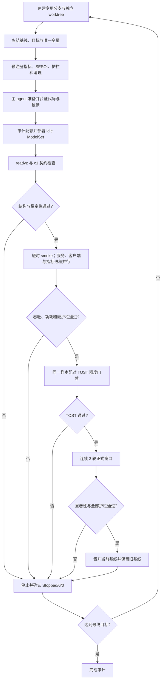

# <对象> <实验主题> Benchmark

> [!NOTE]
> 当前文档类型：benchmark

实验日期：YYYY-MM-DD

> <一句话说明是否达到提升目标、是否满足实验约束，以及最终决策。>

> [!IMPORTANT]
> 属于不同目标、请求契约或统计口径，且不可直接比较的历史结果，必须迁入独立的 `*-archive.md` benchmark。当前 benchmark 只在“排除项”和“参考资料”保留链接与不可比原因，不复制历史结果表，也不得将其倒填为当前基线。

## 结论

> <接受 / 继续实验 / 拒绝，并给出最关键的统计依据。>

| 实验组 | 提升指标 | 回退护栏 | 总体决策 | 依据 |
| --- | --- | --- | --- | --- |
| `<experiment>` | <五类结论> | `通过 / 触发` | `接受 / 继续实验 / 拒绝` | <CI、p 值、效应量> |

## 目标

### 待提升的指标

| 指标 | 趋势 | 当前基线 | 最终目标 | 基线晋升触发 | 显著性与实际效应规则 | 达标后决策 |
| --- | --- | ---: | ---: | ---: | --- | --- |
| `<metric>` | `越高越好 / 越低越好` | <值> | <绝对或相对提升> | <进入正式晋升验证的最低效应> | <CI、alpha、效应量门槛> | <晋升新基线并继续追逐最终目标> |

> [!IMPORTANT]
> 最终目标与基线晋升独立判定。候选未达到最终目标但已显著正向时，必须尝试完成精度、护栏和连续三轮晋升验证；通过后立即更新当前基线，并从新基线继续迭代。

> [!NOTE]
> GPU 功耗健康阈值默认只有下限、没有上限；超过下限不得成为惩罚项。若吞吐是主指标，候选满足功耗下限后按吞吐排序，并把更高功耗作为有利的利用率证据。

### 实验约束

| 约束类型 | 约束对象 | 必须满足 | 验证证据 | 违反后决策 |
| --- | --- | --- | --- | --- |
| `实验有效性 / 回退护栏` | `<hardware / contract / metric>` | <精确条件或阈值> | <运行前/窗口内证据> | `整轮无效 / 拒绝 / 回滚 / 阻断上线` |

## 范围

- 检查对象：<模型、服务、接口或组件>
- 时间范围：<开始与结束>
- 环境边界：<集群、资源、实例与客户端>
- 数据边界：<manifest、样本量、checksum>
- 未覆盖范围：<填写>

## 方法

### 实验设计



<若精度不是门禁，图中 TOST 节点必须标记为不适用并写明依据；不得静默删除回收路径。>

#### 实验参数

- 专用 worktree / 分支：<绝对路径> / `<branch>`
- 候选 commit / 镜像：`<sha>` / `<digest>`
- 实验单位与分组：<填写>
- 并发、重复、随机化、配对或阻断：<填写>
- 请求与预处理契约：<填写>
- 失败、重试和异常值规则：<实验前固定>

### 统计方法

每个实际使用的指标复制一节；删除不适用的示例，不得保留空壳。

#### 吞吐量

> [!NOTE]
> 回答单位墙钟时间内成功处理多少样本；越高越好，作为本实验的 `<主指标 / 描述性指标>`。

```katex
R_j=\frac{N_j}{T_j}
```

其中，$R_j$ 为第 $j$ 轮吞吐量（`<req/s / img/s>`），$N_j$ 为该轮成功样本数，$T_j$ 为连续有效窗口的墙钟时间（秒）。聚合窗口：`<填写>`；失败与重试口径：`<填写>`。

#### `<指标名>`

> [!NOTE]
> <说明该指标回答的问题、越高/越低越好，以及它属于主判定、护栏或描述性统计。>

```katex
<使用 KaTeX 写出该指标的核心定义或统计量>
```

其中，<逐一定义符号、单位、聚合窗口、样本口径和适用条件；符号必须与结果表及脚本字段一致。>

#### 配对精度等效检验（TOST；精度作为门禁时必填）

> [!IMPORTANT]
> 使用基线与候选的同一样本逐项配对，并在查看候选结果前冻结上下等效界值。相关系数和传统差异检验不得替代 TOST。

```katex
H_0:\ \mu_d\le\Delta_L\ \text{或}\ \mu_d\ge\Delta_U,
\qquad
H_1:\ \Delta_L<\mu_d<\Delta_U
```

```katex
t_L=\frac{\bar d-\Delta_L}{s_d/\sqrt{n}},
\qquad
t_U=\frac{\bar d-\Delta_U}{s_d/\sqrt{n}}
```

其中，$d_i=y_{candidate,i}-y_{control,i}$；等效区间为测量前冻结的 $[\Delta_L,\Delta_U]$。仅当两个单侧检验均满足 $p<\alpha$，等价地 $(1-2\alpha)$ 置信区间完整落入该等效区间，才通过精度门禁。必须同时报告样本量、配对均值差、效应量、两侧 p 值、置信区间、bootstrap 稳健性、MAE、P95/最大绝对差和离群样本数。

需要时继续按相同结构分别增加延迟、均值、样本标准差、CV、差值、置信区间、检验统计量、效应量、多重比较校正、逐项输出误差、BRE/SESOI 等效界限、分类分歧上限和 EMU；不得把多个指标合并为一个无标题公式清单。

```shell
<可直接运行的统计脚本命令，列出控制组、实验组、GPU窗口和输出参数>
```

- 脚本资产：[`assets/scripts/<analysis-script>`](<path>)。
- SHA256：`<hash>`。
- 样本量与功效限制：<填写>。

## 实验基线

### 历史基线：`<baseline-id>`

| 日期 | 版本 / 镜像 | 数据集 | 资源与并发 | 核心指标 | 可比性 | 证据 |
| --- | --- | --- | --- | --- | --- | --- |
| <日期> | <revision/digest> | <manifest/checksum> | <规格> | <值> | `可直接比较 / 仅供参考 / 不可比较` | <link> |

**验证**

| 轮次 / 验证组 | 控制基线 | 样本 / 成功 / 失败 | 核心指标 | 统计证据 | 护栏 | 结论 | 证据 |
| --- | --- | --- | --- | --- | --- | --- | --- |
| 1/3 | <control> | <n/success/fail> | <值> | <CI/p/effect> | <状态> | <分类> | <link> |
| 2/3 | <control> | <n/success/fail> | <值> | <CI/p/effect> | <状态> | <分类> | <link> |
| 3/3 | <control> | <n/success/fail> | <值> | <CI/p/effect> | <状态> | <分类> | <link> |

**晋升决策**

> <是否3/3显著正向、护栏状态、晋升/建立决定、生效时间，以及后来被哪个基线取代。>

每个历史基线复制一张独立 H3 卡片。无历史基线时写明原因和补建计划，不得用当前实验结果倒填。

### 当前控制基线：`<baseline-id>`

| 版本 / 镜像 | 样本量 | 成功率 | 吞吐 | P50 / P95 / P99 | 质量 / 输出指标 | 证据 |
| --- | ---: | ---: | ---: | --- | --- | --- |
| <revision/digest> | <n> | <值> | <值> | <值> | <值> | <link> |

**验证**

<当前基线连续三轮、统计显著性、输出与资源护栏证据。>

**晋升决策**

<晋升原因、生效时间和被取代的旧基线。>

**当前候选状态**

<候选ID与验证进度；没有候选时明确写“暂无”。>

## 实验组

| 实验组 | Owner | 状态 | 假设与相对控制组的唯一变量 | 版本 / 配置 | 独立资源 | 计划样本 / 轮次 | 预注册时间 | 证据 |
| --- | --- | --- | --- | --- | --- | --- | --- | --- |
| `<experiment>` | `main` | `planned / smoke / measuring / completed / excluded / cleaned` | <唯一改动与预期机制> | <revision/config> | <ModelSet 精确名称/ID或 pending> | <n × runs> | <结果揭盲前时间> | <link> |

每个实验组还必须在测量前固定主指标、SESOI/等效界限、不可接受回退、停止条件和清理 allowlist。正式测量结果不得先于实验组登记进入决策。

实验 ID 必须与下方逐实验结果卡片一一对应且顺序完全一致；同一前缀按数字和小写后缀自然顺序严格递增，例如 `N13`、`N13b`、`N14`。

## 实验结果

### 结果总表

| 实验组 | 指标 | 趋势 | 控制组 | 实验组 | 绝对变化 | 相对变化 | 置信区间 | p 值 | 效应量 | 校正 | 结论分类 | 目标 / 约束 |
| --- | --- | --- | ---: | ---: | ---: | ---: | --- | ---: | ---: | --- | --- | --- |
| `<experiment>` | `<metric>` | `越高越好 / 越低越好` | <值> | <值> | <delta> | <%> | <CI> | <p> | <effect> | <方法> | <五类之一> | <填写> |

总表只承担跨实验扫描，不代替逐实验解释。总表后每个 H3 必须对应一个实验，不得再用“显著正向”“中性”“显著负向”等分类名作为 H3。

### `<experiment-id> <experiment-name>`

> [!TIP]
> 结论分类：显著正向（+12.3%）。<一句话说明主指标、显著性、实际效应与护栏。>

**关键参数**

| 参数 | 值 |
| --- | --- |
| Owner | `main` |
| 状态 / 有效性 | `planned / measuring / valid / invalid / excluded / cleaned`；<原因> |
| 控制基线 | <baseline ID及可比性> |
| 精确资源 | <ModelSet ID / exact name> |
| 硬件 / 拓扑 | <GPU、CPU、内存、actor/replica> |
| 契约 | <endpoint、manifest、并发、预处理> |
| Ray 合批 | <实际 batch size / max batch size、利用率、wait、execution、queue、batches/s、replica ongoing，或不适用> |
| 样本 / 成功 | <n、成功数、失败数> |
| 吞吐 | <控制、实验、绝对/相对变化> |
| 延迟（描述性） | <P50/P95/P99或未取得及原因> |
| 输出等效 / EMU | <值与护栏状态或测量中> |
| 回收 | <pending / exact NotFound evidence> |

**配置**

- 不可变镜像：<image@digest>。
- 唯一变量：<相对控制组的单一改动>。
- 环境 / 运行时：<关键环境变量、依赖、actor配置>。
- 请求 / 预处理：<接口与客户端预处理契约>。
- 停止规则：<失败、错配、OOM、阈值规则>。
- 清理 allowlist：<resource ID + exact name>。

**结果**

| 指标 | 控制组 | 实验组 | 绝对变化 | 相对变化 | 置信区间 | p 值 | 效应量 | 结论分类 |
| --- | ---: | ---: | ---: | ---: | --- | ---: | ---: | --- |
| <metric> | <值> | <值> | <delta> | <%> | <CI或单轮无CI> | <p或不适用> | <effect> | <五类之一> |

**每轮数据**

| 轮次 | 类型 | 样本 / 成功 / 失败 | 冻结配置 / 引用 | 吞吐 | P50 / P95 / P99（描述性） | 输出 / 精度护栏 | 有效性 | 决策 | 证据 |
| --- | --- | --- | --- | ---: | --- | --- | --- | --- | --- |
| `<run-id>` | `smoke / formal / paired / validation / promotion` | <n/success/fail> | <config或link> |  | <值> | <EMU/等效/分歧> | `有效 / 排除（原因）` | <继续/停止/晋升计数> | <link> |

**同窗硬件剖面**

> [!NOTE]
> 回答该窗口的 GPU 到底受算力、驻留度、显存带宽、主机传输、供给空洞还是降频限制，并作为下一候选预注册的直接依据。

| 轮次 | 功耗 avg / peak | GPU util avg / peak | Graphics Engine | SM active / occupancy | Tensor Pipe | DRAM active / mem copy | 显存占用 | PCIe RX / TX | NVLink RX / TX | 时钟 / 温度 / throttle | 时间窗 / 步长 / 数据源 |
| --- | --- | --- | --- | --- | --- | --- | --- | --- | --- | --- | --- |
| `<run-id>` | <W> | <%> | <%> | <% / %> | <%> | <% / %> | <MiB> | <值与单位> | <值与单位> | <MHz / °C / reason> | <start-end / step / source> |

**Ray Serve 合批剖面**

> [!NOTE]
> 仅在使用 `@serve.batch` 时保留。实际 batch size 是关键指标，配置的 `max_batch_size` 只表示理论上限。

| 轮次 | actual batch avg / P95 | max batch | batch utilization | wait avg / P95 | execution avg / P95 | queue avg / max | batches/s | replica ongoing avg / max | 时间窗 / 数据源 |
| --- | --- | ---: | ---: | --- | --- | --- | ---: | --- | --- |
| `<run-id>` | <值> | <值> | <%> | <ms> | <ms> | <值> | <值> | <值> | <start-end / source> |

**硬件瓶颈判断与下一候选**

| 候选瓶颈 | 证据 | 判断 | 证据级别 |
| --- | --- | --- | --- |
| 客户端 / CPU 供给 | <指标或日志> | `排除 / 保留 / 未确认` | `直接 / 推断` |
| PCIe / NVLink 传输 | <指标> | `排除 / 保留 / 未确认` | `直接 / 推断` |
| 显存容量 / 带宽 | <FB、DRAM、copy> | `排除 / 保留 / 未确认` | `直接 / 推断` |
| SM 驻留 / Tensor Core | <SM active、occupancy、Tensor> | `排除 / 保留 / 未确认` | `直接 / 推断` |
| 串行依赖 / 小 kernel / 同步 | <profiler或组合指标> | `排除 / 保留 / 未确认` | `直接 / 推断` |
| 热 / 功耗降频 | <时钟、温度、throttle> | `排除 / 保留 / 未确认` | `直接 / 推断` |

- 证据链：`<上一轮剖面证据> → <拟验证优化机制> → <预期提升/降低的硬件指标与吞吐>`。
- 下一候选：`<experiment-id>`；若常规指标无法区分瓶颈，先运行独立 profiler 诊断，不直接盲扫参数。

**推理框架候选预检（适用时）**

| 候选 | 精确版本 / 镜像digest | 模型与权重支持 | 多模态embedding注入 | continuous batching / CUDA Graph / attention backend | 请求与输出契约 | 精度门 | 结论 |
| --- | --- | --- | --- | --- | --- | --- | --- |
| SGLang | <version/digest> | <原生/需适配/不支持> | <证据> | <实际配置与命中证据> | <等价/差异> | <TOST计划> | `进入实验 / 先做适配 / 排除` |
| vLLM | <version/digest> | <原生/需适配/不支持> | <证据> | <实际配置与命中证据> | <等价/差异> | <TOST计划> | `进入实验 / 先做适配 / 排除` |

- 若采用 `ViT服务 + SGLang/vLLM语言后端`，补充视觉特征形状/dtype、传输协议、序列化成本、跨进程或跨卡拓扑、端到端吞吐与同窗PCIe/NVLink证据。
- 首轮框架对照只允许替换推理框架；量化、token裁剪、prompt或生成语义变化必须另立实验。

**精度 / 输出偏移**

| 字段 | exact rate | bias | MAE | RMSE | P99 abs error | max abs error | Pearson r |
| --- | ---: | ---: | ---: | ---: | ---: | ---: | ---: |
| <field> | <值> | <值> | <值> | <值> | <值> | <值> | <值> |

- 分类分歧：<数量 / 比例>。
- 汇总误差预算：<EMU或同类指标、阈值与结论>。

**有效性、异常与决策**

- 有效性：<硬件窗口、成功率、契约与排除规则>。
- 异常：<填写；无则写无>。
- 决策：<接受为候选 / 继续实验 / 拒绝 / 排除>。

**资产**

- <manifest、配置、逐请求结果、summary、统计分析、checksum链接>。

**资源回收**

| 资源 ID | 精确名称 | 停机 | 删除 | 精确复核不存在 | 证据 / 时间 |
| --- | --- | --- | --- | --- | --- |
| `<resource-id>` | `<exact-name>` | <状态> | <状态> | <状态> | <链接与时间> |

Idle ModelSet 默认填写单卡资源。只有预注册 Tensor Parallel 或 Pipeline Parallel 的模型级必要性时才使用多卡，并在资源卡中写明 TP/PP degree、GPU 拓扑和独立比较类别。

Callout 必须明确写出一种结论分类：`显著正向`、`正向但不显著`、`中性`、`负向但不显著`、`显著负向` 或 `不相关（排除）`。存在可比控制组的已完成实验必须在分类后写相对控制基线的带符号百分比，例如 `显著正向（+12.3%）`、`中性（+0.2%）` 或 `显著负向（-8.1%）`。`不相关（排除）` 不得为了满足格式虚构百分比；应明确写出不可比原因。建议映射：显著正向用 `[!TIP]`，方向性或中性用 `[!NOTE]`，负向用 `[!WARNING]` / `[!CAUTION]`，不相关或无效实验用 `[!IMPORTANT]`。

每个实验（包括失败、排除和进行中）都只使用一个 `### <实验 ID> <名称>` 标题，内部沿用上述加粗字段及顺序，不再增加 H4/H5/H6 标题。未知值必须写成 `测量中` 或 `未取得（具体原因）`，不得推测。若不清楚的事实会改变有效性、方向、护栏或决策，必须重新测量后再关闭实验。

## 排除项

- <无效预检、错配配置、异常运行及排除理由。>
- 历史隔离：<无；或已迁移至独立 benchmark archive，并给出链接与不可比原因。>

## 未确认项

- <缺失硬件指标、统计功效、长期稳定性或语义真值。>

## 资源回收

<填写聚合状态；逐资源明细只放在对应实验卡片的 `**资源回收**` 表，不在此重复列总表。>

## 建议

- 上线决策：<接受 / 继续实验 / 拒绝>。
- 下一轮实验：<最小改动、样本量和验收门槛>。
- 回退护栏处置：<填写>。

## 参考资料

- [压测配置](./assets/benchmark-config.json)
- [资产校验](./assets/checksums.sha256)
- [历史 Benchmark Archive](./<topic>-archive.md)
