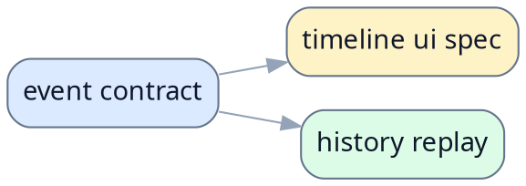

# 示例 Contract 总纲

> [!NOTE]
> 当前文档类型：contract 总纲
>
> 用一句话说明该目录下冻结哪些稳定 contract、谁依赖它们，以及读者从哪里开始读。

## 当前 contract

### 事件 contract

- [示例 Event Contract](../reference-contract.md)
> [!NOTE]
> - 定位：冻结 backend 对 frontend 的稳定 event envelope 与 payload 字段语义。
> - 何时读：只要要改 event producer、frontend normalizer 或 history replay，就先从这里开始。

## 推荐阅读顺序

1. 先读 [示例 Event Contract](../reference-contract.md)，建立稳定字段和事件集合的唯一口径。
2. 再读上层 UI spec 或 replay 文档，理解这些 contract 如何被消费。

## 相关文档

- [项目 README](../../README.md)
- [参考 spec](../reference-spec.md)

## 参考资料

- [frontend types](../../src/types.ts)
- [backend api](../../src/api.ts)
