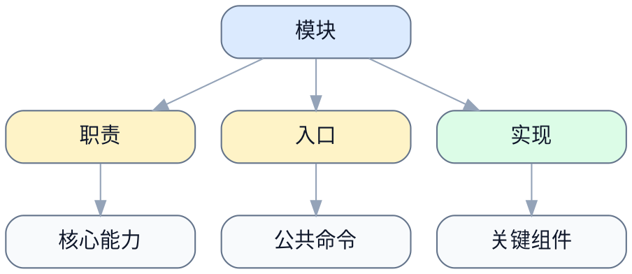

# <目录名> README

> [!NOTE]
> 当前文档类型：Module README

> 用一句话说明这个目录在做什么，以及读者为什么要看这份 README。

## 模块简介

说明这个目录覆盖什么边界。

## 职责边界

- 负责什么
- 不负责什么

## 入口与公共接口

- 关键入口文件
- 对外暴露的接口或命令

## 依赖关系

- 上游依赖
- 下游依赖

## 扩展方式

- 新增文件时遵循什么边界
- 哪些改动需要同步更新这里

## 相关文件

| 路径 | 说明 |
| --- | --- |
| `./example.py` | 示例入口 |

## 参考资料

- [上层文档](../README.md)
- [相关 spec](../docs/spec/README.md)
