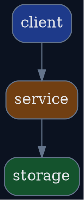

# <项目名> README

> [!NOTE]
> 当前文档类型：Project README

> 用一句话说明这个项目是什么、为什么存在，以及读者为什么要先看这份 README。

## 项目简介

说明项目解决什么问题，以及当前覆盖的系统边界。

## 开发与启动

- 本地开发入口
- 启动命令
- 关键环境变量或依赖

## 架构设计

> 用一句话说明这张图想建立的关键理解。

补一句说明当前主链路或核心依赖关系。

## 代码结构

| 路径 | 说明 |
| --- | --- |
| `./src` | 核心源码 |
| `./docs` | 相关文档 |

## 部署拓扑

> 用一句话说明部署形态、环境边界或主要运行位置。

- 本地运行路径
- 集群 / 线上运行路径
- 外部依赖入口

## 文档链接

- [模块 README](./src/README.md)
- [相关 spec](./docs/spec/README.md)
