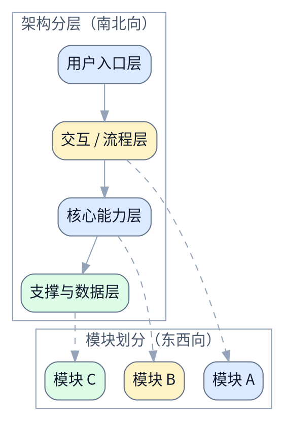

# <主题>设计文档

> [!NOTE]
> 当前 spec 类型：产品 spec

> 用一句话说明用户问题、目标读者和期望结果。

## 背景与现状

### 背景

说明为什么这个用户问题或业务问题现在值得处理。

### 现状

说明当前用户流程、业务问题或策略限制。

## 目标与非目标

### 目标

说明这次要提升什么体验或业务结果。

### 非目标

说明这次不处理的需求或旁支问题。

## 风险与红线

### 风险

- <风险项>

### 红线行为

> [!CAUTION]
> <明确不能突破的产品、合规、体验或策略边界>

## 边界与契约

### 稳定接口与流程边界

列出稳定的接口、输入输出、页面状态、角色边界或流程 contract。

已确认的稳定前提直接写进这些块里；限制条件和禁做边界统一写到 `红线行为`。覆盖边界也可以按主题改成别的块名；重点是这整章仍然清楚表达边界和稳定契约。

## 架构总览

> 产品 spec 没有复杂系统结构时，这里可以用流程图或用户路径图代替。

即使是产品 spec，这里默认也要放一张 fenced `dot` 图，并且这张图要同时体现：

- `架构分层` 的南北向结构
- `模块划分` 的东西向结构

## 架构分层

### 方案设计

#### 期望体验

说明用户能看到什么、怎么操作、结果如何反馈。

#### 边界情况

说明异常输入、权限不足、空结果或失败场景如何处理。

#### 成功信号

说明如何判断这次方案有效，例如转化、完成率、错误率、反馈质量等。

## 模块划分

### <模块一>

说明这一块承载的用户价值、功能边界和与其他模块的关系。

### <模块二>

说明这一块承载的用户价值、功能边界和与其他模块的关系。

## 方案对比

### <方案组一>对比

| 维度 | <方案 A> | <方案 B> |
|---|---|---|
| 首选结论 | 🟢 <推荐原因> | 🟡 <备选条件> |

> [!NOTE]
> 对比结论：<当前推荐方案、备选触发条件和不选择路径。>

## 验收标准

- [ ] ...
- [ ] ...

## 访谈记录

> [!IMPORTANT]
> 定稿前必须把以下占位内容替换为至少 5 轮真实用户问答。

> [!NOTE]
> Q：<第 1 轮真实问题>
>
> A：<第 1 轮真实回答>

收敛影响：<这轮问答改变的边界或决策>

> [!NOTE]
> Q：<第 2 轮真实问题>
>
> A：<第 2 轮真实回答>

收敛影响：<这轮问答改变的边界或决策>

> [!NOTE]
> Q：<第 3 轮真实问题>
>
> A：<第 3 轮真实回答>

收敛影响：<这轮问答改变的边界或决策>

> [!NOTE]
> Q：<第 4 轮真实问题>
>
> A：<第 4 轮真实回答>

收敛影响：<这轮问答改变的边界或决策>

> [!NOTE]
> Q：<第 5 轮真实问题>
>
> A：<第 5 轮真实回答>

收敛影响：<这轮问答改变的边界或决策>

## 参考资料

- [原始需求](./requirement.md)
- [相关说明](../README.md)
