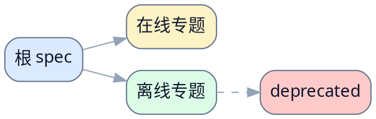

# 示例目录总纲

> [!NOTE]
> 当前 spec 类型：spec 总纲

> 用一句话说明该目录下的 spec 集合覆盖什么、当前主线 authority 是哪一份，以及读者应该从哪里开始读。新增、重命名或废弃 authority spec 时，先更新这份总纲。

## 根 spec

### 当前主线

- [系统主线设计文档](./example-main-spec.md)
  定位：冻结系统级目标态边界与主数据流，是当前目录唯一的根 spec。
  何时读：第一次进入该仓库 spec 体系，或需要判断专题 spec 是否越界时先读这里。

### 缺口与待建项

- 如果当前还没有完整根 spec，在这里明确写缺口和计划文件名。

## 专题 spec

### 在线专题

- [在线专题设计文档](./example-online-topic-spec.md)
  定位：补充在线链路相关 contract。
  何时读：已经理解系统主线，接下来要评审在线请求路径时进入。

### 离线专题

- [离线专题设计文档](./example-offline-topic-spec.md)
  定位：补充离线批处理链路相关 contract。
  何时读：需要看离线 pipeline、补数或定时执行边界时进入。

### deprecated 分组

- [历史兼容设计文档](./deprecated/example-deprecated-spec.md)
  定位：只用于回溯历史兼容路径，不再承载当前 authority。
  何时读：只有在排查历史行为或回溯旧实现时才进入。

## 推荐阅读顺序

> 先读根 spec，再按在线 / 离线 / 专题依赖关系进入对应文档，最后只在必要时进入 `deprecated/`。

1. 先读 [系统主线设计文档](./example-main-spec.md)，确认系统主线、根边界和后续专题的进入前提。
2. 再读 [在线专题设计文档](./example-online-topic-spec.md)，当你要评审在线请求链路时进入。
3. 再读 [离线专题设计文档](./example-offline-topic-spec.md)，当你要评审离线 pipeline 或调度链路时进入。
4. 只有在回溯历史兼容时，再读 `deprecated/` 下的文档。

## 相关文档

- [项目 README](../../README.md)
- [相关 runbook](../runbook/example-runbook.md)

## 参考资料

- 如果没有额外补充材料，可以在这里明确写明不重复列出前文已经成组索引的专题 spec。
