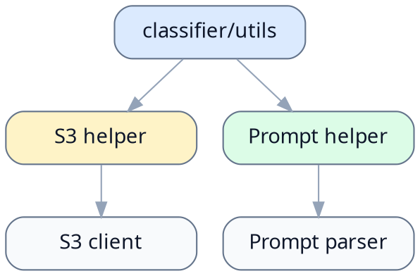

# classifier/utils README

> [!NOTE]
> 当前文档类型：Module README

> 用一句话说明这个目录在做什么，以及读者为什么要看这份 README。

## 模块简介

说明这个目录覆盖什么边界。

## 职责边界

- 负责工具函数与辅助模块
- 不负责业务流程编排

## 入口与公共接口

- `./s3.py`
- `./prompt.py`

## 依赖关系

- 上游由 nodes / runtime 调用
- 下游依赖基础 SDK 与通用工具库

## 扩展方式

- 新增工具模块时保持无状态 helper 边界
- 对外暴露稳定函数时同步更新这里

## 相关文件

| 路径 | 说明 |
| --- | --- |
| `./s3.py` | S3 访问封装 |
| `./prompt.py` | Prompt 解析与装配 |

## 参考资料

- [上层文档](../README.md)
- [相关 spec](../../docs/spec/README.md)
