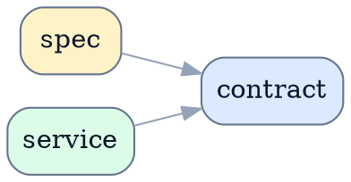

# 示例 Event Contract

> [!NOTE]
> 当前文档类型：contract
>
> 用一句话说明这份 contract 冻结什么稳定语义、由谁维护，以及哪些 spec / 模块依赖它。

## 范围

- 冻结 backend 对 frontend 的 event envelope
- 冻结稳定 event type 与 payload 字段语义

不覆盖：

- 页面视觉与交互表现
- runtime 内部调度细节

## Authority 说明

- authority owner：示例 control plane
- primary consumers：frontend timeline、history replay
- source of truth：`server.ts`、`api.ts`、`types.ts`
- change control：新增 event type 或改 canonical 字段时，必须同步 producer、consumer 与 contract

## 稳定契约

### Contract 清单

| contract 项 | 类型 | producer / owner | consumer | 说明 |
|---|---|---|---|---|
| `BackendApiEvent` | API payload | backend | frontend | 冻结 event 外层 envelope。 |
| `TimelineEventType` | enum-like union | backend + frontend | Timeline UI | 冻结 timeline 可见事件集合。 |

### 依赖关系

说明这份 contract 被哪些 spec、模块或运行链路引用。

## 字段 / 表 / 状态 / 事件定义

### Event / Payload 契约

| 字段 | 类型 | 必填 | 来源 | 语义 |
|---|---|---|---|---|
| `run_id` | `string` | `yes` | `backend` | authority run id |
| `event_type` | `string` | `yes` | `backend` | event discriminator |

## 约束与不变量

- `event_type` 新增前必须先同步 frontend normalizer。
- 同一个 run 内的 event cursor 必须单调递增。

## 版本与兼容性

- 新字段先增量兼容，再删除历史别名。
- 删除旧字段前，必须先完成 consumer 切换。

## 参考资料

- [引用这份 contract 的 spec](./reference-spec.md)
- [代码入口](../README.md)
