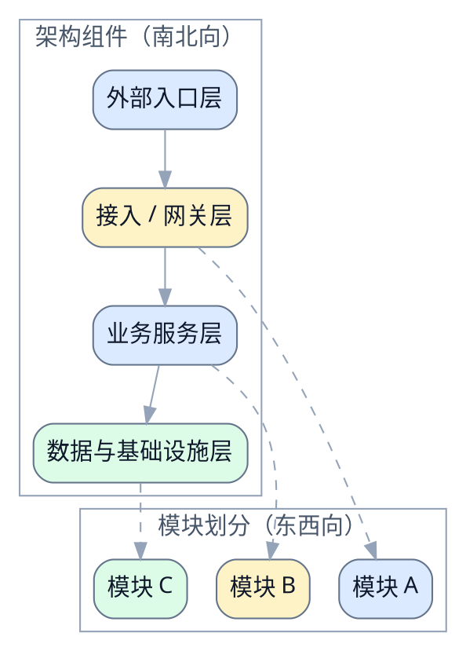

# 示例平台接入设计文档

> [!NOTE]
> 当前 spec 类型：技术 spec

> 用一句话说明技术变更内容，以及它会影响哪些系统边界。

## 总览

### 背景

说明为什么需要这次变更，以及相关外部约束。

### 目标

说明这次改动要让系统达到什么状态。

### 非目标

明确不打算解决的技术问题。

## 风险与红线

### 风险

- 接口兼容性未完全验证

### 红线行为

> [!CAUTION]
> 不允许绕过现有鉴权边界。
>
> 不允许引入新的外部依赖。

## 边界与契约

### 稳定接口与调用边界

- 接入控制器只接收规范化后的鉴权上下文
- 网关层只向业务层暴露稳定的请求 contract

## 架构总览

> 先建立端到端链路、组件关系或运行位置的整体模型。

### 外部入口层

说明这一层负责什么，与上下游如何连接。

### 业务服务层

说明这一层负责什么，与上下游如何连接。

## 模块划分

### 模块一

说明这个模块负责什么、与哪些上下游模块协作，以及它的边界是什么。

### 模块二

说明这个模块负责什么、与哪些上下游模块协作，以及它的边界是什么。

### 方案设计

#### 接口与契约

说明 API、事件、配置或模块边界如何定义和变化。

#### 数据模型或存储变更

说明表结构、对象结构、索引、缓存或文件布局变化。

## 方案对比

### 接入链路方案对比

| 维度 | 方案 A：复用现有网关 | 方案 B：新增独立入口 |
| --- | --- | --- |
| 改造复杂度 | 🟢 复用已有链路，改造面较小 | 🔴 需要新增入口和运维边界 |
| 边界一致性 | 🟢 与当前鉴权和路由边界一致 | 🟡 可以隔离，但需要额外契约 |
| 推荐结论 | 🟢 作为默认方案 | 🟡 仅在隔离诉求更强时作为备选 |

> [!NOTE]
> 对比结论：当前优先复用现有网关，只有在隔离诉求超过复用收益时才考虑新增独立入口。

## 验收标准

- [ ] 请求路径符合新架构边界
- [ ] 文档中的接口契约可被评审

## 访谈记录

> Q：这次变更是否只覆盖接入链路，不触碰鉴权模型？
>
>
> A：是，本轮只覆盖接入链路，鉴权模型保持不变。

收敛影响：把鉴权模型从本轮范围里明确排除，避免 scope 漂移。

> Q：目标状态是否要求新旧链路可以并存一段时间？
>
>
> A：需要，至少要保留一个过渡窗口。

收敛影响：方案必须兼顾兼容期，不能只写最终形态。

> Q：上线时是否允许引入新的外部基础设施？
>
>
> A：不允许，沿用现有基础设施。

收敛影响：把新增外部依赖列为约束，而不是备选方案。

> Q：验收时更看重接口契约还是运行数据？
>
>
> A：先以接口契约和架构边界为主，运行数据可以后补。

收敛影响：验收标准优先绑定接口和边界，不强依赖尚未产出的运行指标。

> Q：这份 spec 是否需要显式记录红线行为？
>
>
> A：需要，尤其是不能绕过现有鉴权边界。

收敛影响：把安全边界写进“红线行为”，避免评审时遗漏。

## 参考资料

- 接口定义：`<path-to-api-contract>`
- 运维文档：`<path-to-runbook>`
