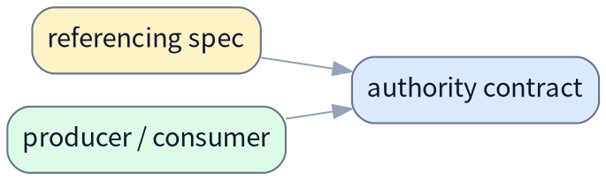
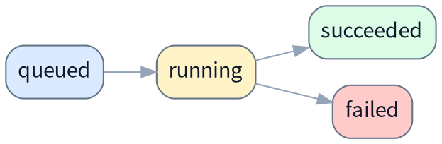

# Contract 模板

适用于需要把稳定接口、数据库表契约、事件载荷、状态机、JSON Schema 或跨模块 I/O 独立冻结成 authority contract 的场景。默认落盘位置是与 `spec/` 平级的 `contract/` 目录，例如 `docs/contract/`；当该目录下 contract 增长到多份时，默认再补一份 `docs/contract/README.md` 作为总纲入口。

```md
# <主题>Contract

> [!NOTE]
> 当前文档类型：contract

> 用一句话说明这份 contract 冻结什么稳定语义、由谁维护，以及哪些 spec / 模块依赖它。

## 范围

说明这份 contract 覆盖哪些对象，以及明确不覆盖哪些实现细节或方案叙事。

## Authority 说明

- authority owner：<谁维护这份 contract>
- primary consumers：<哪些服务 / 仓 / 模块依赖它>
- source of truth：<代码 / migration / schema registry / event bus / DB>
- change control：<变更需要经过什么评审或版本控制>

## 稳定契约

### Contract 清单

| contract 项 | 类型 | producer / owner | consumer | 说明 |
|---|---|---|---|---|
| `<classifier_runs>` | `PostgreSQL table` | `control plane` | `worker / API` | `<一句话说明>` |
| `<RunCreated>` | `event payload` | `scheduler` | `downstream worker` | `<一句话说明>` |

### 依赖关系

说明这份 contract 被哪些 spec、模块或运行链路引用；必要时补一张关系图。



## 字段 / 表 / 状态 / 事件定义

按 contract 类型选择最合适的表达方式；不需要所有小节都出现，但出现的块必须可实现、可对照。

### Tables

#### `<classifier_runs>`

> [!NOTE]
> 这张表负责 `<一句话说明它在做什么，以及谁依赖它>`。

角色：`<run authority>`

主键 / 唯一键：`<id>`

写入方：`<API>`

读取方：`<worker>`

| 字段名 | 类型 | 默认值 | 说明 |
|---|---|---|---|
| `id` | `text` | `<none>` | `<主键>` |
| `status` | `text` | `queued` | `<run state>` |
| `runtime` | `jsonb` | `'{}'::jsonb` | `<运行期补充信息>` |

若包含 `JSONB` 字段，为每个字段分别补对应带注释的 JSON example，不要把多个字段合并在一个 code block：

```jsonc
{
  "runtime": {
    "attempt": 1, // 当前第几次执行
    "duration_ms": 1200, // 本次执行耗时，单位毫秒
    "status_detail": "completed" // 运行结果补充说明
  }
}
```

索引建议：

| 索引名 | 字段 | 说明 |
|---|---|---|
| `<idx_classifier_runs_status>` | `<status>` | `<按状态查询>` |

### 状态机

说明允许的状态集合、迁移方向和禁止路径。



### Event / Payload 契约

| 字段 | 类型 | 必填 | 来源 | 语义 |
|---|---|---|---|---|
| `<run_id>` | `string` | `yes` | `<scheduler>` | `<authority run id>` |

### 错误码 / 异常语义

| 场景 | 返回值 / 状态 | 语义 | 调用方要求 |
|---|---|---|---|
| `<missing record>` | `<404 / not_found>` | `<对象不存在>` | `<不得重试>` |

## 约束与不变量

- `<写入时必须满足什么 invariant>`
- `<哪些字段一旦写入不可回退>`
- `<哪些 consumer 只能追加读取，不能反写>`

## 版本与兼容性

说明版本策略、向后兼容要求、破坏性变更判定标准，以及 migration / rollout 约束。

## 参考资料

- [引用这份 contract 的 spec](./example-spec.md)
- [schema / migration / code owner 文档](../README.md)
```
