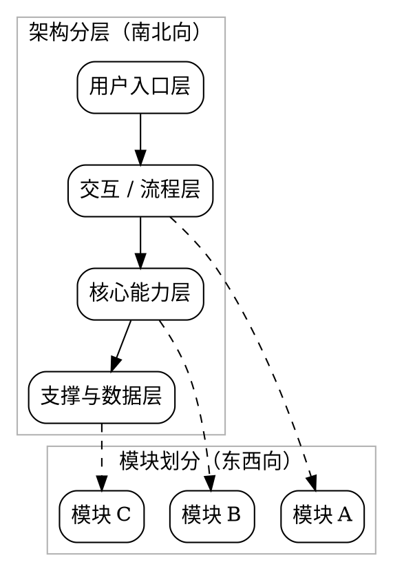

# 产品向 spec 模板

适用于主要任务是澄清用户价值、流程规则、策略边界或体验方案的场景。

```md
# <主题>设计文档

> [!NOTE]
> 当前 spec 类型：产品向 spec

> 用一句话说明用户问题、目标读者和期望结果。

## 背景与现状

### 背景

说明为什么这个用户问题或业务问题现在值得处理。

### 现状

说明当前用户流程、业务问题或策略限制。

```dot
digraph CurrentState {
  rankdir=LR;
  graph [bgcolor="transparent"];
  node [shape=box, style="rounded"];

  current_user [label="当前用户入口"];
  current_flow [label="当前流程"];
  current_result [label="当前结果"];

  current_user -> current_flow -> current_result;
}
```

## 目标与非目标

### 目标

说明这次要提升什么体验或业务结果。

```dot
digraph TargetState {
  rankdir=LR;
  graph [bgcolor="transparent"];
  node [shape=box, style="rounded"];

  target_user [label="目标用户入口"];
  target_flow [label="目标流程"];
  target_result [label="目标结果"];

  target_user -> target_flow -> target_result;
}
```

### 非目标

说明这次不处理的需求或旁支问题。

## 风险与红线

### 风险

- <风险项>

### 红线行为

> [!CAUTION]
> <明确不能突破的产品、合规、体验或策略边界>

## 边界与契约

### 稳定接口与流程边界

列出稳定的接口、输入输出、页面状态、角色边界或流程 contract。

已确认的稳定前提直接写进这些块里；限制条件和禁做边界统一写到 `红线行为`。覆盖边界也可以按主题改成别的块名；重点是这整章仍然清楚表达边界和稳定契约。

## 架构总览

> 产品向 spec 没有复杂系统结构时，这里可以用流程图或用户路径图代替。

即使是产品向 spec，这里默认也要放一张 fenced `dot` 图，并且这张图要同时体现：

- `架构分层` 的南北向结构
- `模块划分` 的东西向结构



## 架构分层

### 方案设计

#### 期望体验

说明用户能看到什么、怎么操作、结果如何反馈。

#### 边界情况

说明异常输入、权限不足、空结果或失败场景如何处理。

#### 成功信号

说明如何判断这次方案有效，例如转化、完成率、错误率、反馈质量等。

## 模块划分

### <模块一>

说明这一块承载的用户价值、功能边界和与其他模块的关系。

### <模块二>

说明这一块承载的用户价值、功能边界和与其他模块的关系。

## 验收标准

- [ ] ...
- [ ] ...

## 访谈记录

使用 [interview-record-template.md](./interview-record-template.md)。

## 参考资料

- [原始需求](./requirement.md)
- [相关说明](../README.md)
```
