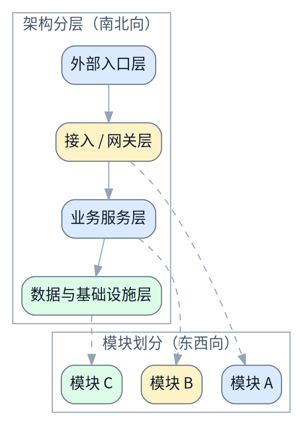

# 技术向 spec 模板

适用于主要任务是设计架构、接口、迁移方案、运行方式或可观测性的场景。

```md
# <主题>设计文档

> [!NOTE]
> 当前 spec 类型：技术向 spec

> 用一句话说明技术变更内容，以及它会影响哪些系统边界。

## 背景与现状

### 背景

说明为什么当前系统状态或外部约束要求现在做这次变更。

### 现状

说明当前系统结构、实现限制或运行痛点。


## 目标与非目标

### 目标

说明这次改动要让系统达到什么状态。


### 非目标

明确不打算解决的技术问题。

## 风险与红线

### 风险

- <风险项>

### 红线行为

> [!CAUTION]
> <明确不能突破的技术、数据、安全或运行边界>

## 边界与契约

### 稳定接口与调用边界

列出稳定的接口、输入输出、状态机、数据模型、ownership contract 或调用边界。

已确认的稳定前提直接写进这些块里；限制条件和禁做边界统一写到 `红线行为`。覆盖边界也可以按主题改成别的块名；重点是这整章仍然清楚表达边界和稳定契约。

## 架构总览

> 先建立端到端链路、组件关系或运行位置的整体模型。

必须放一张 fenced `dot` 图，并且这张图要同时体现：

- `架构分层` 的南北向结构
- `模块划分` 的东西向结构



## 架构分层

> 按层解释请求路径、运行边界或职责拆分。

### <层级一>

说明这一层负责什么，与上下游如何连接。

### <层级二>

说明这一层负责什么，与上下游如何连接。

## 模块划分

> 按东西向拆分模块、域或责任边界，说明系统在横向上如何组织。

### <模块一>

说明这个模块负责什么、与哪些上下游模块协作，以及它的边界是什么。

### <模块二>

说明这个模块负责什么、与哪些上下游模块协作，以及它的边界是什么。

### 方案设计

#### 接口与契约

说明 API、事件、配置或模块边界如何定义和变化。

#### 数据模型或存储变更

说明表结构、对象结构、索引、缓存或文件布局变化。

#### 失败处理与可观测性

说明异常路径、重试、日志、指标、追踪或告警策略。

#### 发布 / 迁移 / 兼容性

说明上线步骤、灰度方式、数据迁移和回滚策略。

## 方案对比

### <方案组一>对比

| 维度 | <方案 A> | <方案 B> |
|---|---|---|
| 首选结论 | 🟢 <推荐原因> | 🟡 <备选条件> |

> [!NOTE]
> 对比结论：<当前推荐方案、备选触发条件和不选择路径。>

## 验收标准

- [ ] ...
- [ ] ...

## 访谈记录

使用 [interview-record-template.md](./interview-record-template.md)。

## 参考资料

- [接口定义](./api.md)
- [运维文档](../README.md)
```
