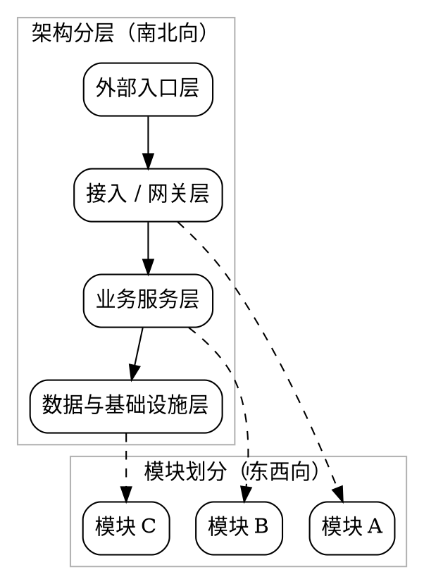

# 示例平台接入设计文档

> 用一句话说明技术变更内容，以及它会影响哪些系统边界。

# 背景与现状

## 背景

说明为什么当前系统状态或外部约束要求现在做这次变更。

## 现状

说明当前系统结构、实现限制或运行痛点。

```dot
digraph CurrentState {
  rankdir=LR;
  graph [bgcolor="transparent"];
  node [shape=box, style="rounded"];

  current_a [label="当前组件 A"];
  current_b [label="当前组件 B"];
  current_c [label="当前组件 C"];

  current_a -> current_b -> current_c;
}
```

# 目标与非目标

## 目标

说明这次改动要让系统达到什么状态。

```graphviz
digraph TargetState {
  rankdir=LR;
  graph [bgcolor="transparent"];
  node [shape=box, style="rounded"];

  target_a [label="目标组件 A"];
  target_b [label="目标组件 B"];
  target_c [label="目标组件 C"];

  target_a -> target_b -> target_c;
}
```

## 非目标

明确不打算解决的技术问题。

## 范围

列出这次变更覆盖的模块、接口、任务或基础设施。

# 风险与红线

## 风险

- 接口兼容性未完全验证

## 红线行为

- 不允许绕过现有鉴权边界

# 假设与约束

## 假设

- 上游接口字段不会在本轮发生破坏性变化

## 约束

- 不能引入新的外部依赖

# 架构总览

> 先建立端到端链路、组件关系或运行位置的整体模型。



# 架构分层

## 外部入口层

说明这一层负责什么，与上下游如何连接。

## 业务服务层

说明这一层负责什么，与上下游如何连接。

# 模块划分

## 模块一

说明这个模块负责什么、与哪些上下游模块协作，以及它的边界是什么。

## 模块二

说明这个模块负责什么、与哪些上下游模块协作，以及它的边界是什么。

## 方案设计

### 接口与契约

说明 API、事件、配置或模块边界如何定义和变化。

### 数据模型或存储变更

说明表结构、对象结构、索引、缓存或文件布局变化。

# 验收标准

- [ ] 请求路径符合新架构边界
- [ ] 文档中的接口契约可被评审

# 访谈记录

> Q：这次变更是否只覆盖接入链路，不触碰鉴权模型？
>
>
> A：是，本轮只覆盖接入链路，鉴权模型保持不变。

收敛影响：把鉴权模型从本轮范围里明确排除，避免 scope 漂移。

> Q：目标状态是否要求新旧链路可以并存一段时间？
>
>
> A：需要，至少要保留一个过渡窗口。

收敛影响：方案必须兼顾兼容期，不能只写最终形态。

> Q：上线时是否允许引入新的外部基础设施？
>
>
> A：不允许，沿用现有基础设施。

收敛影响：把新增外部依赖列为约束，而不是备选方案。

> Q：验收时更看重接口契约还是运行数据？
>
>
> A：先以接口契约和架构边界为主，运行数据可以后补。

收敛影响：验收标准优先绑定接口和边界，不强依赖尚未产出的运行指标。

> Q：这份 spec 是否需要显式记录红线行为？
>
>
> A：需要，尤其是不能绕过现有鉴权边界。

收敛影响：把安全边界写进“红线行为”，避免评审时遗漏。

# 参考文档

- [接口定义](./api.md)
- [运维文档](../README.md)
