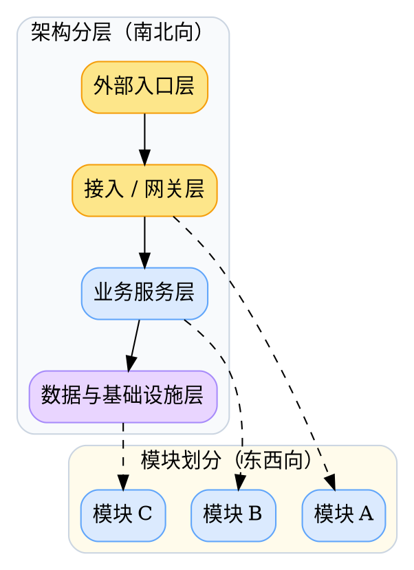

# 示例技术 spec

> 用一句话说明技术变更内容，以及它会影响哪些系统边界。

## 背景与现状

### 背景

说明为什么当前系统状态或外部约束要求现在做这次变更。

### 现状

说明当前系统结构、实现限制或运行痛点。

### 问题

说明当前技术痛点、稳定性风险或演进瓶颈。

## 目标与非目标

### 目标

说明这次改动要让系统达到什么状态。

### 非目标

明确不打算解决的技术问题。

### 范围

列出这次变更覆盖的模块、接口、任务或基础设施。

## 风险与收益

### 风险

- 风险项

### 收益

- 预期收益

## 假设与约束

### 假设

- 未完全确认但当前先按此推进的前提

### 约束

- 兼容性、性能、资源、窗口、外部系统限制等

## 架构总览

> 先建立端到端链路、组件关系或运行位置的整体模型。

## 架构分层

### 入口层

说明这一层负责什么，与上下游如何连接。

### 服务层

说明这一层负责什么，与上下游如何连接。

## 模块划分

### 模块一

说明这个模块负责什么、与哪些上下游模块协作，以及它的边界是什么。

### 模块二

说明这个模块负责什么、与哪些上下游模块协作，以及它的边界是什么。

## 访谈记录

> Q：这份 spec 的主重心是什么？
>
> A：技术架构和接口边界。

收敛影响：按技术向 spec 模板组织正文。

> Q：这次是否覆盖迁移方案？
>
> A：覆盖，但只写迁移边界和兼容路径。

收敛影响：把迁移内容收进模块划分后的设计章节。

> Q：这次是否要求真实访谈记录？
>
> A：要求，不能用作者自问自答替代。

收敛影响：访谈记录必须保留真实问答痕迹。

> Q：正文顶层标题从几级开始？
>
> A：正文从二级标题开始，一级标题只留给文档主标题。

收敛影响：所有主章节都降为 ##。

> Q：图的节点是否需要背景色？
>
> A：需要，同类节点同色，且要适配深色模式。

收敛影响：dot 图默认加 filled 背景和同类节点配色。

## 外部链接

- [模板索引](../../references/template.md)
- [访谈记录模板](../../references/interview-record-template.md)
